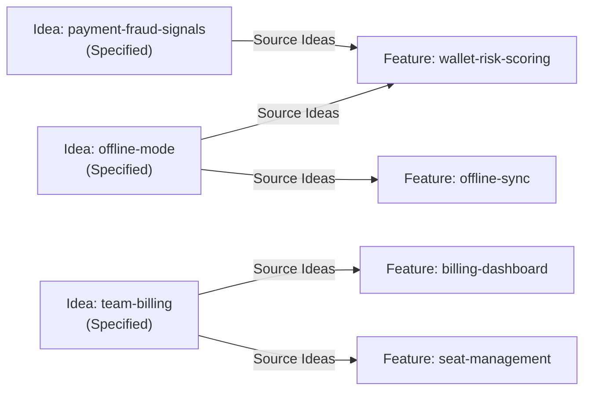

# Idea → Feature Promotion Mechanics

This is the operational deep-dive on how an Idea becomes referenced by one or more Features, how tooling keeps the two sides in sync, and what to do at the edges (reverts, archival, conflicts).

If you are new to Ideas themselves, start with the [ideas workflow guide](../ideas-workflow.md) and the [Idea feature spec](../../spec/features/idea/README.md). This page assumes you already know what an Idea is.

## The Contract in One Paragraph

A Feature carries a `**Source Ideas:**` header field listing zero or more Idea slugs. That field is the **authoritative link** — the only place a human or skill writes the Idea↔Feature relationship. An Idea's `**Promotes To:**` field and its derived `**Status:**` (`Approved` vs. `Specified`) are computed from the reverse index over every Feature's `**Source Ideas:**`. Authors do not edit them; `specscore spec lint --fix` does.

## The Feature Side: `**Source Ideas:**`

The field sits in the Feature README as a body-metadata line, directly after `**Status:**`:

```markdown
# Feature: Wallet Risk Scoring

**Status:** Draft
**Source Ideas:** payment-fraud-signals, offline-mode

## Summary
...
```

Rules (from [feature#req:source-ideas-field](../../spec/features/feature/README.md#req-source-ideas-field)):

- The field is **optional**. A Feature authored without a preceding Idea is valid; simply omit the line, or set it to `—`.
- When present, the value is either `—` or a comma-separated list of Idea slugs.
- Every slug MUST resolve to an existing file at `spec/ideas/<slug>.md` or `spec/ideas/archived/<slug>.md`.
- Every referenced Idea MUST have `Status ∈ {Approved, Specified}`. Referencing a `Draft`, `Under Review`, or `Archived` Idea is a lint error.

Typical rejections:

| What you wrote | Why it fails |
|---|---|
| `**Source Ideas:** payment-fraud-signalz` (typo) | Slug does not resolve to any Idea file. |
| `**Source Ideas:** offline-mode` where `offline-mode` is `Status: Draft` | Draft Ideas are not yet promotable — approve first. |
| `**Source Ideas:** team-billing` where `team-billing` is `Status: Archived` | Archived Ideas cannot ground new Features. Use `**Supersedes:**` on a successor Idea instead. |

## The Idea Side: `**Promotes To:**` and `Status`

Both fields are **managed state**. The Idea header looks like this at rest:

```markdown
# Idea: Payment Fraud Signals

**Status:** Specified
**Date:** 2026-03-02
**Owner:** alex@synchestra.io
**Promotes To:** wallet-risk-scoring
**Supersedes:** —
```

From [idea#req:promotes-to-managed](../../spec/features/idea/README.md#req-promotes-to-managed) and [idea#req:specified-derivation](../../spec/features/idea/README.md#req-specified-derivation):

- `**Promotes To:**` is the reverse index. It lists every Feature slug whose `**Source Ideas:**` contains this Idea's slug.
- `**Status:** Specified` is set **if and only if** `**Promotes To:**` is non-empty.
- Authors MUST NOT hand-write `**Status:** Specified`. Lint rejects it unless a referencing Feature exists.

When the invariant drifts — a Feature was added, removed, renamed, or unlinked — `specscore spec lint` reports `idea-sync-lint-strict` errors. The fix is never to hand-edit the Idea; it is to run `--fix`.

## Many-to-Many

The relationship is many-to-many. One Idea can seed multiple Features (decomposition). One Feature can synthesize multiple Ideas (crystallization).



Two concrete scenarios:

**Crystallization.** `payment-fraud-signals` and `offline-mode` are both Approved. While designing `wallet-risk-scoring`, you realize the Feature rests on assumptions from *both* Ideas — fraud heuristics need to degrade gracefully when the device is offline. The Feature declares:

```markdown
**Source Ideas:** payment-fraud-signals, offline-mode
```

After `--fix`, both Ideas transition to `Specified` and both list `wallet-risk-scoring` in their `**Promotes To:**`.

**Decomposition.** `team-billing` is one Approved Idea. At design time it splits cleanly into two separable capabilities — a billing dashboard and seat management. You create two Features, each with:

```markdown
**Source Ideas:** team-billing
```

After `--fix`, `team-billing`'s `**Promotes To:**` reads `billing-dashboard, seat-management` and its Status is `Specified`. One Idea, two live references.

## What `specscore spec lint --fix` Actually Rewrites

The repair is mechanical and idempotent. Per run:

1. **Build the reverse index.** Scan every `spec/features/**/README.md`, collect `**Source Ideas:**` entries, and compute `idea_slug → [feature_slug, …]`.
2. **Rewrite `**Promotes To:**` per Idea.** Replace the value with the sorted comma-separated Feature list, or `—` if empty. Only the existing header line is edited; no new fields are inserted.
3. **Transition `**Status:**`.**
   - If the Idea has ≥1 referencing Feature and its current Status is `Approved` → set `Specified`.
   - If the Idea has 0 referencing Features and its current Status is `Specified` → drop back to `Approved`.
   - `Draft`, `Under Review`, and `Archived` are not auto-transitioned by the sync rule — they stem from other signals (authoring, archival).
4. **Regenerate the active index** (`spec/ideas/README.md`) — rewrites the `## Index` table with current `Status`, `Date`, `Owner`, `Promotes To` for every active Idea.
5. **Regenerate the archived index** (`spec/ideas/archived/README.md`) — rewrites the chronological list, ordered by `Date` ascending.

The rewrite only touches header lines (the `**Field:** value` block above the first `## ` heading) and index tables. Body prose is never modified.

### Before / after

An author adds `offline-mode` to a new Feature `offline-sync` and commits — but forgets to run `--fix`. Before:

```markdown
# Idea: Offline Mode

**Status:** Approved
**Date:** 2026-02-18
**Owner:** alex@synchestra.io
**Promotes To:** —
**Supersedes:** —
**Related Ideas:** depends_on:local-storage-schema

## Problem Statement
...
```

`specscore spec lint` fails:

```
spec/ideas/offline-mode.md: error idea-sync-lint-strict
  idea "offline-mode" drift: Promotes To / Status disagree with referencing features (run `specscore lint --fix`)
```

After `specscore spec lint --fix`:

```markdown
# Idea: Offline Mode

**Status:** Specified
**Date:** 2026-02-18
**Owner:** alex@synchestra.io
**Promotes To:** offline-sync
**Supersedes:** —
**Related Ideas:** depends_on:local-storage-schema

## Problem Statement
...
```

Only `**Status:**` and `**Promotes To:**` changed. The body, owner, date, and related-ideas line are untouched. Commit the edit together with the Feature that caused it — the two changes belong in the same commit so the tree is always lint-clean at HEAD.

## Reverting a Promotion

The sync rule is symmetric: removing the last reference transitions the Idea back. If `offline-sync` is deleted (or its `**Source Ideas:**` entry for `offline-mode` is removed) and no other Feature references `offline-mode`, then `--fix` walks `Specified → Approved` and resets `**Promotes To:**` to `—`.

This is **desirable** when:

- The Idea was promoted prematurely and the resulting Feature was abandoned.
- A design spike disproved the Idea's Must-be-true assumption.
- The direction pivoted enough that the original Idea no longer represents the live thinking.

This is **not what you want** when:

- The Feature was renamed. Update the `**Source Ideas:**` reference to follow the Feature, don't let the Idea drop back to `Approved`.
- The Feature was split and one of the new Features forgot to copy the `**Source Ideas:**` line. Add it before running `--fix`.
- You genuinely meant to abandon the Idea. In that case, drop the reference *and* archive the Idea in the same change (see below) — don't leave a dangling `Approved` Idea that no longer reflects current thinking.

## Archival Interaction

An Idea cannot be archived while `Specified`. The archival sequence, in order:

1. **Clean up or reassign every referencing Feature.**
   - If the Feature is still wanted, decide whether to drop the `**Source Ideas:**` entry entirely or replace it with a successor Idea slug.
   - If the Feature itself is being abandoned, remove or archive it per the Feature lifecycle.
2. **Run `specscore spec lint --fix`.** The Idea drops from `Specified` to `Approved`, `**Promotes To:**` becomes `—`.
3. **Archive the Idea.**
   - Set `**Status:** Archived`.
   - Add `**Archive Reason:**` with a non-empty value (e.g. `abandoned`, `pivoted`, `superseded`).
   - Move the file to `spec/ideas/archived/<slug>.md`.
4. **Run `--fix` again.** The archived index regenerates in chronological order.

### Successor flow

When an Idea's scope shifted enough to invalidate its assumptions, don't rename — create a successor. Example: `offline-mode` becomes too narrow once the team commits to full conflict-free replicated data types.

1. Archive `offline-mode` with `**Archive Reason:** superseded`.
2. Create `spec/ideas/crdt-sync.md` with `**Supersedes:** offline-mode` and its own fresh assumptions.
3. Update any in-flight Features: swap `offline-mode` for `crdt-sync` in their `**Source Ideas:**` — but only once `crdt-sync` reaches `Approved`. You cannot reference a `Draft` successor.
4. `--fix` reconciles both sides.

## Conflicts Between Two Approved Ideas

If two `Approved` Ideas attack the same problem from incompatible angles, don't rush to archive one. Record the conflict explicitly:

```markdown
# Idea: Single-Click Checkout

**Related Ideas:** conflicts_with:two-factor-checkout
```

and symmetrically on the other side. The `conflicts_with` link is useful record until the team picks one for promotion — at which point the loser is archived with `**Archive Reason:** pivoted` (or similar). Promoting both would create contradictory Features, so lint will not stop you but the downstream `wallet-risk-scoring`-style Features built on top will contradict each other.

## Operational Tips

- **Run `specscore spec lint --fix` before every PR** that touches either `spec/ideas/**` or `spec/features/**/README.md`. CI runs strict lint without `--fix`; any drift fails the build.
- **Populate `**Source Ideas:**` at Feature creation time**, then run `--fix` immediately. This way the Idea transitions to `Specified` in the same commit that introduces the Feature. Reviewers see one atomic change.
- **Don't copy-paste `**Status:** Specified` between Ideas.** Lint rejects it (`idea-specified-not-author-set`) unless a matching Feature reference already exists. Always drive the transition through a Feature.
- **When two Approved Ideas conflict**, prefer `Related Ideas: conflicts_with:` on both sides over premature archival. The conflict is useful history.
- **Keep Idea files single-file.** A directory at `spec/ideas/<slug>/` is a lint error — Ideas have no sub-artifacts, and supporting material belongs on the downstream Feature or in `docs/`.

## Command Reference

```
specscore spec lint                             # show drift
specscore spec lint --fix                       # repair drift
specscore spec lint --rules idea-sync-lint-strict,idea-index-completeness --fix
```

The third form narrows repair to the two rules that rewrite header fields and index tables — useful when you want a minimal diff and are confident the rest of the spec tree is clean.

## Further Reading

- [Ideas workflow guide](../ideas-workflow.md) — the umbrella guide.
- [Idea feature spec](../../spec/features/idea/README.md) — authoritative schema and all REQs.
- [Feature feature spec](../../spec/features/feature/README.md) — the `**Source Ideas:**` field definition.
