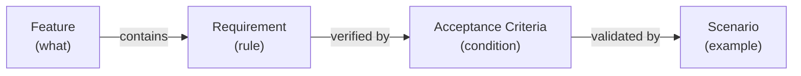
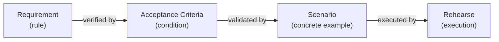

# Requirement & Scenario Specs Implementation Plan

> **For agentic workers:** REQUIRED SUB-SKILL: Use superpowers:subagent-driven-development (recommended) or superpowers:executing-plans to implement this plan task-by-task. Steps use checkbox (`- [ ]`) syntax for tracking.

**Goal:** Add Requirement and Scenario as SpecScore spec features, update existing Feature and AC specs to reference them, and create a demo todo CLI app that exercises all four layers.

**Architecture:** Pure markdown spec authoring — no code changes. Two new spec feature directories, edits to two existing specs, one new `examples/` directory with a complete todo-app specification tree.

**Tech Stack:** Markdown, SpecScore conventions

---

### Task 1: Create Requirement spec feature

**Files:**
- Create: `spec/features/requirement/README.md`

- [ ] **Step 1: Create the Requirement feature spec**

```markdown
# Feature: Requirement

**Status:** Conceptual

## Summary

A requirement is a discrete, testable rule or condition that a system must satisfy. Requirements live as named subsections within a feature's Behavior section — they are a naming convention, not a separate file artifact. Each requirement is addressable by ID, enabling traceability from acceptance criteria and scenarios back to the specific obligation they verify.

## Problem

SpecScore features describe behavior in prose Behavior sections. When a feature has many behavioral rules, individual obligations are not addressable — acceptance criteria cannot trace back to the specific rule they verify, and tooling cannot enumerate or lint individual requirements. This makes it hard to answer: "Which specific rule does this AC verify?" or "Are all behavioral rules covered by ACs?"

## Design Philosophy

Requirements are the **precision layer** within features. A feature's Behavior section explains *how something works* narratively; requirements mark the specific *rules* within that narrative that the system must satisfy.

Requirements are lightweight by design — a heading convention, not a new file type. This keeps them close to the behavioral context they formalize and avoids duplicating content across artifacts.



## Behavior

### Requirement format

Requirements are subsections within a feature's `## Behavior` section, using the `### REQ:` prefix:

```markdown
## Behavior

### REQ: title-required

A todo item MUST have a non-empty title. Creating a todo without a title MUST be rejected with an error message.

### REQ: slug-format

Feature slugs MUST be lowercase, hyphen-separated, and URL-safe. Underscores, spaces, and special characters are not permitted.
```

The `### REQ:` prefix distinguishes requirements from organizational subsections. Subsection headings without the `REQ:` prefix remain valid for grouping and narrative — not every subsection is a requirement.

### Requirement identification

Requirements are identified by their feature path and slug:

```
{feature-path}#req:{slug}
```

| Feature path | Requirement slug | Full ID |
|---|---|---|
| `todo-item/manage` | `title-required` | `todo-item/manage#req:title-required` |
| `todo-item/completion` | `timestamp-on-complete` | `todo-item/completion#req:timestamp-on-complete` |
| `todo-list` | `default-filter-active` | `todo-list#req:default-filter-active` |

### Requirement slugs

Slugs follow the same rules as feature slugs:
- Lowercase letters, numbers, and hyphens only
- No underscores, spaces, or special characters
- URL-safe and path-safe

### RFC 2119 language

Requirements SHOULD use RFC 2119 keywords (MUST, MUST NOT, SHOULD, SHOULD NOT, MAY) to express obligation levels. This is a convention, not a strict rule — natural language is acceptable when the intent is clear.

| Keyword | Meaning |
|---|---|
| MUST / MUST NOT | Absolute requirement or prohibition |
| SHOULD / SHOULD NOT | Recommended but exceptions exist |
| MAY | Truly optional |

### Requirement granularity

Each requirement expresses a **single testable obligation**. If a requirement contains multiple independent conditions, split it into separate requirements.

**Good** — single obligation:
```markdown
### REQ: title-required
A todo item MUST have a non-empty title.
```

**Bad** — multiple obligations bundled:
```markdown
### REQ: title-rules
A todo item MUST have a non-empty title, MUST NOT exceed 200 characters,
and SHOULD be unique within the list.
```

Split the bad example into `title-required`, `title-max-length`, and `title-unique`.

### Referencing requirements from ACs

Acceptance criteria reference the requirement(s) they verify using the `**Requirement:**` metadata field:

```markdown
# AC: title-required

**Requirement:** todo-item/manage#req:title-required

Creating a todo without a title is rejected. Creating a todo with a title succeeds.
```

An AC may reference multiple requirements when it verifies a condition that spans them:

```markdown
**Requirement:** todo-item/manage#req:title-required, todo-item/manage#req:title-max-length
```

### Parent features and requirements

A parent feature MAY define requirements that apply broadly to its sub-features. Sub-features define their own requirements for behavior specific to them. There is no inheritance — a sub-feature's ACs must explicitly reference the parent requirement ID if they verify a parent-level rule.

## Structural Rules

1. **Requirement headings use the `### REQ: {slug}` format.** The `REQ:` prefix is case-sensitive and followed by a space and the slug.
2. **Requirement slugs are unique within a feature.** Two requirements in the same feature cannot share a slug.
3. **Requirements live in Behavior sections only.** The `### REQ:` convention is not valid outside `## Behavior`.
4. **Each requirement is a single testable obligation.** Multi-condition requirements should be split.

## Interaction with Other Features

| Feature | Interaction |
|---|---|
| [Feature](../feature/README.md) | Requirements live within a feature's Behavior section as named subsections. |
| [Acceptance Criteria](../acceptance-criteria/README.md) | ACs reference requirements via the `**Requirement:**` metadata field. |
| [Scenario](../scenario/README.md) | Scenarios validate ACs, which in turn verify requirements — completing the traceability chain. |

## Acceptance Criteria

Not defined yet.

## Outstanding Questions

- Acceptance criteria not yet defined for this feature.
- Should tooling enforce that every requirement has at least one AC, or is it acceptable to have requirements without ACs (e.g., during early specification)?
- Should requirements support a status independent of their parent feature (e.g., a requirement could be marked `deprecated` while the feature remains `stable`)?
```

- [ ] **Step 2: Verify file exists and is well-formed**

Run: `head -5 spec/features/requirement/README.md`
Expected: `# Feature: Requirement` header with `**Status:** Conceptual`

- [ ] **Step 3: Commit**

```bash
git add spec/features/requirement/README.md
git commit -m "feat(spec): add Requirement feature spec

Define requirements as named subsections (### REQ: {slug}) within
feature Behavior sections, with ID scheme, referencing conventions,
and structural rules."
```

---

### Task 2: Create Scenario spec feature

**Files:**
- Create: `spec/features/scenario/README.md`

- [ ] **Step 1: Create the Scenario feature spec**

```markdown
# Feature: Scenario

**Status:** Conceptual

## Summary

A scenario is a concrete example of system behavior written in Given/When/Then format. Scenarios live in a feature's `_tests/` directory as standalone markdown files, each describing a specific interaction flow with exact inputs and expected outputs. They are the executable proof layer — validating that acceptance criteria hold under real conditions. Scenarios are optionally linked to the ACs they validate and are executable by the [Rehearse test runner](https://github.com/synchestra-io/rehearse).

## Problem

SpecScore's acceptance criteria define *what must be true* — abstract conditions like "creating a todo without a title is rejected." But ACs deliberately omit concrete inputs, flows, and edge-case sequences. This creates a gap:

- **Developers** need concrete examples to understand expected behavior
- **Test runners** need exact inputs and expected outputs to execute
- **Reviewers** need specific flows to verify during acceptance

Without a formal scenario concept, concrete examples end up mixed into ACs (blurring the abstract/concrete distinction) or scattered in ad-hoc test files with no link back to the specification.

## Design Philosophy

Scenarios are the **example layer** — the most concrete artifact in the specification chain:

| Layer | Abstraction | Example |
|---|---|---|
| Feature | Narrative behavior | "The system manages todo items" |
| Requirement | Formal rule | "A todo MUST have a non-empty title" |
| Acceptance Criteria | Abstract condition | "Creating a todo without a title is rejected" |
| **Scenario** | **Concrete flow** | **"GIVEN an empty list, WHEN I add a todo with no title, THEN the CLI prints 'Error: title required' and the list remains empty"** |

Each layer adds precision. Scenarios are the ground truth that proves the chain holds.



## Behavior

### Scenario location

Scenarios live in the `_tests/` directory within a feature:

```
spec/features/{feature-slug}/
  _tests/
    {scenario-slug}.md
    {scenario-slug}.md
    flows/                   ← shared setup/teardown flows (optional)
      {flow-slug}.md
```

The `_tests/` directory follows the reserved `_` prefix convention — it is not a sub-feature and is excluded from the feature index.

### Scenario file format

```markdown
# Scenario: {Title}

**Validates:** {feature-slug}/{ac-slug}, {feature-slug}/{ac-slug-2}

## Steps

GIVEN {initial condition}
AND {additional context}
WHEN {action}
THEN {expected outcome}
AND {additional outcome}

## Rehearse

` ` `rehearse
#!/bin/bash
# executable test script
` ` `
```

### Required sections

| Section | Required | Notes |
|---|---|---|
| Title (`# Scenario: X`) | Yes | Always prefixed with `Scenario:` |
| Validates | No | Links to ACs. Omit for exploratory or cross-feature scenarios. |
| Steps | Yes | Given/When/Then format |
| Rehearse | No | Executable script block for test automation |

### Validates metadata

The `**Validates:**` field links a scenario to one or more acceptance criteria:

```markdown
**Validates:** todo-item/manage/added-to-list, todo-item/manage/title-required
```

The reference format is `{feature-path}/{ac-slug}`, where `{ac-slug}` matches the filename (without `.md`) in the feature's `_acs/` directory.

**Rules:**
- The link is **many-to-many**: a scenario can validate multiple ACs, and an AC can be validated by multiple scenarios
- The field is **optional**: scenarios without AC links are valid — they serve as exploratory behavior examples, integration flows, or cross-feature demonstrations
- When present, tooling can verify that referenced ACs exist

### Given/When/Then format

Scenarios use the Gherkin-inspired Given/When/Then structure:

| Keyword | Purpose | Multiplicity |
|---|---|---|
| GIVEN | Initial state or precondition | One or more (use AND for additional) |
| WHEN | Action or trigger | Exactly one |
| THEN | Expected outcome | One or more (use AND for additional) |
| AND | Continues the preceding keyword | Zero or more |

Keywords are uppercase by convention for visual clarity.

**Example:**

```markdown
## Steps

GIVEN a todo list with two active items
AND one item has due date 2026-01-01
AND today is 2026-04-01
WHEN the user runs `todo list --overdue`
THEN the output contains exactly one item
AND the item is the one with due date 2026-01-01
AND the output does not contain the item without a due date
```

### Rehearse script block

Scenarios may include a fenced `rehearse` code block containing an executable script:

````markdown
## Rehearse

```rehearse
#!/bin/bash
todo add "Buy milk"
output=$(todo list)
assert_contains "$output" "Buy milk"
assert_contains "$output" "[active]"
```
````

**Rules:**
- The script language is determined by the shebang line (`#!/bin/bash`, `#!/usr/bin/env python3`, etc.)
- Scripts use assertion helpers provided by the Rehearse framework (`assert_contains`, `assert_not_contains`, `assert_eq`, `assert_exit_code`)
- Scripts are executed by the [Rehearse test runner](https://github.com/synchestra-io/rehearse) — SpecScore defines the format, Rehearse executes it
- The `rehearse` fence tag distinguishes executable blocks from regular code examples

### Shared flows

Common setup and teardown sequences can be extracted into `_tests/flows/`:

```
_tests/
  flows/
    populated-list.md       ← creates a list with standard test data
  add-todo.md               ← references populated-list flow
```

A flow file follows the same Given/When/Then format but is intended for reuse. Scenarios reference flows in their GIVEN section:

```markdown
GIVEN the state from [populated-list](flows/populated-list.md)
WHEN the user runs `todo complete 1`
THEN ...
```

### Cross-feature scenarios

Scenarios that exercise multiple features are placed in the `_tests/` directory of the feature that is the primary subject. The `**Validates:**` field can reference ACs from any feature:

```markdown
**Validates:** due-dates/overdue-detection, todo-list/filter-by-status

## Steps

GIVEN a todo with due date in the past
AND the todo is active
WHEN the user runs `todo list --overdue`
THEN the overdue todo appears in the output
```

## Structural Rules

1. **Scenarios live in `_tests/` directories only.** They are not valid elsewhere in the feature tree.
2. **Scenario filenames are slugs.** Lowercase, hyphen-separated, URL-safe, with `.md` extension.
3. **Scenario titles use the `# Scenario: X` format.** The `Scenario:` prefix is required.
4. **Steps section uses Given/When/Then keywords.** Keywords are uppercase.
5. **Each scenario has exactly one WHEN.** Multiple actions require multiple scenarios.

## Interaction with Other Features

| Feature | Interaction |
|---|---|
| [Feature](../feature/README.md) | Scenarios live in a feature's `_tests/` directory, following the reserved `_` prefix convention. |
| [Acceptance Criteria](../acceptance-criteria/README.md) | Scenarios validate ACs via the `**Validates:**` metadata field. An AC is abstract; a scenario is its concrete proof. |
| [Requirement](../requirement/README.md) | Scenarios indirectly verify requirements through the AC layer: Scenario → AC → Requirement. |

## Acceptance Criteria

Not defined yet.

## Outstanding Questions

- Acceptance criteria not yet defined for this feature.
- Should scenarios support parameterized/templated steps (e.g., run the same scenario with different inputs)? Or should each input combination be a separate scenario file?
- Should the `flows/` convention support nesting (flows referencing other flows), or is one level sufficient?
- How should scenario failures be reported — per-step or pass/fail for the whole scenario?
```

- [ ] **Step 2: Verify file exists and is well-formed**

Run: `head -5 spec/features/scenario/README.md`
Expected: `# Feature: Scenario` header with `**Status:** Conceptual`

- [ ] **Step 3: Commit**

```bash
git add spec/features/scenario/README.md
git commit -m "feat(spec): add Scenario feature spec

Define scenarios as concrete Given/When/Then behavior examples in
_tests/ directories, with AC validation links and Rehearse script
blocks."
```

---

### Task 3: Update Feature spec to reference Requirements and Scenarios

**Files:**
- Modify: `spec/features/feature/README.md`

- [ ] **Step 1: Add `_tests/` to directory structure diagram**

In the Feature location section, update the directory tree to include `_tests/` (it is already present — verify it shows scenarios). The current tree at line 43-59 already includes `_tests/`. No change needed for the tree itself.

- [ ] **Step 2: Add requirement convention to the `_` prefix table**

Find the reserved `_` prefix convention table (around line 68-73) and verify `_tests/` is listed. Current table:

```markdown
| `_acs/` | Acceptance criteria | See [Acceptance Criteria](../acceptance-criteria/README.md) |
| `_args/` | Argument documentation | Extension point for CLI tooling |
| `_tests/` | Feature-scoped test scenarios | Extension point for testing frameworks |
```

Update `_tests/` description to reference the Scenario feature:

```markdown
| `_tests/` | Feature-scoped test scenarios | See [Scenario](../scenario/README.md) |
```

- [ ] **Step 3: Add Requirements convention to Behavior section description**

Find the "Feature README structure" section (around line 76). After the `## Behavior` line in the template, add a note about requirements. Update the template comment from:

```markdown
## Behavior

How the feature works. The bulk of the spec — structure, rules,
examples, edge cases.
```

to:

```markdown
## Behavior

How the feature works. The bulk of the spec — structure, rules,
examples, edge cases. Individual rules use the `### REQ: {slug}`
convention. See [Requirement](../requirement/README.md).
```

- [ ] **Step 4: Add Requirement and Scenario to Interaction with Other Features table**

Find the Interaction with Other Features table (around line 292-298). Add two rows:

```markdown
| [Requirement](../requirement/README.md) | Requirements are named subsections (`### REQ:`) within a feature's Behavior section. They are the addressable rules that ACs verify. |
| [Scenario](../scenario/README.md) | Scenarios are concrete behavior examples in the feature's `_tests/` directory. They validate ACs with Given/When/Then flows. |
```

- [ ] **Step 5: Commit**

```bash
git add spec/features/feature/README.md
git commit -m "feat(spec): update Feature spec with Requirement and Scenario references

Add REQ: convention note in Behavior template, update _tests/ description
to link to Scenario spec, add both to Interaction table."
```

---

### Task 4: Update Acceptance Criteria spec

**Files:**
- Modify: `spec/features/acceptance-criteria/README.md`

- [ ] **Step 1: Tighten the Summary to emphasize abstract conditions**

Replace the current Summary (lines 7-9) from:

```markdown
Acceptance criteria are the contract between what a feature promises and what the system actually delivers. Each AC is a standalone markdown file — readable by product owners, auditable by reviewers, and executable by the [test runner](https://github.com/synchestra-io/rehearse/blob/main/spec/features/testing-framework/test-runner/). ACs live alongside the features they verify, carry their own lifecycle, and compose into [test scenarios](https://github.com/synchestra-io/rehearse/blob/main/spec/features/testing-framework/test-scenario/) for end-to-end validation.
```

to:

```markdown
Acceptance criteria are **abstract verification conditions** — success/failure statements that define what must be true for a requirement to be satisfied. Each AC is a standalone markdown file that states a condition without prescribing specific inputs, flows, or implementation details. ACs are readable by product owners, auditable by reviewers, and verifiable through [scenarios](../scenario/README.md) that provide concrete Given/When/Then proof.

ACs answer: **"What must be true?"** — not **"How do we test it?"** That is the [scenario](../scenario/README.md)'s job.
```

- [ ] **Step 2: Add Requirement reference metadata to SpecScore Conventions**

After the "Mandatory AC section in feature READMEs" subsection (around line 17), add a new subsection:

```markdown
### Requirement traceability

Each AC SHOULD include a `**Requirement:**` metadata field linking it to the requirement(s) it verifies:

```markdown
# AC: title-required

**Requirement:** todo-item/manage#req:title-required

Creating a todo without a title is rejected. Creating a todo with a title succeeds.
```

The reference format is `{feature-path}#req:{slug}`. An AC may reference multiple requirements as a comma-separated list when it verifies a condition spanning them.
```

- [ ] **Step 3: Add AC vs Scenario distinction**

After the "Requirement traceability" subsection, add:

```markdown
### Acceptance criteria vs scenarios

ACs and [scenarios](../scenario/README.md) are complementary but distinct:

| | Acceptance Criteria | Scenario |
|---|---|---|
| **Abstraction** | Abstract condition | Concrete flow |
| **Format** | Prose statement | Given/When/Then steps |
| **Location** | `_acs/` directory | `_tests/` directory |
| **Purpose** | Define what must be true | Prove it with specific inputs |
| **Executable** | No (verified through scenarios) | Yes (via Rehearse) |

**Example pair:**

AC (`_acs/title-required.md`):
> Creating a todo without a title is rejected. Creating a todo with a title succeeds.

Scenario (`_tests/create-without-title.md`):
> GIVEN an empty todo list
> WHEN the user runs `todo add ""`
> THEN the CLI prints "Error: title is required"
> AND the list remains empty

The AC states the rule; the scenario proves it with a concrete example.
```

- [ ] **Step 4: Add Scenario to the Interaction table**

Find the Interaction with Other Features table (around line 38-44). Add a row for Scenario and update the Requirement row:

```markdown
| [Requirement](../requirement/README.md) | ACs reference requirements via the `**Requirement:**` metadata field, creating traceability from verification conditions back to specific behavioral rules. |
| [Scenario](../scenario/README.md) | Scenarios validate ACs with concrete Given/When/Then flows. An AC is abstract; a scenario is its executable proof. |
```

- [ ] **Step 5: Commit**

```bash
git add spec/features/acceptance-criteria/README.md
git commit -m "feat(spec): tighten AC definition and add Requirement/Scenario references

Redefine ACs as abstract verification conditions, add Requirement
traceability metadata, add AC vs Scenario distinction table."
```

---

### Task 5: Update Features index

**Files:**
- Modify: `spec/features/README.md`

- [ ] **Step 1: Add requirement and scenario to the features table**

Find the features table (lines 7-12). Add two rows:

```markdown
| [requirement](requirement/README.md) | Conceptual | Discrete testable rules within feature Behavior sections |
| [scenario](scenario/README.md) | Conceptual | Concrete Given/When/Then behavior examples in `_tests/` directories |
```

- [ ] **Step 2: Add to Feature Hierarchy tree**

Update the hierarchy tree (lines 16-22) to include the new directories:

```
spec/features/
├── feature/               # How to structure and write features
├── requirement/           # How to define addressable rules in Behavior sections
├── acceptance-criteria/   # How to define abstract verification conditions
├── scenario/              # How to write concrete behavior examples
├── source-references/     # How to link code to specifications
├── development-plan/      # How to structure planning documents
└── project-definition/    # Project config and top-level structure
```

- [ ] **Step 3: Commit**

```bash
git add spec/features/README.md
git commit -m "feat(spec): add Requirement and Scenario to features index"
```

---

### Task 6: Create demo todo-app — feature index and todo-item parent

**Files:**
- Create: `examples/todo-app/spec/features/README.md`
- Create: `examples/todo-app/spec/features/todo-item/README.md`

- [ ] **Step 1: Create the examples directory and feature index**

```markdown
# Todo App — Features

A demo CLI todo application specified using all four SpecScore layers: Features, Requirements, Acceptance Criteria, and Scenarios.

## CLI Interface

```
todo add <title> [--due YYYY-MM-DD]
todo edit <id> [--title <text>] [--due YYYY-MM-DD]
todo complete <id>
todo reopen <id>
todo delete <id>
todo list [--all | --completed | --overdue]
```

| Feature | Status | Description |
|---------|--------|-------------|
| [todo-item](todo-item/README.md) | Conceptual | Todo entity definition, management, and completion lifecycle |
| [todo-list](todo-list/README.md) | Conceptual | Listing, filtering, and count summaries |
| [due-dates](due-dates/README.md) | Conceptual | Optional due dates and overdue detection |

## Feature Hierarchy

```
spec/features/
├── todo-item/              # The todo entity
│   ├── manage/            # Create, edit, delete operations
│   └── completion/        # Complete/reopen lifecycle
├── todo-list/             # Listing and filtering
└── due-dates/             # Due dates and overdue detection
```

## Outstanding Questions

None at this time.
```

- [ ] **Step 2: Create the todo-item parent feature**

```markdown
# Feature: Todo Item

**Status:** Conceptual

## Summary

A todo item is the core entity of the application. It has a title (required), an optional description, and a status that tracks its lifecycle. This parent feature defines the entity structure; sub-features define operations (manage) and lifecycle transitions (completion).

## Contents

| Directory | Description |
|---|---|
| [manage/](manage/README.md) | Create, edit, and delete todo items |
| [completion/](completion/README.md) | Complete and reopen todo items |

### manage

CRUD operations for todo items — creating new items with validation, editing existing items, and deleting items. Defines the rules for what makes a valid todo item.

### completion

Lifecycle transitions for todo items — marking items as completed (with timestamp) and reopening completed items. Defines the rules for status transitions and their side effects.

## Problem

A todo application needs a well-defined entity at its core. Without clear rules for what a todo item is and what fields it carries, sub-features (management, completion, listing, due dates) have no stable foundation to build on.

## Behavior

### REQ: has-title

Every todo item MUST have a `title` field. The title is a non-empty string.

### REQ: has-status

Every todo item MUST have a `status` field with value `active` or `completed`. New items are created with status `active`.

### REQ: has-id

Every todo item MUST have a unique numeric `id` assigned on creation. IDs are sequential starting from 1 and MUST NOT be reused after deletion.

### Entity fields

| Field | Type | Required | Default | Notes |
|---|---|---|---|---|
| `id` | integer | Yes | Auto-assigned | Sequential, never reused |
| `title` | string | Yes | — | Non-empty |
| `description` | string | No | empty | Free-form text |
| `status` | enum | Yes | `active` | `active` or `completed` |
| `created_at` | timestamp | Yes | Auto-assigned | Set on creation |
| `completed_at` | timestamp | No | null | Set on completion, cleared on reopen |
| `due_date` | date | No | null | See [due-dates](../due-dates/README.md) |

## Dependencies

- [due-dates](../due-dates/README.md) (optional — extends the entity with `due_date` field)

## Interaction with Other Features

| Feature | Interaction |
|---|---|
| [todo-list](../todo-list/README.md) | Todo list displays and filters todo items |
| [due-dates](../due-dates/README.md) | Due dates adds an optional `due_date` field to the entity |

## Acceptance Criteria

Not defined yet.

## Outstanding Questions

- Acceptance criteria not yet defined for this feature.
```

- [ ] **Step 3: Commit**

```bash
git add examples/todo-app/spec/features/README.md examples/todo-app/spec/features/todo-item/README.md
git commit -m "feat(examples): add todo-app feature index and todo-item parent feature"
```

---

### Task 7: Create todo-item/manage sub-feature with ACs and scenarios

**Files:**
- Create: `examples/todo-app/spec/features/todo-item/manage/README.md`
- Create: `examples/todo-app/spec/features/todo-item/manage/_acs/title-required.md`
- Create: `examples/todo-app/spec/features/todo-item/manage/_acs/added-to-list.md`
- Create: `examples/todo-app/spec/features/todo-item/manage/_acs/edit-updates-fields.md`
- Create: `examples/todo-app/spec/features/todo-item/manage/_acs/delete-removes-item.md`
- Create: `examples/todo-app/spec/features/todo-item/manage/_tests/create-todo.md`
- Create: `examples/todo-app/spec/features/todo-item/manage/_tests/create-without-title.md`
- Create: `examples/todo-app/spec/features/todo-item/manage/_tests/edit-todo.md`
- Create: `examples/todo-app/spec/features/todo-item/manage/_tests/delete-todo.md`

- [ ] **Step 1: Create the manage sub-feature README**

```markdown
# Feature: Manage Todos

**Status:** Conceptual

## Summary

Create, edit, and delete todo items. This sub-feature defines the CRUD operations and validation rules for todo item management.

## Problem

Users need to create, modify, and remove todo items. Without clear rules for validation (what makes a valid todo?) and behavior (what happens on delete?), the CLI cannot give consistent, predictable responses.

## Behavior

### REQ: title-required

Creating a todo MUST require a non-empty title. The CLI MUST reject `todo add ""` and `todo add` (no argument) with an error message.

### REQ: added-to-list

When a todo is created with a valid title, it MUST appear in the active list with status `active` and the exact title provided.

### REQ: title-max-length

A todo title MUST NOT exceed 200 characters. The CLI MUST reject titles longer than 200 characters with an error message.

### REQ: edit-title

`todo edit <id> --title <text>` MUST update the title of the specified item. The new title MUST follow the same validation rules as creation (non-empty, max 200 characters).

### REQ: edit-nonexistent

Editing a non-existent ID MUST produce an error message and exit with a non-zero status code.

### REQ: delete-removes

`todo delete <id>` MUST remove the item from all listings. The ID MUST NOT be reused.

### REQ: delete-nonexistent

Deleting a non-existent ID MUST produce an error message and exit with a non-zero status code.

## Acceptance Criteria

| AC | Requirement | Description |
|---|---|---|
| [title-required](_acs/title-required.md) | `todo-item/manage#req:title-required` | Empty titles are rejected |
| [added-to-list](_acs/added-to-list.md) | `todo-item/manage#req:added-to-list` | Valid todos appear in the list |
| [edit-updates-fields](_acs/edit-updates-fields.md) | `todo-item/manage#req:edit-title` | Editing updates the correct fields |
| [delete-removes-item](_acs/delete-removes-item.md) | `todo-item/manage#req:delete-removes` | Deleted items disappear from all views |

## Outstanding Questions

None at this time.
```

- [ ] **Step 2: Create the ACs**

**`_acs/title-required.md`:**
```markdown
# AC: title-required

**Requirement:** todo-item/manage#req:title-required

Creating a todo without a title is rejected with an error message. Creating a todo with a non-empty title succeeds.
```

**`_acs/added-to-list.md`:**
```markdown
# AC: added-to-list

**Requirement:** todo-item/manage#req:added-to-list

After creating a todo with a valid title, the item appears in the active list with the exact title provided and status `active`.
```

**`_acs/edit-updates-fields.md`:**
```markdown
# AC: edit-updates-fields

**Requirement:** todo-item/manage#req:edit-title

After editing a todo's title, the list shows the updated title. The item's ID and status are unchanged.
```

**`_acs/delete-removes-item.md`:**
```markdown
# AC: delete-removes-item

**Requirement:** todo-item/manage#req:delete-removes

After deleting a todo, the item no longer appears in any listing (active, completed, or all).
```

- [ ] **Step 3: Create the scenarios**

**`_tests/create-todo.md`:**
````markdown
# Scenario: Create a todo item

**Validates:** todo-item/manage/added-to-list

## Steps

GIVEN an empty todo list
WHEN the user runs `todo add "Buy milk"`
THEN the exit code is 0
AND the output confirms the item was created
AND `todo list` shows exactly one item with title "Buy milk" and status `active`

## Rehearse

```rehearse
#!/bin/bash
todo add "Buy milk"
assert_exit_code 0
output=$(todo list)
assert_contains "$output" "Buy milk"
assert_contains "$output" "[active]"
count=$(echo "$output" | grep -c "Buy milk")
assert_eq "$count" "1"
```
````

**`_tests/create-without-title.md`:**
````markdown
# Scenario: Reject todo without title

**Validates:** todo-item/manage/title-required

## Steps

GIVEN an empty todo list
WHEN the user runs `todo add ""`
THEN the exit code is non-zero
AND the output contains an error message about the title
AND `todo list` shows no items

## Rehearse

```rehearse
#!/bin/bash
todo add ""
assert_exit_code 1
output=$(todo add "" 2>&1)
assert_contains "$output" "title"
list_output=$(todo list)
assert_contains "$list_output" "No todos"
```
````

**`_tests/edit-todo.md`:**
````markdown
# Scenario: Edit a todo title

**Validates:** todo-item/manage/edit-updates-fields

## Steps

GIVEN a todo list with one item titled "Buy milk"
WHEN the user runs `todo edit 1 --title "Buy oat milk"`
THEN the exit code is 0
AND `todo list` shows the item with title "Buy oat milk"
AND the item ID is still 1

## Rehearse

```rehearse
#!/bin/bash
todo add "Buy milk"
todo edit 1 --title "Buy oat milk"
assert_exit_code 0
output=$(todo list)
assert_contains "$output" "Buy oat milk"
assert_not_contains "$output" "Buy milk"
```
````

**`_tests/delete-todo.md`:**
````markdown
# Scenario: Delete a todo item

**Validates:** todo-item/manage/delete-removes-item

## Steps

GIVEN a todo list with one item titled "Buy milk"
WHEN the user runs `todo delete 1`
THEN the exit code is 0
AND `todo list` shows no items
AND `todo list --all` shows no items

## Rehearse

```rehearse
#!/bin/bash
todo add "Buy milk"
todo delete 1
assert_exit_code 0
output=$(todo list --all)
assert_contains "$output" "No todos"
```
````

- [ ] **Step 4: Commit**

```bash
git add examples/todo-app/spec/features/todo-item/manage/
git commit -m "feat(examples): add todo-item/manage sub-feature with ACs and scenarios

Create, edit, delete operations with title validation. Includes 4 ACs
and 4 scenarios with rehearse scripts."
```

---

### Task 8: Create todo-item/completion sub-feature with ACs and scenarios

**Files:**
- Create: `examples/todo-app/spec/features/todo-item/completion/README.md`
- Create: `examples/todo-app/spec/features/todo-item/completion/_acs/status-transition.md`
- Create: `examples/todo-app/spec/features/todo-item/completion/_acs/completion-timestamp.md`
- Create: `examples/todo-app/spec/features/todo-item/completion/_acs/reopen-clears-timestamp.md`
- Create: `examples/todo-app/spec/features/todo-item/completion/_tests/complete-todo.md`
- Create: `examples/todo-app/spec/features/todo-item/completion/_tests/reopen-todo.md`
- Create: `examples/todo-app/spec/features/todo-item/completion/_tests/complete-already-completed.md`

- [ ] **Step 1: Create the completion sub-feature README**

```markdown
# Feature: Todo Completion

**Status:** Conceptual

## Summary

Complete and reopen todo items. This sub-feature defines the lifecycle transitions between `active` and `completed` status, including timestamps and idempotency rules.

## Problem

Completing a todo is not a simple boolean flip — it carries side effects (timestamp recording) and edge cases (completing an already-completed item, reopening). Without explicit rules, implementations diverge on these details.

## Behavior

### REQ: complete-sets-status

`todo complete <id>` MUST set the item's status to `completed`.

### REQ: timestamp-on-complete

Completing a todo MUST set `completed_at` to the current timestamp.

### REQ: complete-idempotent

Completing an already-completed todo MUST succeed without error. The `completed_at` timestamp MUST NOT be updated.

### REQ: reopen-sets-active

`todo reopen <id>` MUST set the item's status back to `active`.

### REQ: reopen-clears-timestamp

Reopening a todo MUST clear the `completed_at` timestamp to null.

### REQ: reopen-active-error

Reopening an already-active todo MUST produce an error message and exit with a non-zero status code.

## Acceptance Criteria

| AC | Requirement | Description |
|---|---|---|
| [status-transition](_acs/status-transition.md) | `todo-item/completion#req:complete-sets-status`, `todo-item/completion#req:reopen-sets-active` | Status transitions work correctly |
| [completion-timestamp](_acs/completion-timestamp.md) | `todo-item/completion#req:timestamp-on-complete` | Completion records a timestamp |
| [reopen-clears-timestamp](_acs/reopen-clears-timestamp.md) | `todo-item/completion#req:reopen-clears-timestamp` | Reopening clears the timestamp |

## Outstanding Questions

None at this time.
```

- [ ] **Step 2: Create the ACs**

**`_acs/status-transition.md`:**
```markdown
# AC: status-transition

**Requirement:** todo-item/completion#req:complete-sets-status, todo-item/completion#req:reopen-sets-active

Completing an active todo changes its status to `completed`. Reopening a completed todo changes its status back to `active`.
```

**`_acs/completion-timestamp.md`:**
```markdown
# AC: completion-timestamp

**Requirement:** todo-item/completion#req:timestamp-on-complete

When a todo is completed, a `completed_at` timestamp is recorded. Completing an already-completed todo does not update the timestamp.
```

**`_acs/reopen-clears-timestamp.md`:**
```markdown
# AC: reopen-clears-timestamp

**Requirement:** todo-item/completion#req:reopen-clears-timestamp

When a completed todo is reopened, the `completed_at` timestamp is cleared.
```

- [ ] **Step 3: Create the scenarios**

**`_tests/complete-todo.md`:**
````markdown
# Scenario: Complete a todo item

**Validates:** todo-item/completion/status-transition, todo-item/completion/completion-timestamp

## Steps

GIVEN a todo list with one active item titled "Buy milk"
WHEN the user runs `todo complete 1`
THEN the exit code is 0
AND `todo list` shows no items (default shows active only)
AND `todo list --completed` shows "Buy milk" with status `completed`

## Rehearse

```rehearse
#!/bin/bash
todo add "Buy milk"
todo complete 1
assert_exit_code 0
active=$(todo list)
assert_contains "$active" "No todos"
completed=$(todo list --completed)
assert_contains "$completed" "Buy milk"
assert_contains "$completed" "[completed]"
```
````

**`_tests/reopen-todo.md`:**
````markdown
# Scenario: Reopen a completed todo

**Validates:** todo-item/completion/status-transition, todo-item/completion/reopen-clears-timestamp

## Steps

GIVEN a completed todo item titled "Buy milk"
WHEN the user runs `todo reopen 1`
THEN the exit code is 0
AND `todo list` shows "Buy milk" with status `active`
AND `todo list --completed` shows no items

## Rehearse

```rehearse
#!/bin/bash
todo add "Buy milk"
todo complete 1
todo reopen 1
assert_exit_code 0
active=$(todo list)
assert_contains "$active" "Buy milk"
assert_contains "$active" "[active]"
completed=$(todo list --completed)
assert_contains "$completed" "No todos"
```
````

**`_tests/complete-already-completed.md`:**
````markdown
# Scenario: Complete an already-completed todo

**Validates:** todo-item/completion/completion-timestamp

## Steps

GIVEN a completed todo item titled "Buy milk"
WHEN the user runs `todo complete 1` again
THEN the exit code is 0
AND the item remains completed
AND the completion timestamp is unchanged

## Rehearse

```rehearse
#!/bin/bash
todo add "Buy milk"
todo complete 1
timestamp1=$(todo list --completed --format=json | jq -r '.[0].completed_at')
todo complete 1
assert_exit_code 0
timestamp2=$(todo list --completed --format=json | jq -r '.[0].completed_at')
assert_eq "$timestamp1" "$timestamp2"
```
````

- [ ] **Step 4: Commit**

```bash
git add examples/todo-app/spec/features/todo-item/completion/
git commit -m "feat(examples): add todo-item/completion sub-feature with ACs and scenarios

Complete/reopen lifecycle with idempotency. Includes 3 ACs and 3
scenarios with rehearse scripts."
```

---

### Task 9: Create todo-list feature with ACs and scenarios

**Files:**
- Create: `examples/todo-app/spec/features/todo-list/README.md`
- Create: `examples/todo-app/spec/features/todo-list/_acs/default-shows-active.md`
- Create: `examples/todo-app/spec/features/todo-list/_acs/filter-by-status.md`
- Create: `examples/todo-app/spec/features/todo-list/_acs/count-summary.md`
- Create: `examples/todo-app/spec/features/todo-list/_acs/empty-list-message.md`
- Create: `examples/todo-app/spec/features/todo-list/_tests/list-active-todos.md`
- Create: `examples/todo-app/spec/features/todo-list/_tests/list-completed-todos.md`
- Create: `examples/todo-app/spec/features/todo-list/_tests/list-all-todos.md`
- Create: `examples/todo-app/spec/features/todo-list/_tests/empty-list.md`

- [ ] **Step 1: Create the todo-list feature README**

```markdown
# Feature: Todo List

**Status:** Conceptual

## Summary

Display, filter, and summarize todo items. The list is the primary view of the application — it shows todos filtered by status with a count summary.

## Problem

A todo application is only useful if you can see your todos. Users need to view active items (the default), review completed work, see everything at once, and quickly understand how much remains. Without filtering and summaries, the list becomes noise.

## Behavior

### REQ: default-filter-active

`todo list` with no flags MUST show only items with status `active`.

### REQ: filter-completed

`todo list --completed` MUST show only items with status `completed`.

### REQ: filter-all

`todo list --all` MUST show all items regardless of status.

### REQ: mutually-exclusive-filters

The flags `--all`, `--completed`, and `--overdue` are mutually exclusive. Providing more than one MUST produce an error.

### REQ: count-summary

The list output MUST include a summary line showing the count of displayed items and total items. Format: `Showing N of M items`.

### REQ: empty-list-message

When the filtered list is empty, the output MUST show a "No todos" message instead of blank output.

### Display format

Each item in the list is displayed as:

```
<id>. [<status>] <title>
```

Example:
```
1. [active] Buy milk
2. [active] Pay rent
Showing 2 of 3 items
```

## Dependencies

- [todo-item](../todo-item/README.md)

## Interaction with Other Features

| Feature | Interaction |
|---|---|
| [todo-item](../todo-item/README.md) | Lists display todo items; item creation/deletion changes list contents |
| [due-dates](../due-dates/README.md) | Due dates adds `--overdue` filter and optional due date display |

## Acceptance Criteria

| AC | Requirement | Description |
|---|---|---|
| [default-shows-active](_acs/default-shows-active.md) | `todo-list#req:default-filter-active` | Default list shows active items only |
| [filter-by-status](_acs/filter-by-status.md) | `todo-list#req:filter-completed`, `todo-list#req:filter-all` | Status filters work correctly |
| [count-summary](_acs/count-summary.md) | `todo-list#req:count-summary` | Summary line shows correct counts |
| [empty-list-message](_acs/empty-list-message.md) | `todo-list#req:empty-list-message` | Empty lists show a message |

## Outstanding Questions

None at this time.
```

- [ ] **Step 2: Create the ACs**

**`_acs/default-shows-active.md`:**
```markdown
# AC: default-shows-active

**Requirement:** todo-list#req:default-filter-active

Running `todo list` without flags shows only active items. Completed items do not appear.
```

**`_acs/filter-by-status.md`:**
```markdown
# AC: filter-by-status

**Requirement:** todo-list#req:filter-completed, todo-list#req:filter-all

`--completed` shows only completed items. `--all` shows both active and completed items.
```

**`_acs/count-summary.md`:**
```markdown
# AC: count-summary

**Requirement:** todo-list#req:count-summary

The list output includes a summary line with the count of displayed items and total items.
```

**`_acs/empty-list-message.md`:**
```markdown
# AC: empty-list-message

**Requirement:** todo-list#req:empty-list-message

When no items match the current filter, the output shows "No todos" instead of blank output.
```

- [ ] **Step 3: Create the scenarios**

**`_tests/list-active-todos.md`:**
````markdown
# Scenario: List active todos (default)

**Validates:** todo-list/default-shows-active, todo-list/count-summary

## Steps

GIVEN a todo list with two active items and one completed item
WHEN the user runs `todo list`
THEN the output shows exactly two items
AND both items have status `active`
AND the summary line reads "Showing 2 of 3 items"

## Rehearse

```rehearse
#!/bin/bash
todo add "Buy milk"
todo add "Pay rent"
todo add "Walk dog"
todo complete 3
output=$(todo list)
assert_contains "$output" "Buy milk"
assert_contains "$output" "Pay rent"
assert_not_contains "$output" "Walk dog"
assert_contains "$output" "Showing 2 of 3 items"
```
````

**`_tests/list-completed-todos.md`:**
````markdown
# Scenario: List completed todos

**Validates:** todo-list/filter-by-status

## Steps

GIVEN a todo list with two active items and one completed item
WHEN the user runs `todo list --completed`
THEN the output shows exactly one item
AND the item has status `completed`
AND the summary line reads "Showing 1 of 3 items"

## Rehearse

```rehearse
#!/bin/bash
todo add "Buy milk"
todo add "Pay rent"
todo add "Walk dog"
todo complete 3
output=$(todo list --completed)
assert_contains "$output" "Walk dog"
assert_contains "$output" "[completed]"
assert_not_contains "$output" "Buy milk"
assert_contains "$output" "Showing 1 of 3 items"
```
````

**`_tests/list-all-todos.md`:**
````markdown
# Scenario: List all todos

**Validates:** todo-list/filter-by-status, todo-list/count-summary

## Steps

GIVEN a todo list with two active items and one completed item
WHEN the user runs `todo list --all`
THEN the output shows all three items
AND the summary line reads "Showing 3 of 3 items"

## Rehearse

```rehearse
#!/bin/bash
todo add "Buy milk"
todo add "Pay rent"
todo add "Walk dog"
todo complete 3
output=$(todo list --all)
assert_contains "$output" "Buy milk"
assert_contains "$output" "Pay rent"
assert_contains "$output" "Walk dog"
assert_contains "$output" "Showing 3 of 3 items"
```
````

**`_tests/empty-list.md`:**
````markdown
# Scenario: Empty list shows message

**Validates:** todo-list/empty-list-message

## Steps

GIVEN an empty todo list
WHEN the user runs `todo list`
THEN the output contains "No todos"
AND the exit code is 0

## Rehearse

```rehearse
#!/bin/bash
output=$(todo list)
assert_exit_code 0
assert_contains "$output" "No todos"
```
````

- [ ] **Step 4: Commit**

```bash
git add examples/todo-app/spec/features/todo-list/
git commit -m "feat(examples): add todo-list feature with ACs and scenarios

Filtering by status, count summaries, empty list handling. Includes
4 ACs and 4 scenarios with rehearse scripts."
```

---

### Task 10: Create due-dates feature with ACs and scenarios (including cross-feature)

**Files:**
- Create: `examples/todo-app/spec/features/due-dates/README.md`
- Create: `examples/todo-app/spec/features/due-dates/_acs/due-date-optional.md`
- Create: `examples/todo-app/spec/features/due-dates/_acs/overdue-detection.md`
- Create: `examples/todo-app/spec/features/due-dates/_acs/no-due-date-not-overdue.md`
- Create: `examples/todo-app/spec/features/due-dates/_acs/completed-not-overdue.md`
- Create: `examples/todo-app/spec/features/due-dates/_tests/add-due-date.md`
- Create: `examples/todo-app/spec/features/due-dates/_tests/overdue-todo.md`
- Create: `examples/todo-app/spec/features/due-dates/_tests/filter-overdue.md`
- Create: `examples/todo-app/spec/features/due-dates/_tests/completed-past-due-not-overdue.md`

- [ ] **Step 1: Create the due-dates feature README**

```markdown
# Feature: Due Dates

**Status:** Conceptual

## Summary

Optional due dates for todo items with overdue detection. Items past their due date and still active are flagged as overdue. The list supports an `--overdue` filter to show only overdue items.

## Problem

Todos without deadlines have no urgency signal. Users need to assign due dates, see which items are overdue, and filter for overdue items to prioritize their work. The challenge is handling edge cases: items with no due date, items completed after their due date, and the interaction between overdue filtering and the existing status filters.

## Behavior

### REQ: due-date-optional

The `--due` flag on `todo add` and `todo edit` is optional. Items without a due date function normally.

### REQ: due-date-format

Due dates MUST be specified in `YYYY-MM-DD` format. Invalid formats MUST be rejected with an error message.

### REQ: overdue-detection

A todo item is overdue when ALL of the following are true:
- It has a due date
- The due date is in the past (before today)
- Its status is `active`

### REQ: completed-not-overdue

A completed todo item MUST NOT be considered overdue, even if its due date is in the past.

### REQ: no-due-date-not-overdue

A todo item without a due date MUST NOT be considered overdue.

### REQ: overdue-filter

`todo list --overdue` MUST show only items that are overdue (as defined by the overdue detection rule).

### Display format

Items with due dates show the date after the status:

```
1. [active] Buy milk (due: 2026-04-15)
2. [active] Pay rent (due: 2026-03-01) [OVERDUE]
```

Overdue items are tagged with `[OVERDUE]`.

## Dependencies

- [todo-item](../todo-item/README.md)

## Interaction with Other Features

| Feature | Interaction |
|---|---|
| [todo-item](../todo-item/README.md) | Extends the todo entity with an optional `due_date` field |
| [todo-item/completion](../todo-item/completion/README.md) | Completion status affects overdue detection — completed items are never overdue |
| [todo-list](../todo-list/README.md) | Adds `--overdue` filter to the list command; `--overdue` is mutually exclusive with `--completed` and `--all` |

## Acceptance Criteria

| AC | Requirement | Description |
|---|---|---|
| [due-date-optional](_acs/due-date-optional.md) | `due-dates#req:due-date-optional` | Due dates are optional |
| [overdue-detection](_acs/overdue-detection.md) | `due-dates#req:overdue-detection` | Overdue is correctly determined |
| [no-due-date-not-overdue](_acs/no-due-date-not-overdue.md) | `due-dates#req:no-due-date-not-overdue` | Items without due dates are not overdue |
| [completed-not-overdue](_acs/completed-not-overdue.md) | `due-dates#req:completed-not-overdue` | Completed items are never overdue |

## Outstanding Questions

None at this time.
```

- [ ] **Step 2: Create the ACs**

**`_acs/due-date-optional.md`:**
```markdown
# AC: due-date-optional

**Requirement:** due-dates#req:due-date-optional

Creating and editing todos works with or without the `--due` flag. Items without a due date have no date displayed.
```

**`_acs/overdue-detection.md`:**
```markdown
# AC: overdue-detection

**Requirement:** due-dates#req:overdue-detection

An active todo with a due date in the past is marked as overdue. An active todo with a due date in the future is not overdue.
```

**`_acs/no-due-date-not-overdue.md`:**
```markdown
# AC: no-due-date-not-overdue

**Requirement:** due-dates#req:no-due-date-not-overdue

A todo without a due date never appears in the `--overdue` filter, regardless of status.
```

**`_acs/completed-not-overdue.md`:**
```markdown
# AC: completed-not-overdue

**Requirement:** due-dates#req:completed-not-overdue

A completed todo with a past due date is not considered overdue and does not appear in the `--overdue` filter.
```

- [ ] **Step 3: Create the scenarios**

**`_tests/add-due-date.md`:**
````markdown
# Scenario: Add a todo with a due date

**Validates:** due-dates/due-date-optional

## Steps

GIVEN an empty todo list
WHEN the user runs `todo add "Pay rent" --due 2026-04-15`
THEN the exit code is 0
AND `todo list` shows "Pay rent" with due date "2026-04-15"

## Rehearse

```rehearse
#!/bin/bash
todo add "Pay rent" --due 2026-04-15
assert_exit_code 0
output=$(todo list)
assert_contains "$output" "Pay rent"
assert_contains "$output" "due: 2026-04-15"
```
````

**`_tests/overdue-todo.md`:**
````markdown
# Scenario: Overdue todo is flagged

**Validates:** due-dates/overdue-detection

## Steps

GIVEN a todo "Pay rent" with due date 2026-01-01
AND today is after 2026-01-01
WHEN the user runs `todo list`
THEN the output shows "Pay rent" with an `[OVERDUE]` tag

## Rehearse

```rehearse
#!/bin/bash
todo add "Pay rent" --due 2026-01-01
output=$(todo list)
assert_contains "$output" "Pay rent"
assert_contains "$output" "[OVERDUE]"
```
````

**`_tests/filter-overdue.md`:**
````markdown
# Scenario: Filter overdue todos (cross-feature)

**Validates:** due-dates/overdue-detection, due-dates/no-due-date-not-overdue, todo-list/filter-by-status

## Steps

GIVEN a todo "Pay rent" with due date 2026-01-01 (past)
AND a todo "Buy milk" with no due date
AND a todo "File taxes" with due date 2026-12-31 (future)
WHEN the user runs `todo list --overdue`
THEN the output shows exactly one item: "Pay rent"
AND "Buy milk" does not appear (no due date)
AND "File taxes" does not appear (future due date)

## Rehearse

```rehearse
#!/bin/bash
todo add "Pay rent" --due 2026-01-01
todo add "Buy milk"
todo add "File taxes" --due 2026-12-31
output=$(todo list --overdue)
assert_contains "$output" "Pay rent"
assert_not_contains "$output" "Buy milk"
assert_not_contains "$output" "File taxes"
assert_contains "$output" "Showing 1 of 3 items"
```
````

**`_tests/completed-past-due-not-overdue.md`:**
````markdown
# Scenario: Completed todo with past due date is not overdue

**Validates:** due-dates/completed-not-overdue

## Steps

GIVEN a todo "Pay rent" with due date 2026-01-01
AND the todo is completed
WHEN the user runs `todo list --overdue`
THEN the output shows no items
AND "Pay rent" does not appear

## Rehearse

```rehearse
#!/bin/bash
todo add "Pay rent" --due 2026-01-01
todo complete 1
output=$(todo list --overdue)
assert_contains "$output" "No todos"
assert_not_contains "$output" "Pay rent"
```
````

- [ ] **Step 4: Commit**

```bash
git add examples/todo-app/spec/features/due-dates/
git commit -m "feat(examples): add due-dates feature with ACs and cross-feature scenario

Optional due dates, overdue detection, completed-not-overdue edge case.
Includes 4 ACs and 4 scenarios including a cross-feature filter test."
```

---

### Task 11: Final review and top-level commit

- [ ] **Step 1: Verify all files exist**

Run: `find examples/todo-app -name "*.md" | sort`

Expected output — all files from the plan:
```
examples/todo-app/spec/features/README.md
examples/todo-app/spec/features/due-dates/README.md
examples/todo-app/spec/features/due-dates/_acs/completed-not-overdue.md
examples/todo-app/spec/features/due-dates/_acs/due-date-optional.md
examples/todo-app/spec/features/due-dates/_acs/no-due-date-not-overdue.md
examples/todo-app/spec/features/due-dates/_acs/overdue-detection.md
examples/todo-app/spec/features/due-dates/_tests/add-due-date.md
examples/todo-app/spec/features/due-dates/_tests/completed-past-due-not-overdue.md
examples/todo-app/spec/features/due-dates/_tests/filter-overdue.md
examples/todo-app/spec/features/due-dates/_tests/overdue-todo.md
examples/todo-app/spec/features/todo-item/README.md
examples/todo-app/spec/features/todo-item/completion/README.md
examples/todo-app/spec/features/todo-item/completion/_acs/completion-timestamp.md
examples/todo-app/spec/features/todo-item/completion/_acs/reopen-clears-timestamp.md
examples/todo-app/spec/features/todo-item/completion/_acs/status-transition.md
examples/todo-app/spec/features/todo-item/completion/_tests/complete-already-completed.md
examples/todo-app/spec/features/todo-item/completion/_tests/complete-todo.md
examples/todo-app/spec/features/todo-item/completion/_tests/reopen-todo.md
examples/todo-app/spec/features/todo-item/manage/README.md
examples/todo-app/spec/features/todo-item/manage/_acs/added-to-list.md
examples/todo-app/spec/features/todo-item/manage/_acs/delete-removes-item.md
examples/todo-app/spec/features/todo-item/manage/_acs/edit-updates-fields.md
examples/todo-app/spec/features/todo-item/manage/_acs/title-required.md
examples/todo-app/spec/features/todo-item/manage/_tests/create-todo.md
examples/todo-app/spec/features/todo-item/manage/_tests/create-without-title.md
examples/todo-app/spec/features/todo-item/manage/_tests/delete-todo.md
examples/todo-app/spec/features/todo-item/manage/_tests/edit-todo.md
examples/todo-app/spec/features/todo-list/README.md
examples/todo-app/spec/features/todo-list/_acs/count-summary.md
examples/todo-app/spec/features/todo-list/_acs/default-shows-active.md
examples/todo-app/spec/features/todo-list/_acs/empty-list-message.md
examples/todo-app/spec/features/todo-list/_acs/filter-by-status.md
examples/todo-app/spec/features/todo-list/_tests/empty-list.md
examples/todo-app/spec/features/todo-list/_tests/list-active-todos.md
examples/todo-app/spec/features/todo-list/_tests/list-all-todos.md
examples/todo-app/spec/features/todo-list/_tests/list-completed-todos.md
```

- [ ] **Step 2: Verify cross-references are consistent**

Spot-check that:
- All `**Requirement:**` references in ACs point to valid `### REQ:` headings in their feature README
- All `**Validates:**` references in scenarios point to valid AC files in `_acs/` directories
- The features index table matches the actual directories

- [ ] **Step 3: Final verification commit (if any fixups needed)**

Only if the review in Step 2 found issues. Otherwise, skip.
