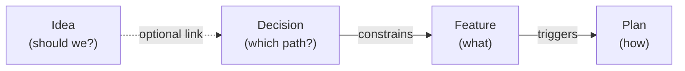
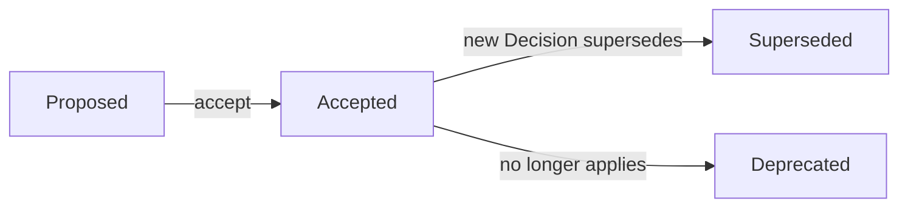

# Feature: Decision

> [View in Synchestra Hub](https://hub.synchestra.io/project/features?id=specscore@synchestra-io@github.com&path=spec%2Ffeatures%2Fdecision) — graph, discussions, approvals

**Status:** Draft
**Source Ideas:** decision-and-decisions-index

## Summary

A decision is a **durable, lintable record of a choice made between two or more options** — what was chosen, why, what was declined, and what consequences were predicted and then observed. Decisions are SpecScore's Architecture-Decision-Record primitive, adapted to SpecScore conventions (markdown-body metadata, REQ blocks, AC blocks, adherence footer).

A decision artifact is a single file at `spec/decisions/<NNNN>-<slug>.md` with fixed header fields and a fixed section schema. Decisions are **immutable once Accepted** — the body is frozen and further change requires a successor decision that supersedes the prior one. One section — `Observed Consequences` — is append-only and remains mutable for post-hoc observations.

## Problem

SpecScore already has artifacts for what will be built (`feature`), how it will be built (`plan`), and whether it is worth building (`idea`). It has no artifact for **which of several paths was chosen and why, captured at the moment of choice, preserved forever**. This creates three problems:

- **Rationale dies in chat.** The reasoning for "why Postgres and not Mongo?" lives in an hour-long Slack thread that no future engineer will find, or in a commit message that nobody cites two years later. When the choice needs to be revisited, the original reasoning is reconstructed from memory — badly.
- **Superseded choices lose their audit chain.** When a team reverses course, the prior reasoning vanishes. Future reviewers cannot tell the difference between "we tried it and it failed" and "we never considered it in the first place."
- **Implementation-time trade-offs have nowhere to live.** An Idea's `Alternatives Considered` section captures *pre-spec* options. Mid-implementation forks (sync vs async, library A vs library B, migrate now vs later) and externally-forced choices (compliance, vendor constraint) do not fit the Idea schema and end up undocumented.

The Decision feature fills that gap with a typed, lintable artifact for "we chose X over Y and Z because …", numbered for citation, immutable once accepted, and superseded — never rewritten — when course changes.

## Design Philosophy

Decisions are the **"which path?"** layer. Features describe desired behavior; Plans describe how to build it; Ideas describe whether a direction is worth committing to; Decisions describe the branch point that was taken and the branches that were declined.



Key tenets:

- **Write at the point of choice.** Retrofitted decisions are vapid. A Decision is authored when the choice is being made — not reconstructed a week later.
- **Declined alternatives are first-class.** The reason a future engineer opens a Decision is usually "why didn't we just do Y?" That answer must already be written.
- **Immutable body, append-only observation.** Once Accepted, the body is frozen forever. `Observed Consequences` is the sole append-only exception — it is where reality gets compared to prediction.
- **Supersede, never rewrite.** Course changes produce a new Decision that points at the old one. The old Decision stays readable as the state of thinking on the date it was accepted.
- **Stable numeric ID.** Decisions are numbered `NNNN-<slug>` for short citation (`D-0007`) in PRs, commits, and prose. Numbers are assigned at creation and never reused.

## Behavior

### Decision location and filename

Decisions live under `spec/decisions/` in the spec repository. Active decisions sit at the top level; superseded and deprecated decisions move to a reserved `archived/` subdirectory:

```text
spec/decisions/
  README.md                      <- decisions index (active)
  0001-<slug>.md                 <- an active decision
  0002-<another-slug>.md
  archived/
    README.md                    <- archived decisions index
    0003-<old-slug>.md           <- superseded or deprecated (Status: Superseded | Deprecated)
```

Unlike Features and Plans, Decisions are **files, not directories**. A Decision has no sub-artifacts.

#### REQ: decision-location

Every Decision artifact MUST reside at `spec/decisions/<NNNN>-<slug>.md` (active) or `spec/decisions/archived/<NNNN>-<slug>.md` (superseded or deprecated). Decisions in `docs/decisions/`, `spec/features/*/decisions/`, or any other location are rejected by validation.

#### REQ: filename-format

Every Decision filename MUST match `<NNNN>-<slug>.md` where `<NNNN>` is a zero-padded four-digit sequence number and `<slug>` is a lowercase, hyphen-separated, URL-safe string. Example: `0007-postgres-over-mongo.md`. Both parts are required — a filename with only the number or only the slug is a validation error.

#### REQ: number-assignment

Decision numbers MUST be assigned sequentially starting at `0001`. The next number is one greater than the highest number currently present in the repository (including Decisions in `archived/`). Gaps are permitted (for example, if a draft file is deleted before commit) but MUST NOT be backfilled by later Decisions — a new Decision always takes the next unused number above the highest existing one.

#### REQ: number-stable

A Decision's number MUST NOT change for any reason — not on archival, not on supersession, not on rename. The number is a citation anchor (`D-0007`) that external artifacts (PRs, commit messages, comments, other Decisions) rely on. Renumbering would break every citation.

#### REQ: slug-format

Decision slugs MUST be lowercase, hyphen-separated, and URL-safe (same pattern as Feature and Idea slugs). A slug is a renameable convenience; a number is the stable ID. Slug changes MUST update the filename AND every reference in the spec tree, but the number MUST NOT change.

#### REQ: single-file

A Decision MUST be a single markdown file. Creating a directory at `spec/decisions/<NNNN>-<slug>/` is a validation error.

### Decision header fields

Decisions use the same markdown-body metadata convention as Features and Ideas — no YAML front-matter. Metadata fields appear as bold-prefixed lines immediately after the title:

```markdown
# Decision: <Decision Title>

**Status:** Proposed
**Date:** YYYY-MM-DD
**Owner:** <author identifier>
**Tags:** — *(optional; comma-separated free-form tags)*
**Source Idea:** — *(optional; slug of originating Idea)*
**Supersedes:** — *(optional; decision ID this one replaces)*
**Superseded By:** — *(managed by tooling; do not edit manually)*
```

#### REQ: title-format

Every Decision README title MUST use the `# Decision: <Title>` format. The `Decision:` prefix is required — it is the dispatch key used by `specscore lint` to select the Decision rule set.

#### REQ: header-fields

Every Decision MUST include `**Status:**`, `**Date:**`, and `**Owner:**` fields immediately after the title, in that order. `**Tags:**`, `**Source Idea:**`, `**Supersedes:**`, and `**Superseded By:**` MUST be present (value `—` when empty), in that order.

#### REQ: id-is-filename

A Decision's canonical ID is `<NNNN>-<slug>` — its filename without `.md`. The short citation form `D-<NNNN>` (e.g. `D-0007`) is the conventional way to refer to a Decision in PRs, commit messages, and prose; it is not a separate field and not enforced by lint.

#### REQ: source-idea-optional

The `**Source Idea:**` field MAY be `—` (no originating Idea) or a single Idea slug. When non-empty, the referenced Idea MUST exist under `spec/ideas/` (active or archived). Multiple source Ideas are not supported in this revision — if a Decision synthesizes more than one Idea, pick the closest and mention the others in `## Context`.

#### REQ: superseded-by-managed

The `**Superseded By:**` field is **managed state**. Tooling populates it when a new Decision is created that references this Decision in its `**Supersedes:**` field. Authors and authoring skills MUST NOT edit it manually. A Decision with `Status: Superseded` MUST have a non-empty `**Superseded By:**`.

### Decision document structure

Every Decision follows this section schema:

```markdown
# Decision: <Decision Title>

**Status:** <status>
**Date:** YYYY-MM-DD
**Owner:** <author>
**Tags:** —
**Source Idea:** —
**Supersedes:** —
**Superseded By:** —

## Context
<What problem forced a choice. What was known at the time.>

## Decision
<The chosen option, stated as a short declarative sentence or two.>

## Rationale
<Why this option was chosen. 1–3 paragraphs.>

## Declined Alternatives
### <Alternative name>
<One-line pitch. Why it lost.>

### <Another alternative>
<One-line pitch. Why it lost.>

## Consequences at Decision Time
<What we expected to follow from this choice — positive and negative. Written at the moment of decision.>

## Observed Consequences
<Append-only dated log of what actually happened. Empty at creation.>

## Affected Features
- <feature-slug>
- <another-feature-slug>
```

#### REQ: required-sections

A Decision MUST include these sections, in this order:

| Section | Required | Notes |
|---|---|---|
| Title (`# Decision: <Title>`) | Yes | `Decision:` prefix required. See [REQ: title-format](#req-title-format). |
| Header fields | Yes | See [REQ: header-fields](#req-header-fields). |
| Context | Yes | What problem forced a choice. |
| Decision | Yes | The chosen option, stated briefly. |
| Rationale | Yes | Why this option won. |
| Declined Alternatives | Yes | See [REQ: declined-alternatives-non-empty](#req-declined-alternatives-non-empty). |
| Consequences at Decision Time | Yes | Written at decision time. Immutable after Accepted. |
| Observed Consequences | Yes | Empty state: "None observed yet." Append-only after Accepted. |
| Affected Features | Yes | May be `None at this time.` when no Features are touched. |

#### REQ: declined-alternatives-non-empty

The `Declined Alternatives` section MUST contain at least one entry. A Decision with no declined alternatives is not a decision — it is a design note that belongs in the Feature README. Each entry MUST be a third-level heading (`### <Alternative name>`) followed by prose explaining the alternative and why it lost.

#### REQ: observed-consequences-placeholder

At creation, the `Observed Consequences` section MUST contain the literal text `None observed yet.` or an equivalent empty-state line. After the first observation is appended, the placeholder is removed.

### Status lifecycle

| Status | Description |
|---|---|
| `Proposed` | Author is drafting; body may change freely. Not yet authoritative. |
| `Accepted` | Decision is in force. Body is frozen except `Observed Consequences`. |
| `Superseded` | A newer Decision replaces this one. File is moved to `spec/decisions/archived/`. `**Superseded By:**` points to the successor. |
| `Deprecated` | Decision is no longer in force but has no successor ("don't follow this anymore"). File is moved to `spec/decisions/archived/`. `**Superseded By:**` remains `—`. |



#### REQ: status-values

The `**Status:**` value MUST be one of: `Proposed`, `Accepted`, `Superseded`, `Deprecated`. Any other value is a validation error.

#### REQ: archived-location

A Decision with `Status: Superseded` or `Status: Deprecated` MUST reside at `spec/decisions/archived/<NNNN>-<slug>.md`. A Decision file at the top level of `spec/decisions/` with either status is a validation error, as is a Superseded or Deprecated file outside that directory. Moving the file is part of the status transition.

#### REQ: superseded-requires-successor

A Decision with `Status: Superseded` MUST have a non-empty `**Superseded By:**` field whose value is an existing Decision ID. A Decision with `Status: Deprecated` MUST have `**Superseded By:**` equal to `—`.

### Immutability

Accepted Decisions are immutable except for the `Observed Consequences` section. This is the feature's central discipline — without it, Decisions stop being trustworthy historical records.

#### REQ: immutability-once-accepted

Once a Decision's `**Status:**` becomes `Accepted`, the body of every section EXCEPT `Observed Consequences` MUST NOT change. Lint MAY enforce this via a body-hash check stored out-of-band, or by treating any edit to an Accepted Decision (other than to `Observed Consequences`, `**Status:**`, or `**Superseded By:**`) as a validation error. Tooling details are left to the implementation; the invariant is non-negotiable.

Editorial fixes (typo corrections, link repair, adherence-footer updates) are a known tension. This revision does NOT carve out an exception; fixes require a successor Decision. If this proves too strict in practice, a future revision may introduce a narrow `editorial` severity for whitespace- and punctuation-only diffs.

#### REQ: observed-consequences-append-only

Edits to the `Observed Consequences` section of an Accepted Decision MUST be additive only. Existing entries MUST NOT be modified or removed. New entries SHOULD be dated (`YYYY-MM-DD — <observation>`). Lint MAY enforce append-only semantics by comparing the section against its prior state; at minimum it MUST NOT flag additions as immutability violations.

### Supersession

A Decision whose choice no longer applies MUST NOT be rewritten. Instead, create a successor:

1. Create a new Decision with the next sequential number, a new slug, and a `**Supersedes:**` field listing the prior Decision's ID.
2. Tooling (or the author, if tooling is absent) transitions the prior Decision to `Status: Superseded`, populates its `**Superseded By:**`, and moves its file to `spec/decisions/archived/`.
3. The successor's `## Context` section SHOULD explain what changed since the prior Decision.

#### REQ: supersedes-target-exists

If a Decision's `**Supersedes:**` field is non-empty, every referenced Decision ID MUST exist (under `spec/decisions/` or `spec/decisions/archived/`). Broken references are rejected by lint.

#### REQ: supersedes-bidirectional

When Decision B lists Decision A in its `**Supersedes:**`, Decision A MUST have `**Superseded By:** <B's ID>` and `**Status:** Superseded`, and MUST reside in `spec/decisions/archived/`. Drift between these fields is a lint error. `specscore lint --fix` MUST reconcile the drift by updating the prior Decision's header fields and moving the file.

### Affected features

The `## Affected Features` section is an author-maintained list of Feature slugs whose behavior this Decision constrains. It is not a managed field — authors update it when the Decision causes a Feature change.

#### REQ: affected-features-target-exists

Every Feature slug listed in `## Affected Features` MUST resolve to a directory under `spec/features/`. Broken references are rejected by lint. Empty state (`None at this time.`) is permitted.

### Adherence footer

#### REQ: adherence-footer

Every Decision document MUST end with an adherence footer per the [Adherence Footer feature](../adherence-footer/README.md). The footer URL MUST be `https://specscore.md/decision-specification`.

### Scaffolding

#### REQ: scaffold-command

The `specscore` CLI MUST provide `specscore new decision <slug>` that scaffolds a skeleton at `spec/decisions/<next-number>-<slug>.md`. Behavior:

- **Number assignment.** The CLI determines the next sequence number per [REQ: number-assignment](#req-number-assignment) and embeds it in the filename. Authors do not supply the number.
- **Pre-population.** Each required section is emitted with an inline HTML-comment prompt describing what belongs there. `Observed Consequences` is pre-populated with `None observed yet.` to satisfy [REQ: observed-consequences-placeholder](#req-observed-consequences-placeholder).
- **Argument injection.** Values supplied via flags (`--title`, `--owner`, `--source-idea`, `--supersedes`, `--tags`, etc.) replace the corresponding prompt with real content.
- **Always lint-clean on exit.** A generated file MUST pass `specscore lint` immediately — the inline prompts and `—` placeholders are designed so an untouched scaffold already validates (with `Status: Proposed`).

#### REQ: authoring-agnostic

Validation MUST NOT depend on authoring provenance. A hand-written Decision and a skill-authored Decision with identical content produce identical lint results.

## Relationship to Other Artifacts

### Decisions and ideas

Decisions and Ideas are **optionally linked, not coupled**. An Idea MAY produce zero, one, or many Decisions; a Decision MAY reference zero or one source Idea.

- An Idea's `Alternatives Considered` is pre-spec thinking. It can exist without any Decision ever being written.
- A Decision is post-choice and durable. It can exist without an Idea (mid-implementation forks, external constraints, reversals).
- The overlap case — an Idea's ideation culminates in a clear choice — produces one Decision with `**Source Idea:** <idea-slug>`.

**When to write a Decision vs put alternatives in an Idea's `Alternatives Considered`:**

- If the choice is still under discussion and no direction has been selected → it belongs in an Idea's `Alternatives Considered`.
- If a direction has been selected and you want that reasoning preserved for future auditors → write a Decision.
- If both are true (you did ideation AND made a choice) → write both: the Idea captures the divergent thinking, the Decision captures the convergent result and stays readable forever.

### Decisions and features

Decisions constrain Features but do not own them. A Feature README MAY cite one or more Decisions by ID in prose. The formal back-link lives only on the Decision side via `## Affected Features`. A formal REQ↔Decision link (where an individual Requirement cites the Decision that produced it) is a plausible future feature; this revision does not introduce it.

### Decisions and outstanding questions

Decisions do not carry an Outstanding Questions section. An Accepted Decision has no open questions — that is the point. Open questions at authoring time belong in the `## Context` section as named unknowns.

## Interaction with Other Features

| Feature | Interaction |
|---|---|
| [Idea](../idea/README.md) | A Decision MAY reference a source Idea via `**Source Idea:**`. The link is optional and one-directional; Ideas are not updated when a Decision cites them. |
| [Feature](../feature/README.md) | A Decision lists constrained Features in `## Affected Features`. Feature READMEs MAY cite Decisions in prose but carry no managed back-link in this revision. |
| [Decisions Index](../decisions-index/README.md) | Every active Decision has a row in `spec/decisions/README.md`. Every Superseded or Deprecated Decision has an entry in `spec/decisions/archived/README.md`. Completeness is enforced by the Decisions-Index feature. |
| [Adherence Footer](../adherence-footer/README.md) | Every Decision ends with a footer delegating to the Adherence Footer feature. URL: `https://specscore.md/decision-specification`. |
| [Document Types Registry](../document-types-registry/README.md) | Decision is a `Document` Kind with URL `https://specscore.md/decision-specification` and Consumer Path `spec/decisions/**/*.md`. Its Index cross-reference is `decisions-index`. |

## Dependencies

- feature
- idea
- adherence-footer
- document-types-registry
- decisions-index

## Acceptance Criteria

### AC: decision-structure

**Requirements:** decision#req:required-sections, decision#req:declined-alternatives-non-empty, decision#req:observed-consequences-placeholder

A Decision file contains all required sections in order, at least one declined alternative with a reason, and either an `Observed Consequences` placeholder (at creation) or dated observation entries (after appends). Any violation is rejected by `specscore lint`.

### AC: decision-header

**Requirements:** decision#req:title-format, decision#req:header-fields, decision#req:id-is-filename, decision#req:status-values, decision#req:source-idea-optional

A Decision carries a valid `# Decision: <Title>` header, the required body-metadata fields in order, a valid `Status` value, and an optional `Source Idea` that resolves to an existing Idea when non-empty. The filename (`NNNN-slug`) is the canonical ID.

### AC: filename-and-numbering

**Requirements:** decision#req:filename-format, decision#req:number-assignment, decision#req:number-stable, decision#req:slug-format, decision#req:single-file

Every Decision filename matches `NNNN-<slug>.md`. Numbers are sequential (gaps permitted, backfills prohibited). Numbers never change. Slugs follow the shared format. Decisions are files, not directories.

### AC: lifecycle

**Requirements:** decision#req:archived-location, decision#req:superseded-requires-successor, decision#req:superseded-by-managed, decision#req:supersedes-target-exists, decision#req:supersedes-bidirectional

Superseded and Deprecated Decisions reside in `spec/decisions/archived/`. Superseded Decisions have non-empty `**Superseded By:**` pointing to an existing successor. `**Supersedes:**` and `**Superseded By:**` remain bidirectionally consistent; drift is a lint error.

### AC: immutability

**Requirements:** decision#req:immutability-once-accepted, decision#req:observed-consequences-append-only

An Accepted Decision's body is immutable except for `Observed Consequences`, which is append-only. Edits to any other section of an Accepted Decision fail lint. Appends to `Observed Consequences` are accepted; modifications or removals of existing entries are rejected.

### AC: affected-features

**Requirements:** decision#req:affected-features-target-exists

Every Feature slug listed in `## Affected Features` resolves to an existing Feature directory. Broken references are rejected. Empty state (`None at this time.`) is permitted.

### AC: adherence-footer

**Requirements:** decision#req:adherence-footer

Every Decision ends with a footer containing the bare URL `https://specscore.md/decision-specification`. Lint matches on the URL, not the prose.

### AC: scaffold-behavior

**Requirements:** decision#req:scaffold-command, decision#req:authoring-agnostic

`specscore new decision <slug>` produces a lint-clean file with the next sequence number assigned. Hand-authored and skill-authored Decisions with identical content produce identical lint results.

## TODO

None at this time.

## Outstanding Questions

- Should lint provide an `editorial` severity carve-out for whitespace- and punctuation-only diffs on Accepted Decisions, or is the strict immutability rule preferred forever? Current position: strict; revisit if dogfooding produces a stream of necessary editorial fixes.
- Should `**Source Idea:**` support a list (multiple Ideas) in a future revision, and if so, how does that interact with Idea `Promotes To` bookkeeping? Current position: single slug only; Decisions synthesizing multiple Ideas mention the others in `## Context`.
- Should a REQ within a Feature be able to cite a Decision as its rationale (e.g. `> Rationale: see D-0007`) via a managed header field, rather than in freeform prose? Current position: prose only in this revision; the managed link is a plausible follow-on feature once usage patterns are visible.

---
*This document follows the https://specscore.md/feature-specification*
