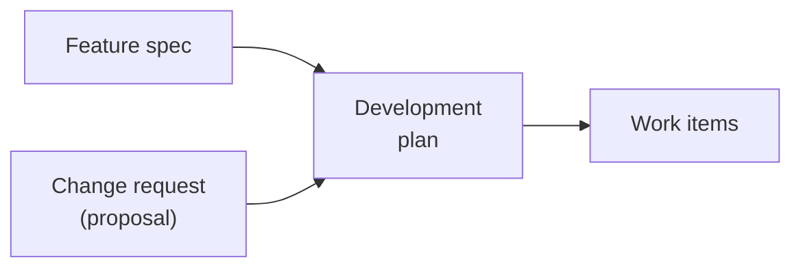
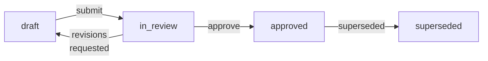
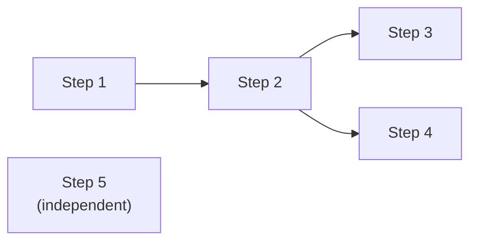
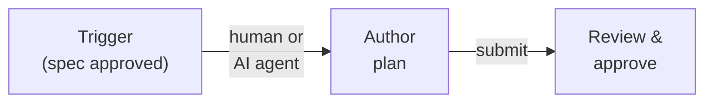
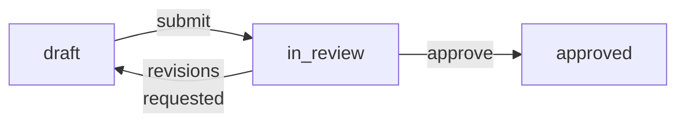

# Feature: Development Plan

**Status:** Conceptual

## Summary

A development plan bridges feature specifications and change requests to executable work items. It is a short, flat, immutable document that captures the approach and rationale for implementing a piece of work. Once approved, it never changes — execution evolves freely while the plan remains a fixed reference point for review and retrospective.

## Problem

Teams have well-defined execution systems — work items, tickets, tasks — but there is no structured way to go from "we know what to build" to "here are the work items to execute."

Today that decomposition happens ad hoc — a human or AI agent reads a feature spec, mentally breaks it into steps, and manually creates work items one by one. This creates three problems:

- **No review gate.** Work begins without explicit approval of the approach. A bad decomposition wastes time and effort.
- **No stable reference.** Work items are designed to be fluid — agents add sub-tasks, humans cancel items, parallel work gets restructured. This fluidity is a feature of execution, but it means there is no fixed record of what was originally planned.
- **No retrospective anchor.** Without a snapshot of intent, you cannot compare what was planned against what actually happened. Lessons learned require a before-and-after.

## Design Philosophy

SpecScore separates **intent** from **execution** by design, with distinct artifacts for each stage of the workflow.

| Artifact | Question it answers | Audience | Mutability | Lives in |
|---|---|---|---|---|
| Feature spec | What do we want? | Product, engineering | Versioned | Spec repo |
| Change request | What should change in an existing feature? | Product, engineering | Versioned until approved | Spec repo |
| Development plan | How will we build it? | Reviewers, planners | Immutable once approved | Spec repo |
| Work items | Who's doing what right now? | Agents, operators | Highly fluid | Execution system |

A **feature spec** defines something new. A **change request** (implemented as a [proposal](../proposals/README.md)) mutates something that already exists. Both are *what* artifacts — they describe desired outcomes. The distinction matters because:

- **New features** start from a blank slate. The plan is unconstrained.
- **Change requests** operate on existing behavior. The plan must account for what is already there — migration paths, backward compatibility, affected dependents. The review process is different: reviewers need to understand the delta, not just the destination.

From the planning pipeline's perspective, both converge to the same output — a development plan that produces work items:



**Why not use the work item tree as the plan?** Work items are designed to be fluid. Agents add sub-items when they discover complexity. Humans cancel items when priorities shift. Parallel work gets restructured on the fly. This fluidity is a feature — it is how real development works. But fluidity is the enemy of reviewability. A human reviewer needs a stable, scannable document to approve before work begins. And after work completes, you need a fixed reference point to compare against.

**No duplicated status tracking.** The plan does not track completion — execution tools do. A progress view can be derived by mapping plan steps to their linked work items and looking up live status. One source of truth, two views: the flat plan view for humans, the deep work item tree for agents.

## Behavior

### Plan location

All plans live under `spec/plans/` in the spec repository:

```text
spec/plans/
  README.md              <- index of all plans
  {plan-slug}/
    README.md            <- the plan document
```

`{plan-slug}` is a URL/path-safe identifier (e.g., `add-batch-mode`, `user-auth`).

#### REQ: plan-directory

Every plan MUST reside in a dedicated directory under `spec/plans/` with a `README.md` file as the plan document.

#### REQ: plan-slug-format

Plan slugs MUST be lowercase, hyphen-separated, and URL-safe. Underscores, spaces, and special characters MUST NOT be used.

#### REQ: features-field-uniform

Every plan MUST list its affected features in the header. There is no distinction between single-feature and multi-feature plans — every plan uniformly declares the features it touches.

### Plan document structure

```markdown
# Plan: Add batch mode to CLI

**Status:** approved
**Features:**
  - [cli](../../features/cli/README.md)
**Source type:** feature
**Source:** [CLI feature spec](../../features/cli/)
**Author:** @alex
**Approver:** @jordan
**Created:** 2026-03-14
**Approved:** 2026-03-15

## Context

Why this plan exists. Links to the feature spec or the approved change
request (proposal) that triggered it. 2-5 sentences establishing the
problem and the high-level approach chosen.

## Acceptance criteria

- All new CLI flags appear in help output
- End-to-end test: batch file with 100 items completes in under 10s
- No breaking changes to existing single-item flow

## Steps

### 1. Define batch input schema

Establish the YAML/JSON schema for batch input files. This determines
the contract for all downstream steps.

**Depends on:** (none)
**Produces:**
  - `batch-input-schema.json` — JSON Schema definition

**Acceptance criteria:**
- Schema validates all example inputs from the feature spec
- Schema rejects malformed inputs with actionable error messages

### 2. Implement batch parser

Parse and validate batch input files against the schema.

**Depends on:** Step 1
**Produces:**
  - Batch parser module

**Acceptance criteria:**
- Validates input against schema from Step 1; rejects invalid files
  with per-field error messages
- Handles files up to 50MB without exceeding 256MB memory

#### 2.1. Add streaming support

For large batch files, parse line-by-line rather than loading into
memory.

**Acceptance criteria:**
- Files over 10MB are streamed; memory stays under 256MB regardless of
  file size

### 3. Update CLI entry point

Add `--batch <file>` flag and wire it to the parser.

**Depends on:** Step 2

**Acceptance criteria:**
- Help output shows `--batch` flag with description
- `--batch` and positional arguments are mutually exclusive with a
  clear error message

## Dependency graph

Step 1 --> Step 2 --> Step 3

## Risks and open decisions

- Batch files over 10MB may need streaming — Step 2.1 addresses this
  but we may discover additional memory constraints.
- Error reporting granularity: per-item or fail-fast? Defaulting to
  per-item with `--fail-fast` flag.

## Outstanding Questions

None at this time.
```

#### REQ: plan-title-format

Every plan document MUST use the `# Plan: {Title}` format for its title. The `Plan:` prefix is required.

#### REQ: plan-required-sections

Every plan document MUST include the following sections: title (`# Plan: X`), header metadata fields, Context, Acceptance criteria, and Steps. A Dependency graph section and Risks and open decisions section are OPTIONAL.

### Header fields

| Field | Required | Description |
|---|---|---|
| **Status** | Yes | Current plan status (see [Plan statuses](#plan-statuses)) |
| **Features** | Yes | List of affected features, each linking to its feature spec README |
| **Source type** | Yes | `feature` or `change-request` |
| **Source** | Yes | Link to the originating feature spec or approved proposal |
| **Author** | Yes | Who wrote the plan |
| **Approver** | On approval | Who approved the plan |
| **Created** | Yes | Date the plan was created |
| **Approved** | On approval | Date the plan was approved |
| **Effort** | No | `S` \| `M` \| `L` \| `XL` — see [Optional ROI metadata](#optional-roi-metadata) |
| **Impact** | No | `low` \| `medium` \| `high` \| `critical` — see [Optional ROI metadata](#optional-roi-metadata) |

#### REQ: required-header-fields

Every plan MUST include these header fields: Status, Features, Source type, Source, Author, and Created. The Approver and Approved fields MUST be present when the plan status is `approved`. Effort and Impact are OPTIONAL.

#### REQ: source-type-values

The Source type field MUST be either `feature` or `change-request`. No other values are permitted.

#### REQ: proposal-forward-reference

When a plan is triggered by a change request (proposal), the Source field MUST link directly to the proposal. The proposal in turn MUST include a forward reference to the plan.

When a plan is triggered by a change request (proposal), the **Source** field links directly to the proposal. The proposal in turn gets a forward reference to the plan:

```markdown
# Proposal: Deprecate v1 endpoints

| Field  | Value                                             |
|--------|---------------------------------------------------|
| Status | `approved`                                        |
| Plan   | [migrate-to-v2](../../../plans/migrate-to-v2/)    |
```

### Plan statuses

| Status | Description |
|---|---|
| `draft` | Plan is being written, not ready for review |
| `in_review` | Submitted for human review |
| `approved` | Reviewed and approved — work items can be generated |
| `superseded` | Replaced by a newer plan (includes link to successor) |

Plans do not have `completed` or `failed` statuses — those are execution concerns. A plan is either the current approved approach (`approved`) or it has been replaced (`superseded`).

#### REQ: valid-statuses

A plan's Status field MUST be one of: `draft`, `in_review`, `approved`, or `superseded`. No other values are permitted.

#### REQ: no-execution-status

Plans MUST NOT carry `completed` or `failed` statuses. Completion tracking is an execution concern, not a plan concern.

### Status transitions



#### REQ: status-transitions

Plan status transitions MUST follow these rules: `draft` MAY transition to `in_review`; `in_review` MAY transition back to `draft` (revisions requested) or forward to `approved`; `approved` MAY transition only to `superseded`. No other transitions are permitted.

### Immutability after approval

Once a plan reaches `approved`, its content is frozen. The freeze is a convention that can be enforced by tooling (e.g., pre-commit hooks, linters, or orchestration tools).

If the approach needs to change after approval, create a new plan that supersedes the current one rather than editing the approved plan. The superseded plan remains as a historical record.

#### REQ: immutability-after-approval

Once a plan reaches `approved` status, its content MUST NOT be modified. If the approach needs to change, a new plan MUST be created that supersedes the approved plan. The original plan MUST remain as a historical record.

### Nesting limit

Plans support a maximum of **two levels** of nesting: steps (level 1) and sub-steps (level 2, e.g., "2.1"). Anything deeper is execution detail that belongs in work item decomposition, not the plan.

This constraint is intentional — it keeps plans scannable. A reviewer should be able to read the full plan in under two minutes.

#### REQ: nesting-limit

Plan steps MUST NOT exceed two levels of nesting: steps (level 1) and sub-steps (level 2, e.g., "2.1"). Deeper nesting MUST be deferred to work item decomposition.

### Steps and dependencies

Steps that do not declare a `Depends on` field may execute in parallel. The dependency graph determines the critical path.

For complex plans, an optional **Dependency graph** section visualizes the parallelism:



This section is optional — useful for complex plans, noise for simple sequential ones.

#### REQ: parallel-eligibility

Steps that do not declare a `Depends on` field MUST be treated as parallel-eligible. The dependency graph determines the critical path; steps without dependencies MAY execute concurrently.

### Plan-level and step-level acceptance criteria

Acceptance criteria appear at two levels:

- **Plan-level** (the `## Acceptance criteria` section): cross-cutting criteria that span multiple steps. These inform integration and end-to-end tests.
- **Step-level** (within each step): criteria specific to that step's deliverable. These inform unit and component tests.

Both levels can be consumed by execution tools to populate work item descriptions, giving agents and test authors clear targets.

#### REQ: two-level-acceptance-criteria

Plans MUST support acceptance criteria at two levels: plan-level (cross-cutting, in the `## Acceptance criteria` section) and step-level (per-step deliverables, inline within each step). Both levels are consumed by execution tools.

Acceptance criteria can also use a subdirectory format for complex criteria:

**Inline (simple).** Include them directly in the plan as bullet points. Suitable for straightforward criteria that fit in a line or two.

**Subdirectory (complex).** For criteria that require scripts, multiple test cases, or extensive documentation, create `spec/plans/{plan-slug}/acs/{ac-slug}/` directories:

```
spec/plans/user-auth/
  README.md
  acs/
    end-to-end-test/
      README.md          # Describes the test
      script.sh          # Test implementation
      fixtures/
        ...
    security-audit/
      README.md
      checklist.md
```

This allows criteria to be as simple or as complex as needed without cluttering the plan document.

### Plan hierarchy

Plans can nest to mirror the feature tree convention. A **roadmap** is a parent plan that defines ordering between child plans. A **child plan** has the same format as today's standalone plans. A **standalone plan** (no children) works exactly as before.

#### Directory structure

```text
spec/plans/
  README.md                          <- index
  chat-feature/
    README.md                        <- roadmap plan (parent)
    chat-infrastructure/
      README.md                      <- child plan
    chat-workflow-engine/
      README.md                      <- child plan
  e2e-testing-framework/
    README.md                        <- standalone plan (no children)
```

#### REQ: roadmap-no-steps

A roadmap (parent plan) MUST NOT have implementation steps. Its Steps section MUST be replaced by a Child Plans table listing child plans with their relationships.

#### REQ: child-plan-format

A child plan MUST follow the same format as a standalone plan, including steps and acceptance criteria.

#### REQ: hierarchy-nesting-limit

Plan hierarchy MUST NOT exceed two levels: roadmap (parent) and child plan. Deeper nesting MUST be deferred to work item decomposition.

#### Roadmap document structure

```markdown
# Plan: Chat Feature Roadmap

**Status:** draft
**Features:**
  - [chat](../../features/chat/README.md)
  - [chat/workflow](../../features/chat/workflow/README.md)
**Source type:** feature
**Source:** [Chat feature spec](../../features/chat/)
**Author:** @alex
**Created:** 2026-03-24
**Effort:** XL
**Impact:** critical

## Context

High-level roadmap for the Chat feature. Decomposes into sequential
phases, each with its own child plan.

## Acceptance criteria

- All child plans completed
- Chat feature status moves to Stable

## Child Plans

| Order | Plan | Status | Effort | Impact |
|-------|------|--------|--------|--------|
| 1 | [chat-infrastructure](chat-infrastructure/) | draft | L | high |
| 2 | [chat-workflow-engine](chat-workflow-engine/) | draft | M | high |
```

### Roadmap status derivation

A roadmap's status is derived from its children:

| Condition | Derived status |
|---|---|
| At least one child is `draft` | `draft` |
| All children are `in_review` or `approved` | `in_review` |
| All children are `approved` | `approved` |
| At least one child plan has linked work items in progress | `in_progress` |
| Explicitly set when the roadmap is replaced | `superseded` |

#### REQ: roadmap-status-derivation

A roadmap's status MUST be derived from the statuses of its child plans according to these rules: if at least one child is `draft`, the roadmap is `draft`; if all children are `in_review` or `approved`, the roadmap is `in_review`; if all children are `approved`, the roadmap is `approved`; if at least one child has linked work items in progress, the roadmap is `in_progress`; the roadmap MAY be explicitly set to `superseded` when replaced.

### Optional ROI metadata

Two optional fields can be added to the plan document header:

```markdown
**Effort:** S | M | L | XL
**Impact:** low | medium | high | critical
```

Both fields are **optional**. When absent, tooling may infer effort from step count, dependency depth, and acceptance criteria complexity. It may infer impact from feature importance and downstream dependents. During plan authoring, the tooling **suggests** values. The user accepts, declines, or overwrites.

For roadmaps, effort/impact describe the aggregate. Child plans carry independent estimates.

#### REQ: effort-values

When present, the Effort field MUST be one of: `S`, `M`, `L`, or `XL`.

#### REQ: impact-values

When present, the Impact field MUST be one of: `low`, `medium`, `high`, or `critical`.

#### Effort scale

| Effort | Rough meaning |
|--------|---------------|
| S | A few hours of focused work, 1-3 steps |
| M | A few days, 3-6 steps, limited dependencies |
| L | A week or more, 5-10 steps, cross-cutting |
| XL | Multi-week, many steps, multiple child plans or deep dependencies |

#### Impact scale

| Impact | Rough meaning |
|--------|---------------|
| low | Nice-to-have, no users blocked |
| medium | Improves existing capability, some users benefit |
| high | Enables important new capability, many users benefit |
| critical | Unblocks core functionality or other critical work |

### Plans index

`spec/plans/README.md` lists all plans:

```markdown
# Plans

| Plan | Status | Features | Effort | Impact | Author | Approved |
|---|---|---|---|---|---|---|
| [chat-feature](chat-feature/) | draft | chat, chat/workflow | XL | critical | @alex | - |
| &ensp;[chat-infrastructure](chat-feature/chat-infrastructure/) | draft | chat | L | high | @alex | - |
| &ensp;[chat-workflow-engine](chat-feature/chat-workflow-engine/) | draft | chat/workflow | M | high | @alex | - |
| [user-auth](user-auth/) | approved | api, ui/hub | M | high | @alex | 2026-03-15 |
| [add-batch-mode](add-batch-mode/) | in_review | cli | S | medium | @alex | - |
| [refactor-output](refactor-output/) | superseded | cli | - | - | @alex | - |

## Recently Closed

| Plan                     | Status     | Completed  |
|--------------------------|------------|------------|
| [old-auth](old-auth/)    | superseded | 2026-03-10 |

## Outstanding Questions

None at this time.
```

#### REQ: index-completeness

The plans index (`spec/plans/README.md`) MUST list every plan. An unlisted plan is a validation error.

#### REQ: index-child-indentation

Child plans in the index MUST be indented with `&ensp;` and their link paths MUST include the parent directory (e.g., `chat-feature/chat-infrastructure/`).

#### REQ: index-roi-columns

The plans index MUST include Effort and Impact columns. When ROI metadata is absent from a plan, the column value MUST display `-`.

#### REQ: index-recently-closed

The plans index MUST include a Recently Closed section showing completed or superseded plans from the last N plans (configurable per project, default: 5).

### Feature README back-reference

Each affected feature's README includes a **Plans** section linking to plans that touch it. Features can reference both roadmaps and child plans — the path disambiguates:

```markdown
## Plans

| Plan                                                                  | Status    | Author | Approved   |
|-----------------------------------------------------------------------|-----------|--------|------------|
| [chat-feature](../../plans/chat-feature/)                             | draft     | @alex  | -          |
| [chat-infrastructure](../../plans/chat-feature/chat-infrastructure/)  | draft     | @alex  | -          |
| [user-auth](../../plans/user-auth/)                                   | approved  | @alex  | 2026-03-15 |
| [add-batch-mode](../../plans/add-batch-mode/)                         | in_review | @alex  | -          |
```

A feature appearing in both a roadmap and its child plan is valid — the roadmap covers it broadly, the child plan implements a slice. A feature linked only to a roadmap (no child plan yet) signals "planned but not decomposed."

#### REQ: feature-back-reference

Each affected feature's README MUST include a Plans section with a table linking to plans that touch it. The table MUST include columns for Plan, Status, Author, and Approved.

### Step artifacts

An artifact is a named output that a step produces. It is not code (code lives in code repos on branches). It is the metadata, decisions, schemas, and intermediate results that downstream steps need to do their work.

Examples:

| Artifact | Produced by | Consumed by |
|---|---|---|
| JSON Schema definition | "Define data model" step | "Implement endpoints" step, "Build UI" step |
| API contract (OpenAPI snippet) | "Design API" step | "Implement client" step, "Write integration tests" step |
| Migration plan | "Analyze existing data" step | "Write migration script" step |
| Architecture decision record | "Evaluate auth approach" step | All downstream steps |
| Test fixtures / seed data | "Generate test data" step | Any step running tests |

#### REQ: artifact-declaration

Plan steps that produce outputs SHOULD declare them using the `**Produces:**` field with a bulleted list of named artifacts and their descriptions.

#### REQ: artifact-dependency-flow

When a step depends on another step, it MUST have access to that step's declared artifacts. The dependency is made explicit through the `Depends on` and `Produces` fields.

## Workflow

The planning pipeline has three stages. Each can be performed by a human or an AI agent.



### Stage 1: Trigger

Something initiates the need for a plan:

| Trigger | Source |
|---|---|
| New feature spec approved | `spec/features/{feature}/README.md` |
| Change request (proposal) approved | `spec/features/{feature}/proposals/{proposal}/` |
| Manual request | Human decides work is needed |

If auto-planning is enabled in the project configuration, tooling can automatically create a `draft` plan when a feature spec or proposal reaches `approved` status. If disabled (the default), a human or external tool initiates plan creation explicitly.

### Stage 2: Author the plan

The plan author (human or AI agent) writes the plan document following the structure defined above.

**When authored by a human:** Write the markdown directly. The spec tooling scaffolds the directory and template.

**When authored by an AI agent:** The agent receives the feature spec or approved proposal as input context, along with relevant codebase context, and produces the plan document. The agent should have access to:

- The feature spec or approved proposal
- Existing codebase structure (for change requests)
- Other active plans (to avoid conflicts)
- Project conventions

### Stage 3: Review and approve



The review process transitions the plan from `draft` to `in_review`, and upon approval sets the status to `approved`, records the approver and approval date, and freezes the plan content.

### After approval: Execution handoff

Once approved, the plan's steps can be consumed by execution tools to generate work items. The exact mechanism depends on the orchestration tool used. For Synchestra integration, see [synchestra.io](https://synchestra.io).

Execution is handled by the orchestration tool, not SpecScore. The plan remains a frozen reference during execution.

## Integration with Execution Tools

Plan steps can be mapped to execution units (tasks, work items) by orchestration tools. SpecScore defines the plan format; execution tools consume it.

Key integration points:

- Each plan step can carry metadata (like a step identifier) that execution tools use to create and link work items.
- `Depends on` fields in the plan map to dependency relationships in the execution system.
- Acceptance criteria from plan steps can be copied into generated work item descriptions.

## Retrospective

Once all steps reach terminal states, a deviation report can compare planned vs actual:

- **Planned steps** vs. **actual work items** — were steps added, removed, or split?
- **Planned dependencies** vs. **actual execution order**
- **Planned acceptance criteria** vs. **outcomes**
- **Time estimates** (if provided) vs. **actual durations**

The report is a learning artifact. It can be stored alongside the plan:

```
spec/plans/{plan-slug}/
  README.md             <- the plan
  reports/
    README.md           <- deviation report
```

## What's Next Report

The What's Next report is an AI-generated prioritization document that surfaces what to work on next based on plan statuses, dependencies, and ROI metadata.

### Location

`spec/plans/WHATS-NEXT.md`

### Report structure

```markdown
# What's Next

**Generated:** 2026-03-24
**Mode:** incremental | full

## Completed Since Last Update

- [chat-infrastructure](chat-feature/chat-infrastructure/) — completed 2026-03-20

## In Progress

- [hero-scene](hero-scene/) — 2/4 steps done, no blockers

## Recommended Next

1. **[chat-workflow-engine](chat-feature/chat-workflow-engine/)** — Impact: high,
   Effort: M. Unblocked by chat-infrastructure completion. Advances the
   highest-impact roadmap.
2. **[agent-skills-roadmap](agent-skills-roadmap/)** — Impact: medium, Effort: L.
   No blockers, independent of current momentum.

### Reasoning

Brief AI explanation of prioritization — dependency unlocks, ROI ratio,
momentum, competing priorities.

## Outstanding Questions

(ambiguities the AI surfaced during analysis)
```

### Update mechanism

- **Trigger:** plan completion events or status transitions.
- **Incremental mode:** reads previous `WHATS-NEXT.md` + the completion delta. Regenerates only affected sections. Minimizes token usage.
- **Full mode:** scans all features, plans, and statuses. Used for initial generation or to correct incremental drift.
- The file is **committed to git** after each update, providing a history of how priorities evolved over time.

### Prioritization inputs

The AI considers these signals in order of priority:

1. Explicit ROI metadata (effort/impact) when present
2. Dependency graph — what is newly unblocked by recent completions
3. Momentum — preference for advancing roadmaps already in progress
4. Feature status — features closer to "stable" get a boost
5. AI inference from plan complexity when ROI metadata is absent

## Project Configuration

Planning settings are configured in the project definition file. See [Project Definition](../project-definition/README.md).

## Interaction with Other Features

| Feature | Interaction |
|---|---|
| [Feature](../feature/README.md) | Features are the source artifacts that trigger plans. Plans list affected features; features back-reference active plans in their README. |
| [Requirement](../requirement/README.md) | Requirements are `#### REQ:` subsections within a feature's Behavior section. Development plan REQs define the rules for plan structure and lifecycle. |
| [Acceptance Criteria](../acceptance-criteria/README.md) | Plan-level and step-level ACs follow the same format as feature ACs but are frozen with the plan. |
| [Scenario](../scenario/README.md) | Scenarios in `_tests/` validate development plan REQs with concrete Given/When/Then flows. |
| [Proposals](../proposals/README.md) | A proposal (change request) is a trigger for plan creation. Approved proposals link forward to their plan; plans link back to their source proposal. |
| [Outstanding Questions](../outstanding-questions/README.md) | Plan steps may surface outstanding questions. These follow the existing question lifecycle. |

## Acceptance Criteria

### AC: plan-document-validity

**Requirements:** development-plan#req:plan-title-format, development-plan#req:plan-required-sections, development-plan#req:required-header-fields, development-plan#req:source-type-values

A plan document has a correctly formatted title (`# Plan: {Title}`), all required sections present (Context, Acceptance criteria, Steps), all required header fields populated (Status, Features, Source type, Source, Author, Created), and a valid Source type value (`feature` or `change-request`). A document that violates any of these is rejected by validation.

### AC: plan-location-validity

**Requirements:** development-plan#req:plan-directory, development-plan#req:plan-slug-format, development-plan#req:features-field-uniform

A plan resides in a dedicated directory under `spec/plans/` with a slug-formatted name and a `README.md` file. The plan uniformly declares all affected features in its header regardless of how many features are touched.

### AC: status-lifecycle

**Requirements:** development-plan#req:valid-statuses, development-plan#req:no-execution-status, development-plan#req:status-transitions

A plan's status is always one of `draft`, `in_review`, `approved`, or `superseded`. Status transitions follow the defined state machine. Plans never carry execution-level statuses like `completed` or `failed`.

### AC: approved-plan-frozen

**Requirements:** development-plan#req:immutability-after-approval

An approved plan's content cannot be modified. Changes require creating a new superseding plan. The original remains as a historical record.

### AC: plan-structure-constraints

**Requirements:** development-plan#req:nesting-limit, development-plan#req:parallel-eligibility, development-plan#req:two-level-acceptance-criteria

Plan steps use at most two levels of nesting (steps and sub-steps). Steps without `Depends on` are parallel-eligible. Acceptance criteria exist at both plan-level and step-level.

### AC: hierarchy-validity

**Requirements:** development-plan#req:roadmap-no-steps, development-plan#req:child-plan-format, development-plan#req:hierarchy-nesting-limit, development-plan#req:roadmap-status-derivation

Roadmaps have a Child Plans table instead of implementation steps. Child plans follow the standard plan format. Hierarchy does not exceed two levels. Roadmap status is derived from child plan statuses.

### AC: index-validity

**Requirements:** development-plan#req:index-completeness, development-plan#req:index-child-indentation, development-plan#req:index-roi-columns, development-plan#req:index-recently-closed

The plans index lists every plan, indents child plans with `&ensp;`, includes Effort and Impact columns (showing `-` when absent), and has a Recently Closed section.

### AC: cross-artifact-links

**Requirements:** development-plan#req:feature-back-reference, development-plan#req:proposal-forward-reference

Affected features back-reference plans in a Plans table. Proposals triggered by change requests include forward references to their plans. Bidirectional traceability is maintained.

## Outstanding Questions

- How should plan steps reference specific sections of a feature spec when the plan implements only part of a feature?
- What is the exact format for the plan step reference — should it be structured metadata (YAML frontmatter) or a markdown convention (as shown in examples)?
- Should the deviation report be generated automatically when all steps complete, or only on demand?
