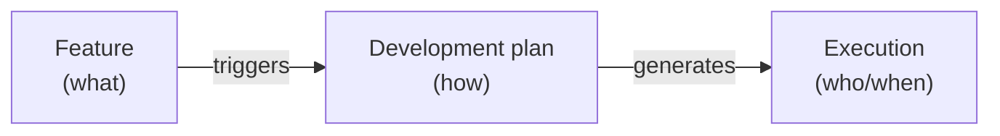
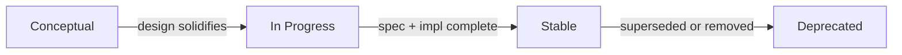
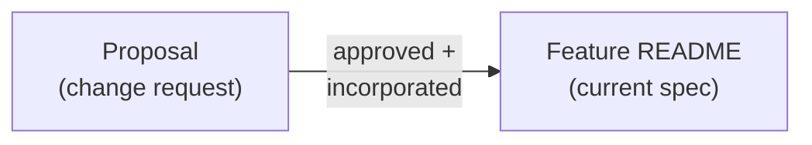
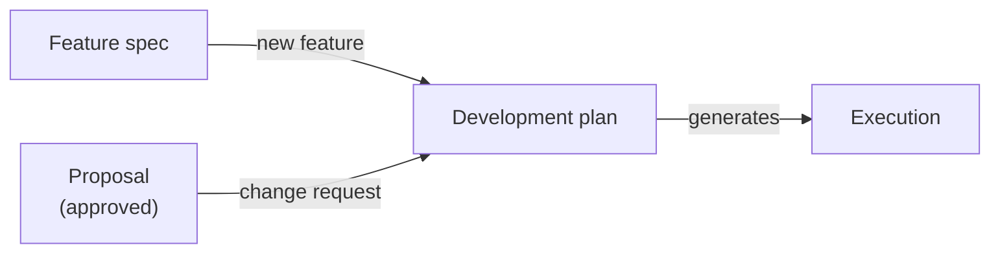

# Feature: Feature

**Status:** Conceptual

## Summary

A feature is the atomic unit of product specification in SpecScore. It describes a capability the product should have — what it does, why it matters, and how it behaves. Features live in the spec repository under `spec/features/` as directories with a mandatory `README.md`. They can nest (sub-features), accept change requests via [proposals](../proposals/README.md), trigger [development plans](../development-plan/README.md), and drive execution through task management tools.

This specification defines the structure, metadata, lifecycle, and conventions that every feature must follow.

## Problem

Projects that use structured specifications often have implicit conventions — scattered across contributor guides, root README files, and learned by example. There is no single document that answers:

- What must a feature directory contain?
- What metadata does a feature carry?
- What is a feature's lifecycle?
- How do features relate to plans, proposals, and tasks?

Without a formal definition, new features are created inconsistently, AI agents cannot reliably navigate the feature tree, and validation tools have nothing to validate against.

## Design Philosophy

Features are the **"what"** layer of a specification. They describe desired product behavior — not how to build it (that is the [development plan](../development-plan/README.md)'s job) and not who is building it right now (that is execution/task management's job).



Features are **living documents**. Unlike development plans, which are frozen once approved, a feature spec evolves as proposals are accepted and incorporated. The feature README always reflects the current desired behavior — not a historical snapshot.

## Behavior

### Feature location

Features live under `spec/features/` in the spec repository:

```
spec/features/
  README.md                     <- feature index
  {feature-slug}/
    README.md                   <- feature specification
    _acs/                       <- acceptance criteria (optional)
      {ac-slug}.md
    _tests/                     <- feature-scoped test scenarios (optional)
      {scenario-slug}.md
      flows/
    proposals/                  <- change requests (optional)
      README.md
      {proposal-slug}/
        README.md
    {sub-feature-slug}/         <- sub-feature (optional)
      README.md
```

### REQ: directory-readme

Every feature directory MUST contain a `README.md` file. This file is the feature specification — the single source of truth for what the feature does and how it behaves.

**AC:** [directory-readme](_acs/directory-readme.md)

### REQ: slug-format

Feature slugs MUST be lowercase, hyphen-separated, and URL-safe. Underscores, spaces, and special characters are not permitted.

Examples of valid slugs: `claim-and-push`, `model-selection`, `ui`, `source-references`.

**AC:** [slug-format](_acs/slug-format.md)

### Reserved `_` prefix convention

Directories prefixed with `_` are reserved for SpecScore tooling and extensions:

| Directory | Purpose | Spec |
|---|---|---|
| `_acs/` | Acceptance criteria | [Acceptance Criteria](../acceptance-criteria/README.md) |
| `_args/` | Argument documentation | Extension point for CLI tooling |
| `_tests/` | Feature-scoped test scenarios | [Scenario](../scenario/README.md) |

### REQ: underscore-reserved

Directories prefixed with `_` are NOT sub-features. They MUST be excluded from the feature index and Contents table.

**AC:** [underscore-reserved](_acs/underscore-reserved.md)

### Feature README structure

Every feature README follows this template:

```markdown
# Feature: {Title}

**Status:** {status}

## Summary

One to three sentences describing the feature's purpose.

## Contents

(Only if the feature has sub-features or child directories)

| Directory   | Description                     |
|-------------|---------------------------------|
| [child/](child/README.md) | Brief description of the child |

### child

1-7 sentence summary of each child directory.

## Problem

Why this feature exists. What gap or pain point it addresses.

## Behavior

How the feature works. The bulk of the spec — structure, rules,
examples, edge cases. Individual rules use the `### REQ: {slug}`
convention. See [Requirement](../requirement/README.md).

## Interaction with Other Features

(Optional) How this feature relates to other features.

## Dependencies

- feature-slug-1
- feature-slug-2

(Or omit the section entirely if the feature is independent.)

## Acceptance Criteria

Not defined yet.

(Or: a table of ACs when defined.)

## Outstanding Questions

- Question 1
- Question 2

(Or: "None at this time." — the section is never omitted.)
```

### REQ: title-format

Every feature README title MUST use the `# Feature: {Title}` format. The `Feature:` prefix is required.

**AC:** [title-format](_acs/title-format.md)

### REQ: status-field

A `**Status:**` field MUST appear immediately after the title. The value MUST be one of: `Conceptual`, `In Progress`, `Stable`, `Deprecated`.

**AC:** [status-field](_acs/status-field.md)

### REQ: required-sections

Every feature README MUST include these sections:

| Section                 | Required    | Notes                                                             |
|-------------------------|-------------|-------------------------------------------------------------------|
| Title (`# Feature: X`) | Yes         | Always prefixed with `Feature:`                                   |
| Status                  | Yes         | Immediately after the title                                       |
| Summary                 | Yes         | 1-3 sentences                                                     |
| Contents                | Conditional | Required when the feature has child directories                   |
| Problem                 | Yes         | Why the feature exists                                            |
| Behavior                | Yes         | How the feature works                                             |
| Proposals               | Conditional | Present when the feature has a `proposals/` directory             |
| Plans                   | Conditional | Present when a [development plan](../development-plan/README.md) touches this feature |
| Acceptance Criteria     | Yes         | Always present. See [REQ: ac-section](#req-ac-section).           |
| Outstanding Questions   | Yes         | Always present. See [REQ: outstanding-questions](#req-outstanding-questions). |

**AC:** [required-sections](_acs/required-sections.md)

### Optional sections

Features MAY include additional sections as needed:

| Section                         | When to use                                              |
|---------------------------------|----------------------------------------------------------|
| Dependencies                    | When the feature depends on other features. A bullet list of feature IDs. Consumed by spec tooling. Omit if independent. |
| Design Principles               | When the feature has guiding architectural constraints    |
| Interaction with Other Features | When the feature has notable dependencies or touchpoints  |
| Configuration                   | When the feature introduces project settings              |

### REQ: outstanding-questions

The Outstanding Questions section MUST always be present in every feature README. If there are no open questions, it MUST explicitly state "None at this time." The section MUST NOT be omitted.

**AC:** [outstanding-questions](_acs/outstanding-questions.md)

### REQ: ac-section

The Acceptance Criteria section MUST always be present in every feature README. When no ACs are defined, it MUST state "Not defined yet." and a corresponding Outstanding Question ("Acceptance criteria not yet defined for this feature.") MUST be raised.

**AC:** [ac-section](_acs/ac-section.md)

### REQ: contents-when-children

When a feature has child directories (sub-features), its README MUST include a Contents section with:

1. An index table listing each child directory with a description
2. A 1-7 sentence summary for each child, giving readers context without requiring them to open each child

**AC:** [contents-when-children](_acs/contents-when-children.md)

### Feature statuses

| Status        | Description                                                                   |
|---------------|-------------------------------------------------------------------------------|
| `Conceptual`  | Feature is described at a high level; design decisions remain open             |
| `In Progress` | Feature is actively being specified and/or implemented                         |
| `Stable`      | Feature is fully specified and implemented; changes go through proposals       |
| `Deprecated`  | Feature is being phased out; a successor or removal plan exists                |



These statuses describe the feature's **specification maturity**, not its implementation progress. A feature can be `Stable` in spec while its implementation is still in development — the spec is the source of truth for desired behavior.

### Feature nesting (sub-features)

Features can contain sub-features as child directories. Each sub-feature is a full feature with its own `README.md`, status, and lifecycle.

```
spec/features/ui/
  README.md                  <- parent feature
  hub/
    README.md                <- sub-feature
  tui/
    README.md                <- sub-feature
```

### REQ: path-identification

Features MUST be identified by their path relative to `spec/features/`. This path is the canonical identifier used in development plans, source references, and spec tooling.

**AC:** [path-identification](_acs/path-identification.md)

| Feature path                      | Identifier          |
|-----------------------------------|---------------------|
| `spec/features/authentication/`   | `authentication`    |
| `spec/features/billing/payments/` | `billing/payments`  |
| `spec/features/user-management/`  | `user-management`   |

### Feature index

The feature index (`spec/features/README.md`) is the entry point for understanding the product's planned capabilities. It contains:

1. An **Index** table with columns: Feature, Status, Description
2. A **Feature Summaries** section with a paragraph per feature
3. A **Feature dependency graph** showing relationships
4. An **Outstanding Questions** section

### REQ: index-completeness

The feature index (`spec/features/README.md`) MUST list every top-level feature. An unlisted feature is a validation error.

**AC:** [index-completeness](_acs/index-completeness.md)

## Relationship to Other Artifacts

### Features and proposals

[Proposals](../proposals/README.md) are change requests attached to a feature. They live under `{feature}/proposals/` and follow the proposal lifecycle (`draft -> submitted -> approved -> implemented`). A proposal is non-normative until its content is incorporated into the feature's main README.



### Features and development plans

[Development plans](../development-plan/README.md) bridge features to execution. A plan is triggered by either a new feature spec or an approved proposal. Plans live separately in `spec/plans/` but reference the features they affect.

Every plan lists its affected features in its header. Each affected feature's README includes a **Plans** section back-referencing active plans.



### Features and execution

Features do not directly reference execution units. The development plan bridges specifications to execution.

### Features and outstanding questions

Every feature maintains an [Outstanding Questions](../outstanding-questions/README.md) section. Questions follow the standard question lifecycle defined by the Outstanding Questions feature.

## Tooling Support

SpecScore features can be queried programmatically by spec-aware tools:

- **Feature info** — Retrieve structured metadata (status, parent, children, dependency counts) plus section table-of-contents with line ranges.
- **Feature list** — Flat listing of all feature IDs.
- **Feature tree** — Hierarchical view with optional focus and direction.
- **Feature deps/refs** — Dependency and reverse-dependency traversal.

For Synchestra integration, see [synchestra.io](https://synchestra.io) CLI documentation.

## Configuration

Feature behavior is configured through the project definition file. See [Project Definition](../project-definition/README.md) for available settings.

## Interaction with Other Features

| Feature | Interaction |
|---------|-------------|
| [Proposals](../proposals/README.md) | Proposals attach change requests to features. Features display recent proposals in their README. |
| [Development Plan](../development-plan/README.md) | Plans reference features they affect. Features back-reference active plans. |
| [Requirement](../requirement/README.md) | Requirements are named subsections (`### REQ:`) within a feature's Behavior section. They are the addressable rules that ACs verify. |
| [Scenario](../scenario/README.md) | Scenarios are concrete behavior examples in the feature's `_tests/` directory. They validate ACs with Given/When/Then flows. |
| [Outstanding Questions](../outstanding-questions/README.md) | Every feature maintains an Outstanding Questions section with the standard question lifecycle. |

For tool integrations (CLI, UI, API, LSP), see [Synchestra](https://synchestra.io).

## Acceptance Criteria

| AC | Requirement | Summary |
|---|---|---|
| [directory-readme](_acs/directory-readme.md) | feature#req:directory-readme | Feature directories contain a README.md |
| [slug-format](_acs/slug-format.md) | feature#req:slug-format | Feature slugs are lowercase, hyphen-separated, URL-safe |
| [underscore-reserved](_acs/underscore-reserved.md) | feature#req:underscore-reserved | Underscore-prefixed directories excluded from feature index |
| [title-format](_acs/title-format.md) | feature#req:title-format | Feature titles use the `Feature:` prefix |
| [status-field](_acs/status-field.md) | feature#req:status-field | Status field is present with a valid value |
| [required-sections](_acs/required-sections.md) | feature#req:required-sections | All required sections are present |
| [outstanding-questions](_acs/outstanding-questions.md) | feature#req:outstanding-questions | Outstanding Questions has correct empty-state text |
| [ac-section](_acs/ac-section.md) | feature#req:ac-section | AC section has correct empty-state behavior |
| [contents-when-children](_acs/contents-when-children.md) | feature#req:contents-when-children | Features with children include a Contents section |
| [path-identification](_acs/path-identification.md) | feature#req:path-identification | Features use path-based identification |
| [index-completeness](_acs/index-completeness.md) | feature#req:index-completeness | Feature index lists all top-level features |

## Outstanding Questions

- Should features have a machine-readable metadata format (YAML frontmatter) in addition to the markdown convention (`**Status:** X`), or is the markdown convention sufficient for both humans and parsers?
- Should sub-feature status roll up to the parent? (e.g., if all sub-features are `Stable`, is the parent automatically `Stable`?)
- How should features handle versioning? When a feature undergoes a major redesign, should the old spec be archived or superseded in place?
