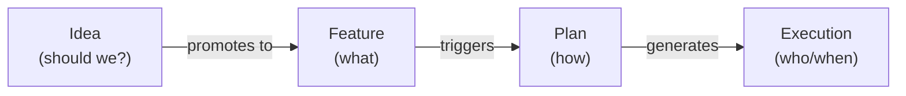
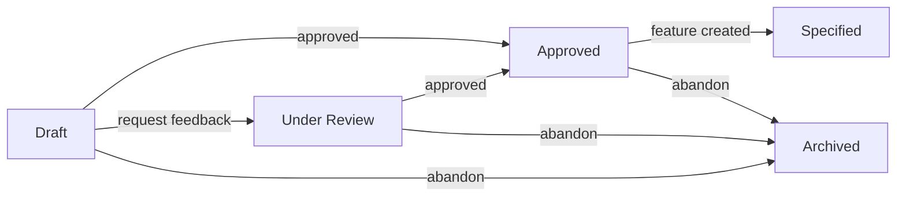
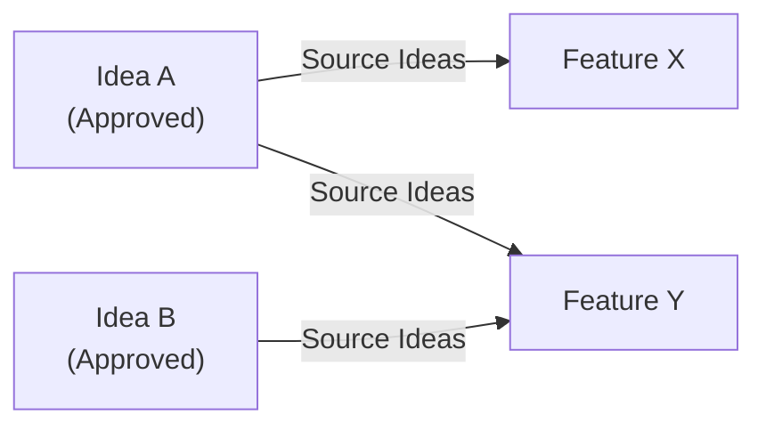

# Feature: Idea

> [View in Synchestra Hub](https://hub.synchestra.io/project/features?id=specscore@synchestra-io@github.com&path=spec%2Ffeatures%2Fidea) — graph, discussions, approvals

**Status:** Conceptual

## Summary

An idea is a **pre-spec, lintable one-pager** that captures a problem, a recommended direction, an MVP scope, and the assumptions that must hold for the direction to be worth pursuing. Ideas are the optional front-door to SpecScore: they refine a vague concept into something concrete enough to promote into one or more [Features](../feature/README.md).

An idea artifact is a single file at `spec/ideas/<slug>.md` with typed YAML front-matter and a fixed section schema. Ideas can be authored manually, by AI agents, or — recommended — via the [`spec-studio:ideate`](https://github.com/synchestra-io/spec-studio) skill. The spec defines the artifact; it does not mandate the authoring workflow.

## Problem

Projects accumulate raw concepts — half-formed features, user complaints, "what if we…" sketches — long before anyone is ready to write a Feature spec. Today that material lives in chat logs, scratch docs, or `docs/ideas/` directories that no tool can read. This creates three problems:

- **No review gate before design.** Teams jump from vague idea to feature design without stress-testing alternatives or naming dealbreaker assumptions. Bad directions survive into plans and code.
- **No traceable lineage.** When a shipped Feature turns out to rest on a bad assumption, there is no earlier artifact to point at. The assumption is implicit, and the retrospective has nothing to audit.
- **No machine-addressable pre-spec layer.** Tools that want to reason about the product pipeline (Synchestra, Rehearse, dashboards) can see Features and Plans but have no typed representation of the upstream thinking.

The Idea feature fills that gap: a typed, lintable artifact for the "is this worth building?" conversation, with a promotion path into Features.

## Design Philosophy

Ideas are the **"should we?"** layer. Features describe desired behavior; Plans describe how to build it; Ideas describe whether the direction is worth committing to.



Key tenets inherited from the SDD skill family:

- **Unsaved ideation is waste.** If a direction is worth discussing, it is worth a lint-clean artifact.
- **Say no to 1,000 things.** The `Not Doing` section is load-bearing — an Idea without explicit exclusions is not an Idea.
- **Types beat vibes.** An Idea that cannot pass `specscore lint` is not ready to be promoted.
- **Stable IDs, mutable content.** The slug is a contract; the body is revised in place until the Idea is Specified or Archived.

Ideas are **living until promoted**. Once `status: Specified`, the artifact is effectively frozen — further changes belong in the downstream Features, not in the Idea.

## Behavior

### Idea location

Ideas live as single files under `spec/ideas/` in the spec repository. Archived Ideas are moved to a reserved `archived/` subdirectory:

```text
spec/ideas/
  README.md              <- idea index (active + archived)
  <slug>.md              <- an active idea
  <another-slug>.md
  archived/
    README.md            <- archived idea index
    <old-slug>.md        <- an archived idea (Status: Archived)
```

Unlike Features and Plans, Ideas are **files, not directories**. An Idea has no sub-artifacts, no `_tests/`, and no `proposals/`. Supporting material (mockups, research notes) belongs either on the downstream Feature (once promoted) or in `docs/`.

#### REQ: idea-location

Every Idea artifact MUST reside at `spec/ideas/<slug>.md` (active) or `spec/ideas/archived/<slug>.md` (archived). Ideas in `docs/ideas/`, `spec/features/*/ideas/`, or any other location are rejected by validation.

#### REQ: slug-format

Idea slugs MUST be lowercase, hyphen-separated, and URL-safe (matching the same pattern as Feature slugs). The slug is the stable ID; once created, it MUST NOT be renamed. A scope change that invalidates the current slug requires a successor Idea with a new slug and a `supersedes:` link.

Examples of valid slugs: `payment-fraud-signals`, `offline-mode`, `team-billing`.

#### REQ: single-file

An Idea MUST be a single markdown file. Creating a directory at `spec/ideas/<slug>/` is a validation error.

### Idea header fields

Ideas use the **same markdown-body metadata convention as Features** — no YAML front-matter. Metadata fields appear as bold-prefixed lines immediately after the title:

```markdown
# Idea: <Idea Name>

**Status:** Draft
**Date:** YYYY-MM-DD
**Owner:** <author identifier>
**Promotes To:** — *(managed by tooling; do not edit manually)*
**Supersedes:** — *(optional; slug of an Idea this one replaces)*
**Related Ideas:** — *(optional; typed links to other Ideas — see [Related Ideas](#related-ideas))*
**Archive Reason:** — *(required only when Status is Archived)*
```

#### REQ: title-format

Every Idea README title MUST use the `# Idea: <Title>` format. The `Idea:` prefix is required — it is the dispatch key used by `specscore lint` to select the Idea rule set.

#### REQ: header-fields

Every Idea MUST include `**Status:**`, `**Date:**`, and `**Owner:**` fields immediately after the title, in that order. `**Promotes To:**`, `**Supersedes:**`, and `**Related Ideas:**` MUST be present (value `—` when empty). `**Archive Reason:**` is required only when `Status: Archived` (see [REQ: archive-reason](#req-archive-reason)).

#### REQ: id-is-slug

An Idea's canonical id is its filename without `.md` — the slug itself. There is no separate `id` field.

#### REQ: promotes-to-managed

The `**Promotes To:**` field is **managed state**. Tooling populates it when a Feature is created that references this Idea (see [REQ: feature-cross-reference](#req-feature-cross-reference)). Authors and authoring skills MUST NOT edit it manually. An Idea with `Status: Specified` MUST have a non-empty `**Promotes To:**`.

### Idea document structure

Every Idea follows this section schema:

```markdown
# Idea: <Idea Name>

**Status:** <status>
**Date:** YYYY-MM-DD
**Owner:** <author>
**Promotes To:** —
**Supersedes:** —

## Problem Statement
<One "How Might We…" sentence.>

## Context
<Triggering observation, related specs, prior art.>

## Recommended Direction
<2–3 paragraphs: what and why, over the alternatives.>

## Alternatives Considered
<2–3 directions that lost, and why each lost.>

## MVP Scope
<The single job the MVP nails. Timeboxed, not feature-listed.>

## Not Doing (and Why)
- <Thing 1> — <reason>
- <Thing 2> — <reason>
- <Thing 3> — <reason>

## Key Assumptions to Validate
| Tier | Assumption | How to validate |
|------|------------|-----------------|
| Must-be-true | … | … |
| Should-be-true | … | … |
| Might-be-true | … | … |

## SpecScore Integration
- **New Features this would create:** <list or "TBD at design time">
- **Existing Features affected:** <list or "none">
- **Dependencies:** <other Ideas or in-flight work>

## Open Questions
- <Question that needs answering before promotion to Feature(s)>
```

#### REQ: required-sections

An Idea MUST include these sections, in this order:

| Section | Required | Notes |
|---|---|---|
| Title (`# Idea: <Name>`) | Yes | `Idea:` prefix required. See [REQ: title-format](#req-title-format). |
| Header fields | Yes | `Status`, `Date`, `Owner`, `Promotes To`, `Supersedes`. See [REQ: header-fields](#req-header-fields). |
| Problem Statement | Yes | Contains exactly one "How Might We…" framing. |
| Context | Yes | May be brief but MUST be present. |
| Recommended Direction | Yes | The direction the author is recommending. |
| Alternatives Considered | Yes | At least two alternatives with reasons they lost. |
| MVP Scope | Yes | Describes the smallest useful release. |
| Not Doing (and Why) | Yes | See [REQ: not-doing-non-empty](#req-not-doing-non-empty). |
| Key Assumptions to Validate | Yes | See [REQ: must-be-true-present](#req-must-be-true-present). |
| SpecScore Integration | Yes | Links the Idea back to the Feature graph. |
| Open Questions | Yes | Empty state: "None at this time." |

#### REQ: not-doing-non-empty

The `Not Doing (and Why)` section MUST contain at least one explicit exclusion with a reason. An Idea with an empty "Not Doing" list is rejected — the absence of explicit scope cuts is treated as insufficient sharpening.

#### REQ: must-be-true-present

The `Key Assumptions to Validate` table MUST list at least one Must-be-true assumption. Must-be-true assumptions are dealbreakers — an Idea without a named dealbreaker has not been stress-tested.

#### REQ: hmw-framing

The `Problem Statement` section SHOULD contain exactly one "How Might We…" sentence. Violations are warnings, not errors — some Ideas legitimately frame problems differently, but the HMW form is the idiomatic shape.

### Idea statuses

| Status | Description |
|---|---|
| `Draft` | First lint-clean write. Author is iterating. |
| `Under Review` | Author has requested feedback from stakeholders. |
| `Approved` | Recommended Direction has been approved; ready for promotion to Feature(s). |
| `Specified` | At least one Feature in `spec/features/` lists this Idea in its `**Source Ideas:**` field. Tooling manages this transition — see [The Specified transition](#the-specified-transition). |
| `Archived` | Idea was abandoned or superseded. File is moved to `spec/ideas/archived/<slug>.md`. |



#### REQ: status-values

The `**Status:**` value MUST be one of: `Draft`, `Under Review`, `Approved`, `Specified`, `Archived`. Any other value is a validation error.

#### REQ: specified-requires-promotion

An Idea with `Status: Specified` MUST have a non-empty `**Promotes To:**` list. The transition to `Specified` is driven by Feature creation, not by the author.

#### REQ: archived-location

An Idea with `Status: Archived` MUST reside at `spec/ideas/archived/<slug>.md`. An Idea file at the top level of `spec/ideas/` with `Status: Archived` is a validation error, as is an Archived file outside that directory. Moving the file is part of the archival transition.

#### REQ: archive-reason

An Idea with `Status: Archived` MUST include a `**Archive Reason:**` header field with a non-empty value. Expected values are free-form but SHOULD categorize the reason (e.g. `abandoned`, `pivoted`, `superseded`, `no longer relevant`). Non-Archived Ideas MAY omit the field or set it to `—`.

### Related Ideas

The `**Related Ideas:**` header links one Idea to another with a **typed relationship**. This captures dependencies and alternatives without introducing a heavyweight dependency system. Format:

```markdown
**Related Ideas:** depends_on:payment-rails-audit, alternative_to:single-click-checkout
```

Each entry is `<relationship>:<idea-slug>`. Multiple entries are comma-separated. Value `—` means no links.

| Relationship | Meaning |
|---|---|
| `depends_on` | This Idea can only be meaningfully pursued if the referenced Idea is also pursued (typically needs it to reach `Specified` first). |
| `alternative_to` | This Idea and the referenced Idea address the same problem in different ways. At most one should normally be promoted. |
| `extends` | This Idea builds on the scope of the referenced Idea (not a successor — both can coexist). |
| `conflicts_with` | The two Ideas have incompatible directions. Promoting both would create contradictory Features. |

#### REQ: related-ideas-format

Each entry in `**Related Ideas:**` MUST match `<relationship>:<idea-slug>` where `<relationship>` is one of the four values above and `<idea-slug>` is an existing Idea (active or archived). Unknown relationships are a validation error. The vocabulary is deliberately fixed at this initial set; additional types require a revision of this spec.

#### REQ: cycles-allowed

Cycles in `depends_on` (including mutual `depends_on` between two Ideas and longer loops) are **permitted**. Ideas describe pre-spec thinking; interdependence is legitimate. Lint MUST NOT reject cycles. Tooling that traverses `depends_on` (e.g. for visualization or ordering) MUST detect cycles and terminate safely rather than loop forever.

#### REQ: related-ideas-target-exists

Every slug referenced in `**Related Ideas:**` MUST resolve to an Idea file under `spec/ideas/` or `spec/ideas/archived/`. Broken references are rejected by lint.

### The Specified transition

`Specified` is a **derived status**: it reflects the existence of at least one Feature that references the Idea. It is not a state the author chooses. Three mechanisms can drive the transition:

1. **`specscore` CLI (authoritative).** `specscore idea sync` (equivalently `specscore lint --fix`) scans `spec/features/**/README.md` for `**Source Ideas:**` fields, recomputes every Idea's `**Promotes To:**`, and updates `**Status:**` accordingly. Running this command is the definitive way to reconcile Idea status.
2. **Feature-creation tooling.** When `specscore new feature` (or an equivalent scaffolder) creates a Feature with `**Source Ideas:**`, it performs the same update on each referenced Idea in the same commit.
3. **Synchestra (optional).** When Synchestra is present, it watches for Feature changes and performs the update automatically, emitting `idea.specified`. Standalone SpecScore users do not need Synchestra — the CLI is sufficient.

**CI enforcement is strict.** `specscore lint` (without `--fix`) fails on any drift between a Feature's `**Source Ideas:**` entries and the corresponding Idea's `**Promotes To:**` / `**Status:**`. Contributors are expected to run `specscore lint --fix` locally before committing. If strictness proves too disruptive in practice, the severity can be relaxed in a future revision; the initial posture is strict because `lint --fix` makes compliance cheap.

#### REQ: sync-lint-strict

`specscore lint` MUST fail (error severity) when an Idea's `**Promotes To:**` or derived `**Status:**` is inconsistent with the set of Features referencing it. `specscore lint --fix` MUST repair the drift by rewriting the Idea's header fields in place.

Recomputation is symmetric: if every Feature referencing an Idea is removed or unlinks it, the Idea's `**Promotes To:**` becomes empty and `Status` drops back to `Approved`. An Idea is never "stuck" in `Specified` without a live referencing Feature.

#### REQ: specified-derivation

`Status: Specified` MUST be set if and only if at least one Feature in `spec/features/` lists the Idea's slug in its `**Source Ideas:**` field. A tree where this invariant is violated is a lint error (rule enforces the check without requiring that the CLI be run).

#### REQ: specified-not-author-set

An author (human or skill) MUST NOT directly write `**Status:** Specified`. Attempting to do so produces a lint error unless the corresponding Feature references already exist.

### Recommended authoring workflow

The [`spec-studio:ideate`](https://github.com/synchestra-io/spec-studio/tree/main/skills/ideate) skill is the **recommended** way to produce an Idea artifact. It runs a three-phase divergent/convergent process (Understand & Expand → Evaluate & Converge → Crystallize), enforces the schema above, and emits `idea.drafted` / `idea.approved` events for Synchestra consumers.

Using the skill is **not mandatory**. An Idea is valid if and only if it passes `specscore lint` — how it was authored is out of scope for this spec. Manual authoring, other skills, bespoke AI agents, and imports from external systems are all acceptable.

#### REQ: authoring-agnostic

Validation MUST NOT depend on authoring provenance. An Idea hand-written by a human and an Idea produced by `spec-studio:ideate` are indistinguishable to `specscore lint` and to downstream tooling.

#### REQ: scaffold-command

The `specscore` CLI MUST provide `specscore new idea <slug>` that scaffolds a skeleton at `spec/ideas/<slug>.md`. Behavior:

- **Pre-population.** Each required section is emitted with an inline HTML-comment prompt describing what belongs there (e.g. `<!-- One "How Might We…" sentence. -->`). These prompts replace placeholder text and do not trip lint rule U-005 (placeholders).
- **Argument injection.** Values supplied via flags (`--title`, `--owner`, `--hmw`, `--not-doing`, etc.) replace the corresponding prompt with real content.
- **Interactive TUI.** When invoked with `--interactive` (or `-i`), the CLI prompts the user for each field and writes actual values in place of the HTML-comment prompts.
- **Always lint-clean on exit.** Regardless of how much content was supplied, the generated file MUST pass `specscore lint` — the inline prompts and `—` placeholders are designed so an untouched scaffold already validates.

The `spec-studio:ideate` skill SHOULD delegate file creation to this command when available, and fall back to writing the file directly when the CLI is not installed.

### Idea index

There are two indexes: one for active Ideas and one for archived Ideas.

**Active index** (`spec/ideas/README.md`):

1. An **Index** table with columns: Idea, Status, Date, Owner, Promotes To.
2. An **Outstanding Questions** section.

**Archived index** (`spec/ideas/archived/README.md`):

1. A chronological list of Archived Ideas, ordered by the **Date** field (oldest first, newest at bottom) — not a full metadata table. Each entry is a line of the form `- YYYY-MM-DD — [slug](<slug>.md) — <archive reason>`.
2. An **Outstanding Questions** section.

#### REQ: index-completeness

`spec/ideas/README.md` MUST list every active (non-Archived) Idea in `spec/ideas/`. `spec/ideas/archived/README.md` MUST list every Archived Idea in `spec/ideas/archived/`. An unlisted Idea on either side is a validation error.

#### REQ: archived-index-chronological

Entries in `spec/ideas/archived/README.md` MUST appear in chronological order by each Idea's `**Date:**` field. Ordering violations are a validation error (auto-fixable by `specscore lint --fix`).

### Superseding

An Idea whose scope has shifted enough to invalidate its assumptions MUST NOT be renamed. Instead, create a successor:

1. Archive the predecessor: set `**Status:** Archived` and move the file to `spec/ideas/archived/<slug>.md`.
2. Create a new Idea with a new slug and list the predecessor slug in `**Supersedes:**`.
3. The successor's `Context` section SHOULD explain what changed.

#### REQ: supersedes-target-archived

If an Idea's `**Supersedes:**` list is non-empty, every referenced Idea MUST exist (under `spec/ideas/archived/`) and have `Status: Archived`.

## Relationship to Other Artifacts

### Ideas and features

Ideas and Features cross-reference each other in a **many-to-many** relationship:

- An Idea MAY promote to **multiple Features** when its scope decomposes.
- A Feature MAY reference **multiple source Ideas** when it synthesizes several lines of thought.

The Feature carries the authoritative link via a `**Source Ideas:**` header field listing one or more Idea slugs. The Idea's `**Promotes To:**` field is the derived reverse index, maintained by tooling.



When a Feature is created or updated with a `**Source Ideas:**` entry, tooling:

1. Resolves the link.
2. Appends the Feature slug to each referenced Idea's `**Promotes To:**` list.
3. Transitions any referenced Idea from `Status: Approved` to `Status: Specified`.
4. Optionally emits an `idea.specified` event (see [Synchestra events](https://github.com/synchestra-io/spec-studio/blob/main/skills/shared/synchestra-events.md)).

When every Feature referencing an Idea is deleted or loses its reference, the Idea's `**Promotes To:**` is recomputed accordingly; if it becomes empty, tooling reverts `Status: Specified → Approved`.

#### REQ: feature-cross-reference

A Feature's `**Source Ideas:**` field MAY list zero or more Idea slugs. Each referenced Idea MUST exist and have `Status ∈ {Approved, Specified}`. Referencing an Idea that is `Draft`, `Under Review`, or `Archived` is a validation error.

### Ideas and plans

Ideas do not directly reference [Plans](../plan/README.md). The Feature bridges the Idea to the Plan, just as it bridges the Feature to execution.

### Ideas and outstanding questions

Every Idea maintains an Outstanding Questions section with the standard empty-state text ("None at this time.") when no questions remain open.

### Adherence footer

#### REQ: adherence-footer

Every Idea document MUST end with an adherence footer per the [Adherence Footer feature](../adherence-footer/README.md). The footer URL MUST be `https://specscore.md/idea-specification`.

## Interaction with Other Features

| Feature | Interaction |
|---|---|
| [Feature](../feature/README.md) | Features carry an optional `**Source Ideas:**` header field listing one or more Idea slugs. The relationship is many-to-many. Tooling uses this link to manage each Idea's `Status` and `Promotes To`. Requires a companion update to the Feature spec. |
| [Plan](../plan/README.md) | No direct link. Plans reference Features; Features reference Ideas. |
| [Project Definition](../project-definition/README.md) | `specscore-project.yaml` MAY declare whether Ideas are required before Features (policy knob, default off). |

## Dependencies

- feature
- project-definition

## Acceptance Criteria

### AC: idea-structure

**Requirements:** idea#req:required-sections, idea#req:not-doing-non-empty, idea#req:must-be-true-present

An Idea file contains all required sections in order, a non-empty "Not Doing" list, and at least one Must-be-true assumption. Any violation is rejected by `specscore lint`.

### AC: idea-header

**Requirements:** idea#req:title-format, idea#req:header-fields, idea#req:id-is-slug, idea#req:status-values

An Idea carries a valid `# Idea: <Title>` header, the required body-metadata fields (`Status`, `Date`, `Owner`, `Promotes To`, `Supersedes`) in order, and a valid `Status` value. The filename slug is the canonical id; no separate `id` field is needed.

### AC: promotion-lifecycle

**Requirements:** idea#req:promotes-to-managed, idea#req:specified-requires-promotion, idea#req:specified-derivation, idea#req:specified-not-author-set, idea#req:feature-cross-reference

Creating a Feature with `**Source Ideas:**` entries transitions each referenced Idea's status from `Approved` to `Specified` and appends the Feature slug to the Idea's `**Promotes To:**`. Removing every reference reverts the Idea to `Approved`. An author who writes `Status: Specified` without a matching Feature reference is rejected by lint.

### AC: archival

**Requirements:** idea#req:archived-location, idea#req:archive-reason, idea#req:supersedes-target-archived, idea#req:archived-index-chronological

An Idea with `Status: Archived` resides at `spec/ideas/archived/<slug>.md`, carries a non-empty `**Archive Reason:**`, and appears in the chronologically ordered archived index. Any `**Supersedes:**` reference resolves to an Archived Idea in that directory.

### AC: related-ideas

**Requirements:** idea#req:related-ideas-format, idea#req:related-ideas-target-exists, idea#req:cycles-allowed

Typed relationships (`depends_on`, `alternative_to`, `extends`, `conflicts_with`) in `**Related Ideas:**` parse cleanly and resolve to existing Idea files. Unknown relationships and broken slugs are rejected. Cycles in `depends_on` are accepted by lint; consumers that traverse the graph handle cycles without infinite loops.

### AC: sync-strictness

**Requirements:** idea#req:sync-lint-strict

`specscore lint` fails when a Feature's `**Source Ideas:**` entries disagree with an Idea's `**Promotes To:**` or `**Status:**`. `specscore lint --fix` reconciles the drift by updating the Idea's header fields in place.

### AC: scaffold-behavior

**Requirements:** idea#req:scaffold-command

`specscore new idea <slug>` produces a lint-clean file whether invoked bare, with flag arguments, or interactively. Inline HTML-comment prompts stand in for missing content without triggering placeholder-detection rules.

### AC: authoring-independence

**Requirements:** idea#req:authoring-agnostic

A hand-authored Idea and a skill-authored Idea with identical content produce identical lint results. No rule references authoring provenance.

## TODO

None at this time.

## Outstanding Questions

None at this time.

---
*This document follows the https://specscore.md/feature-specification*
