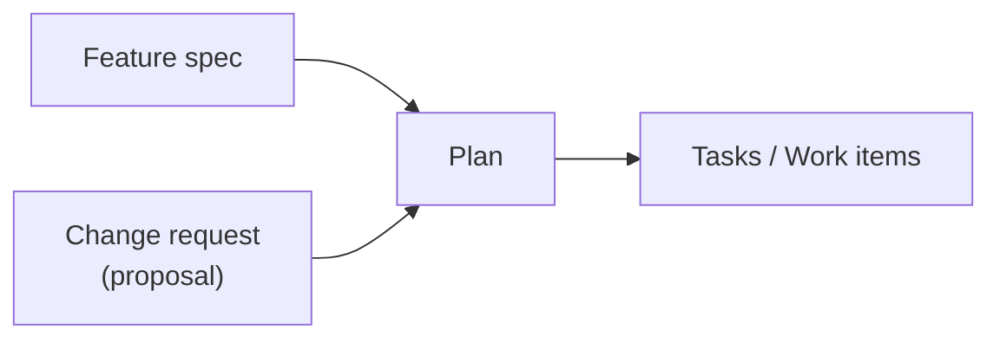
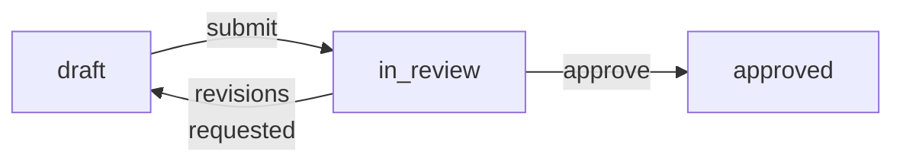
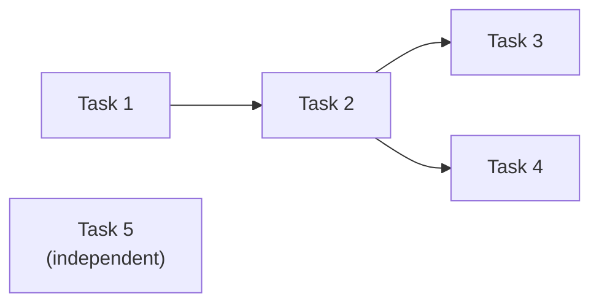
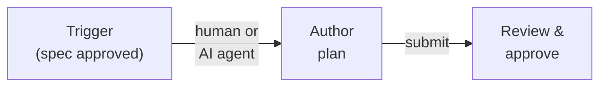

# Feature: Plan

> [View in Synchestra Hub](https://hub.synchestra.io/project/features?id=specscore@synchestra-io@github.com&path=spec%2Ffeatures%2Fplan) — graph, discussions, approvals

**Status:** Stable

## Summary

A plan is a composite task -- a task that contains subtasks. It bridges feature specifications and change requests to executable work. Plans are mutable documents; snapshots provide immutable reference points for review, approval, and retrospective.

There is one structural concept: the **task**. A task with children is a plan. A task without children is a leaf task. This is determined by structure, not declaration. Plans nest recursively -- there is no artificial depth limit.

## Contents

| Directory | Description |
|---|---|
| [plans-index](plans-index/README.md) | Specification of the `spec/plans/README.md` plans-index file: required sections, Contents-table columns, Recently Closed section, adherence footer. |
| [_tests](_tests/README.md) | Test scenarios validating plan feature requirements |

### plans-index

The plans-index sub-feature specifies the contract for the `spec/plans/README.md` file that every spec repository maintains. It defines the required section order (Contents, Recently Closed, Outstanding Questions), the standard column set for the Contents table, the sub-plan indentation convention, and the adherence footer that marks a file as conforming to the SpecScore plans-index specification. Details previously inlined in this feature's "Plans index" section now live entirely in the sub-feature.

## Problem

Teams have well-defined execution systems -- work items, tickets, tasks -- but there is no structured way to go from "we know what to build" to "here are the work items to execute."

Today that decomposition happens ad hoc -- a human or AI agent reads a feature spec, mentally breaks it into tasks, and manually creates work items one by one. This creates three problems:

- **No review gate.** Work begins without explicit approval of the approach. A bad decomposition wastes time and effort.
- **No stable reference.** Work items are designed to be fluid -- agents add subtasks, humans cancel items, parallel work gets restructured. This fluidity is a feature of execution, but it means there is no fixed record of what was originally planned.
- **No retrospective anchor.** Without a snapshot of intent, you cannot compare what was planned against what actually happened. Lessons learned require a before-and-after.

## Design Philosophy

SpecScore separates **intent** from **execution** by design, with distinct artifacts for each stage of the workflow.

| Artifact | Question it answers | Audience | Mutability | Lives in |
|---|---|---|---|---|
| Feature spec | What do we want? | Product, engineering | Versioned | Spec repo |
| Change request | What should change in an existing feature? | Product, engineering | Versioned until approved | Spec repo |
| Plan | How will we build it? | Reviewers, planners | Mutable; snapshots provide fixed references | Spec repo |
| Work items | Who's doing what right now? | Agents, operators | Highly fluid | Execution system |

A **feature spec** defines something new. A **change request** (implemented as a [proposal](../proposals/README.md)) mutates something that already exists. Both are *what* artifacts -- they describe desired outcomes. The distinction matters because:

- **New features** start from a blank slate. The plan is unconstrained.
- **Change requests** operate on existing behavior. The plan must account for what is already there -- migration paths, backward compatibility, affected dependents. The review process is different: reviewers need to understand the delta, not just the destination.

From the planning pipeline's perspective, both converge to the same output -- a plan that produces executable tasks:



**Why not use the work item tree as the plan?** Work items are designed to be fluid. Agents add subtasks when they discover complexity. Humans cancel items when priorities shift. Parallel work gets restructured on the fly. This fluidity is a feature -- it is how real development works. But fluidity is the enemy of reviewability. A human reviewer needs a stable, scannable document to approve before work begins. Snapshots provide that stability without sacrificing the ability to evolve the plan.

**No duplicated status tracking.** The plan does not track completion -- execution tools do. A progress view can be derived by mapping plan tasks to their linked work items and looking up live status. One source of truth, two views: the plan view for humans, the deep work item tree for agents.

## Behavior

### Plan location

All plans live under `spec/plans/` in the spec repository:

```text
spec/plans/
  README.md              <- index of all plans
  {plan-slug}/
    README.md            <- the plan document
```

`{plan-slug}` is a URL/path-safe identifier (e.g., `add-batch-mode`, `user-auth`).

#### REQ: plan-directory

Every plan MUST reside in a dedicated directory under `spec/plans/` with a `README.md` file as the plan document.

#### REQ: plan-slug-format

Plan slugs MUST be lowercase, hyphen-separated, and URL-safe. Underscores, spaces, and special characters MUST NOT be used.

#### REQ: features-field-uniform

Every plan MUST list its affected features in the header. There is no distinction between single-feature and multi-feature plans -- every plan uniformly declares the features it touches.

### Plan document structure

```markdown
# Plan: Add batch mode to CLI

**Status:** approved
**Features:**
  - [cli](../../features/cli/README.md)
**Source type:** feature
**Source:** [CLI feature spec](../../features/cli/)
**Author:** @alex
**Approver:** @jordan
**Created:** 2026-03-14
**Approved:** 2026-03-15

## Context

Why this plan exists. Links to the feature spec or the approved change
request (proposal) that triggered it. 2-5 sentences establishing the
problem and the high-level approach chosen.

## Acceptance criteria

- All new CLI flags appear in help output
- End-to-end test: batch file with 100 items completes in under 10s
- No breaking changes to existing single-item flow

## Tasks

### 1. Define batch input schema

Establish the YAML/JSON schema for batch input files. This determines
the contract for all downstream tasks.

**Depends on:** (none)
**Produces:**
  - `batch-input-schema.json` -- JSON Schema definition

**Acceptance criteria:**
- Schema validates all example inputs from the feature spec
- Schema rejects malformed inputs with actionable error messages

### 2. Implement batch parser

Parse and validate batch input files against the schema.

**Depends on:** Task 1
**Produces:**
  - Batch parser module

**Acceptance criteria:**
- Validates input against schema from Task 1; rejects invalid files
  with per-field error messages
- Handles files up to 50MB without exceeding 256MB memory

#### 2.1. Add streaming support

For large batch files, parse line-by-line rather than loading into
memory.

**Acceptance criteria:**
- Files over 10MB are streamed; memory stays under 256MB regardless of
  file size

### 3. Update CLI entry point

Add `--batch <file>` flag and wire it to the parser.

**Depends on:** Task 2

**Acceptance criteria:**
- Help output shows `--batch` flag with description
- `--batch` and positional arguments are mutually exclusive with a
  clear error message

## Snapshots

| Date | Git Hash | Action | Comment |
|---|---|---|---|
| 2026-03-15 | `a1b2c3d` | approved | Initial approval by @jordan |

## Dependency graph

Task 1 --> Task 2 --> Task 3

## Risks and open decisions

- Batch files over 10MB may need streaming -- Task 2.1 addresses this
  but we may discover additional memory constraints.
- Error reporting granularity: per-item or fail-fast? Defaulting to
  per-item with `--fail-fast` flag.

## Outstanding Questions

None at this time.
```

#### REQ: plan-title-format

Every plan document MUST use the `# Plan: {Title}` format for its title. The `Plan:` prefix is required.

#### REQ: plan-required-sections

Every plan document MUST include the following sections: title (`# Plan: X`), header metadata fields, Context, Acceptance criteria, and Tasks. A Snapshots section, Dependency graph section, and Risks and open decisions section are OPTIONAL.

### Header fields

| Field | Required | Description |
|---|---|---|
| **Status** | Yes | Current plan status (see [Plan statuses](#plan-statuses)) |
| **Features** | Yes | List of affected features, each linking to its feature spec README |
| **Source type** | Yes | `feature` or `change-request` |
| **Source** | Yes | Link to the originating feature spec or approved proposal |
| **Author** | Yes | Who wrote the plan |
| **Approver** | On approval | Who approved the plan |
| **Created** | Yes | Date the plan was created |
| **Approved** | On approval | Date the plan was approved |
| **Effort** | No | `S` \| `M` \| `L` \| `XL` -- see [Optional ROI metadata](#optional-roi-metadata) |
| **Impact** | No | `low` \| `medium` \| `high` \| `critical` -- see [Optional ROI metadata](#optional-roi-metadata) |

#### REQ: required-header-fields

Every plan MUST include these header fields: Status, Features, Source type, Source, Author, and Created. The Approver and Approved fields MUST be present when the plan status is `approved`. Effort and Impact are OPTIONAL.

#### REQ: source-type-values

The Source type field MUST be either `feature` or `change-request`. No other values are permitted.

#### REQ: proposal-forward-reference

When a plan is triggered by a change request (proposal), the Source field MUST link directly to the proposal. The proposal in turn MUST include a forward reference to the plan.

When a plan is triggered by a change request (proposal), the **Source** field links directly to the proposal. The proposal in turn gets a forward reference to the plan:

```markdown
# Proposal: Deprecate v1 endpoints

| Field  | Value                                             |
|--------|---------------------------------------------------|
| Status | `approved`                                        |
| Plan   | [migrate-to-v2](../../../plans/migrate-to-v2/)    |
```

### Plan statuses

| Status | Description |
|---|---|
| `draft` | Plan is being written, not ready for review |
| `in_review` | Submitted for human review |
| `approved` | Reviewed and approved -- execution may proceed |

Plans do not have `completed` or `failed` statuses -- those are execution concerns. A plan is either being prepared (`draft`, `in_review`) or it has been approved (`approved`). Plans are mutable; if the approach needs to change after approval, edit the plan and create a new snapshot rather than creating a separate document.

#### REQ: valid-statuses

A plan's Status field MUST be one of: `draft`, `in_review`, or `approved`. No other values are permitted.

#### REQ: no-execution-status

Plans MUST NOT carry `completed` or `failed` statuses. Completion tracking is an execution concern, not a plan concern.

### Status transitions



#### REQ: status-transitions

Plan status transitions MUST follow these rules: `draft` MAY transition to `in_review`; `in_review` MAY transition back to `draft` (revisions requested) or forward to `approved`. No other transitions are permitted.

### Snapshots

A snapshot is an immutable reference point within a plan's history. Instead of freezing the entire plan on approval, snapshots record meaningful moments -- approval, checkpoints, completion -- as entries in a table with a corresponding git commit hash.

Snapshots remove the need to freeze a plan on approval. A plan can be edited freely at any time. When a reference point is needed, a snapshot captures the plan's state at that git hash. The snapshot table lives in the plan document:

```markdown
## Snapshots

| Date | Git Hash | Action | Comment |
|---|---|---|---|
| 2026-03-15 | `a1b2c3d` | approved | Initial approval by @jordan |
| 2026-03-20 | `e4f5g6h` | checkpoint | Added streaming support task |
| 2026-04-01 | `i7j8k9l` | completed | All tasks verified |
```

#### REQ: snapshot-table-format

When a plan includes snapshots, they MUST be recorded in a `## Snapshots` section containing a table with columns: Date, Git Hash, Action, and Comment.

#### REQ: snapshot-actions

Snapshot actions include `approved`, `checkpoint`, `completed`, and user-defined values. The `approved` action SHOULD correspond to setting the plan status to `approved`.

#### REQ: snapshot-git-hash

Each snapshot MUST reference a valid git commit hash that represents the plan's state at the time the snapshot was taken.

### Recursive task and plan model

A plan is a composite task -- it contains other tasks. Some of those child tasks may themselves contain subtasks, making them sub-plans. This nesting is recursive with no artificial depth limit.

```text
spec/plans/
  README.md                          <- index
  chat-feature/
    README.md                        <- plan (composite task)
    chat-infrastructure/
      README.md                      <- sub-plan (also a composite task)
      set-up-database/
        README.md                    <- task (leaf)
      configure-networking/
        README.md                    <- task (leaf)
    chat-workflow-engine/
      README.md                      <- sub-plan
    send-notifications/
      README.md                      <- task (leaf, sibling of sub-plans)
  e2e-testing-framework/
    README.md                        <- plan (standalone, no sub-plans)
```

Whether something is a "plan" or a "task" is determined by structure: if it has children, it is a plan. If it has no children, it is a task. The same document format applies at every level.

#### REQ: recursive-nesting

Plans and tasks MAY nest to arbitrary depth. There is no maximum nesting level. Depth is a judgment call made by the plan author.

#### REQ: child-plan-format

A sub-plan (child plan) MUST follow the same format as a top-level plan, including tasks and acceptance criteria.

### Mixed children

Tasks and sub-plans can coexist at the same level within a plan. There is no requirement to separate them or force restructuring. In the example above, `send-notifications` (a leaf task) is a sibling of `chat-infrastructure` and `chat-workflow-engine` (sub-plans).

#### REQ: mixed-children

A plan MAY contain both leaf tasks and sub-plans as direct children at the same level. No restructuring is required to separate tasks from sub-plans.

### Status rollup

A composite task's (plan's) status can be derived from its children. This is the default behavior for plans that do not set an explicit status override.

| Condition | Derived status |
|---|---|
| All children are `draft` or unstarted | `draft` |
| At least one child is `in_review` and none are later | `in_review` |
| All children are `approved` or `completed` | `approved` |

Status rollup is advisory -- a plan author MAY set an explicit status that overrides the derived value. Tooling SHOULD surface discrepancies between explicit and derived status.

#### REQ: status-rollup

A composite task's status MAY be derived from the statuses of its children. Tooling SHOULD support automatic status rollup. An explicitly set status MUST take precedence over the derived value.

### Tasks and dependencies

Tasks that do not declare a `Depends on` field may execute in parallel. The dependency graph determines the critical path.

For complex plans, an optional **Dependency graph** section visualizes the parallelism:



This section is optional -- useful for complex plans, noise for simple sequential ones.

#### REQ: parallel-eligibility

Tasks that do not declare a `Depends on` field MUST be treated as parallel-eligible. The dependency graph determines the critical path; tasks without dependencies MAY execute concurrently.

### Plan-level and task-level acceptance criteria

Acceptance criteria appear at two levels:

- **Plan-level** (the `## Acceptance criteria` section): cross-cutting criteria that span multiple tasks. These inform integration and end-to-end tests.
- **Task-level** (within each task): criteria specific to that task's deliverable. These inform unit and component tests.

Both levels can be consumed by execution tools to populate work item descriptions, giving agents and test authors clear targets.

#### REQ: two-level-acceptance-criteria

Plans MUST support acceptance criteria at two levels: plan-level (cross-cutting, in the `## Acceptance criteria` section) and task-level (per-task deliverables, inline within each task). Both levels are consumed by execution tools.

Acceptance criteria can also use a subdirectory format for complex criteria:

**Inline (simple).** Include them directly in the plan as bullet points. Suitable for straightforward criteria that fit in a line or two.

**Subdirectory (complex).** For criteria that require scripts, multiple test cases, or extensive documentation, create `spec/plans/{plan-slug}/acs/{ac-slug}/` directories:

```
spec/plans/user-auth/
  README.md
  acs/
    end-to-end-test/
      README.md          # Describes the test
      script.sh          # Test implementation
      fixtures/
        ...
    security-audit/
      README.md
      checklist.md
```

This allows criteria to be as simple or as complex as needed without cluttering the plan document.

### Optional ROI metadata

Two optional fields can be added to the plan document header:

```markdown
**Effort:** S | M | L | XL
**Impact:** low | medium | high | critical
```

Both fields are **optional**. When absent, tooling may infer effort from task count, dependency depth, and acceptance criteria complexity. It may infer impact from feature importance and downstream dependents. During plan authoring, the tooling **suggests** values. The user accepts, declines, or overwrites.

For composite plans, effort/impact describe the aggregate. Sub-plans carry independent estimates.

#### REQ: effort-values

When present, the Effort field MUST be one of: `S`, `M`, `L`, or `XL`.

#### REQ: impact-values

When present, the Impact field MUST be one of: `low`, `medium`, `high`, or `critical`.

#### Effort scale

| Effort | Rough meaning |
|--------|---------------|
| S | A few hours of focused work, 1-3 tasks |
| M | A few days, 3-6 tasks, limited dependencies |
| L | A week or more, 5-10 tasks, cross-cutting |
| XL | Multi-week, many tasks, multiple sub-plans or deep dependencies |

#### Impact scale

| Impact | Rough meaning |
|--------|---------------|
| low | Nice-to-have, no users blocked |
| medium | Improves existing capability, some users benefit |
| high | Enables important new capability, many users benefit |
| critical | Unblocks core functionality or other critical work |

### Plans index

Every spec repository with plans maintains an index at `spec/plans/README.md`. Its format — required sections, Contents-table columns, Recently Closed section, and adherence footer — is specified by the [plans-index](plans-index/README.md) sub-feature.

### Feature README back-reference

Each affected feature's README includes a **Plans** section linking to plans that touch it. Features can reference both top-level plans and sub-plans -- the path disambiguates:

```markdown
## Plans

| Plan                                                                  | Status    | Author | Approved   |
|-----------------------------------------------------------------------|-----------|--------|------------|
| [chat-feature](../../plans/chat-feature/)                             | draft     | @alex  | -          |
| [chat-infrastructure](../../plans/chat-feature/chat-infrastructure/)  | draft     | @alex  | -          |
| [user-auth](../../plans/user-auth/)                                   | approved  | @alex  | 2026-03-15 |
| [add-batch-mode](../../plans/add-batch-mode/)                         | in_review | @alex  | -          |
```

A feature appearing in both a plan and its sub-plan is valid -- the plan covers it broadly, the sub-plan implements a slice. A feature linked only to a top-level plan (no sub-plan yet) signals "planned but not decomposed."

#### REQ: feature-back-reference

Each affected feature's README MUST include a Plans section with a table linking to plans that touch it. The table MUST include columns for Plan, Status, Author, and Approved.

### Task artifacts

An artifact is a named output that a task produces. It is not code (code lives in code repos on branches). It is the metadata, decisions, schemas, and intermediate results that downstream tasks need to do their work.

Examples:

| Artifact | Produced by | Consumed by |
|---|---|---|
| JSON Schema definition | "Define data model" task | "Implement endpoints" task, "Build UI" task |
| API contract (OpenAPI snippet) | "Design API" task | "Implement client" task, "Write integration tests" task |
| Migration plan | "Analyze existing data" task | "Write migration script" task |
| Architecture decision record | "Evaluate auth approach" task | All downstream tasks |
| Test fixtures / seed data | "Generate test data" task | Any task running tests |

#### REQ: artifact-declaration

Plan tasks that produce outputs SHOULD declare them using the `**Produces:**` field with a bulleted list of named artifacts and their descriptions.

#### REQ: artifact-dependency-flow

When a task depends on another task, it MUST have access to that task's declared artifacts. The dependency is made explicit through the `Depends on` and `Produces` fields.

## Workflow

The planning pipeline has three stages. Each can be performed by a human or an AI agent.



### Stage 1: Trigger

Something initiates the need for a plan:

| Trigger | Source |
|---|---|
| New feature spec approved | `spec/features/{feature}/README.md` |
| Change request (proposal) approved | `spec/features/{feature}/proposals/{proposal}/` |
| Manual request | Human decides work is needed |

If auto-planning is enabled in the project configuration, tooling can automatically create a `draft` plan when a feature spec or proposal reaches `approved` status. If disabled (the default), a human or external tool initiates plan creation explicitly.

### Stage 2: Author the plan

The plan author (human or AI agent) writes the plan document following the structure defined above.

**When authored by a human:** Write the markdown directly. The spec tooling scaffolds the directory and template.

**When authored by an AI agent:** The agent receives the feature spec or approved proposal as input context, along with relevant codebase context, and produces the plan document. The agent should have access to:

- The feature spec or approved proposal
- Existing codebase structure (for change requests)
- Other active plans (to avoid conflicts)
- Project conventions

### Stage 3: Review and approve


The review process transitions the plan from `draft` to `in_review`, and upon approval sets the status to `approved`, records the approver and approval date, and creates an `approved` snapshot. The plan remains editable after approval -- future changes are tracked through additional snapshots.

### After approval: Execution handoff

Once approved, the plan's tasks can be consumed by execution tools to generate work items. The exact mechanism depends on the orchestration tool used. For Synchestra integration, see [synchestra.io](https://synchestra.io).

Execution is handled by the orchestration tool, not SpecScore. The plan remains a living document during execution, with snapshots marking significant milestones.

## Integration with Execution Tools

Plan tasks can be mapped to execution units (tasks, work items) by orchestration tools. SpecScore defines the plan format; execution tools consume it.

Key integration points:

- Each plan task can carry metadata (like a task identifier) that execution tools use to create and link work items.
- `Depends on` fields in the plan map to dependency relationships in the execution system.
- Acceptance criteria from plan tasks can be copied into generated work item descriptions.

## Retrospective

Once all tasks reach terminal states, a deviation report can compare planned vs actual:

- **Planned tasks** vs. **actual work items** -- were tasks added, removed, or split?
- **Planned dependencies** vs. **actual execution order**
- **Planned acceptance criteria** vs. **outcomes**
- **Time estimates** (if provided) vs. **actual durations**

The report is a learning artifact. It can be stored alongside the plan:

```
spec/plans/{plan-slug}/
  README.md             <- the plan
  reports/
    README.md           <- deviation report
```

## What's Next Report

The What's Next report is an AI-generated prioritization document that surfaces what to work on next based on plan statuses, dependencies, and ROI metadata.

### Location

`spec/plans/WHATS-NEXT.md`

### Report structure

```markdown
# What's Next

**Generated:** 2026-03-24
**Mode:** incremental | full

## Completed Since Last Update

- [chat-infrastructure](chat-feature/chat-infrastructure/) -- completed 2026-03-20

## In Progress

- [hero-scene](hero-scene/) -- 2/4 tasks done, no blockers

## Recommended Next

1. **[chat-workflow-engine](chat-feature/chat-workflow-engine/)** -- Impact: high,
   Effort: M. Unblocked by chat-infrastructure completion. Advances the
   highest-impact plan.
2. **[agent-skills-framework](agent-skills-framework/)** -- Impact: medium, Effort: L.
   No blockers, independent of current momentum.

### Reasoning

Brief AI explanation of prioritization -- dependency unlocks, ROI ratio,
momentum, competing priorities.

## Outstanding Questions

(ambiguities the AI surfaced during analysis)
```

### Update mechanism

- **Trigger:** plan completion events or status transitions.
- **Incremental mode:** reads previous `WHATS-NEXT.md` + the completion delta. Regenerates only affected sections. Minimizes token usage.
- **Full mode:** scans all features, plans, and statuses. Used for initial generation or to correct incremental drift.
- The file is **committed to git** after each update, providing a history of how priorities evolved over time.

### Prioritization inputs

The AI considers these signals in order of priority:

1. Explicit ROI metadata (effort/impact) when present
2. Dependency graph -- what is newly unblocked by recent completions
3. Momentum -- preference for advancing plans already in progress
4. Feature status -- features closer to "stable" get a boost
5. AI inference from plan complexity when ROI metadata is absent

## Project Configuration

Planning settings are configured in the project definition file. See [Project Definition](../project-definition/README.md).

## Interaction with Other Features

| Feature | Interaction |
|---|---|
| [Feature](../feature/README.md) | Features are the source artifacts that trigger plans. Plans list affected features; features back-reference active plans in their README. |
| [Task](../task/README.md) | A task is the atomic unit of work. A plan is a composite task -- it contains tasks. The plan feature defines the composite structure; the task feature defines the leaf node properties. |
| [Requirement](../requirement/README.md) | Requirements are `#### REQ:` subsections within a feature's Behavior section. Plan REQs define the rules for plan structure and lifecycle. |
| [Acceptance Criteria](../acceptance-criteria/README.md) | Plan-level and task-level ACs follow the same format as feature ACs. Snapshots provide immutable references to AC state at specific points. |
| [Scenario](../scenario/README.md) | Scenarios in `_tests/` validate plan REQs with concrete Given/When/Then flows. |
| [Proposals](../proposals/README.md) | A proposal (change request) is a trigger for plan creation. Approved proposals link forward to their plan; plans link back to their source proposal. |
| [Outstanding Questions](../outstanding-questions/README.md) | Plan tasks may surface outstanding questions. These follow the existing question lifecycle. |

## Acceptance Criteria

### AC: plan-document-validity

**Requirements:** plan#req:plan-title-format, plan#req:plan-required-sections, plan#req:required-header-fields, plan#req:source-type-values

A plan document has a correctly formatted title (`# Plan: {Title}`), all required sections present (Context, Acceptance criteria, Tasks), all required header fields populated (Status, Features, Source type, Source, Author, Created), and a valid Source type value (`feature` or `change-request`). A document that violates any of these is rejected by validation.

### AC: plan-location-validity

**Requirements:** plan#req:plan-directory, plan#req:plan-slug-format, plan#req:features-field-uniform

A plan resides in a dedicated directory under `spec/plans/` with a slug-formatted name and a `README.md` file. The plan uniformly declares all affected features in its header regardless of how many features are touched.

### AC: status-lifecycle

**Requirements:** plan#req:valid-statuses, plan#req:no-execution-status, plan#req:status-transitions

A plan's status is always one of `draft`, `in_review`, or `approved`. Status transitions follow the defined state machine. Plans never carry execution-level statuses like `completed` or `failed`.

### AC: snapshot-integrity

**Requirements:** plan#req:snapshot-table-format, plan#req:snapshot-actions, plan#req:snapshot-git-hash

Snapshots are recorded in a table with Date, Git Hash, Action, and Comment columns. Each snapshot references a valid git commit. Actions include `approved`, `checkpoint`, `completed`, and user-defined values. Snapshots provide immutable reference points without restricting plan mutability.

### AC: plan-structure-constraints

**Requirements:** plan#req:recursive-nesting, plan#req:mixed-children, plan#req:parallel-eligibility, plan#req:two-level-acceptance-criteria, plan#req:status-rollup

Plans nest recursively with no artificial depth limit. Tasks and sub-plans coexist at the same level. Tasks without `Depends on` are parallel-eligible. Acceptance criteria exist at both plan-level and task-level. Composite task status derives from children unless explicitly overridden.

### AC: cross-artifact-links

**Requirements:** plan#req:feature-back-reference, plan#req:proposal-forward-reference

Affected features back-reference plans in a Plans table. Proposals triggered by change requests include forward references to their plans. Bidirectional traceability is maintained.

## Outstanding Questions

- How should plan tasks reference specific sections of a feature spec when the plan implements only part of a feature?
- What is the exact format for the plan task reference -- should it be structured metadata (YAML frontmatter) or a markdown convention (as shown in examples)?
- Should the deviation report be generated automatically when all tasks complete, or only on demand?

---
*This document follows the https://specscore.md/feature-specification*
