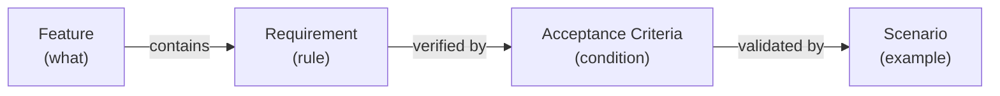

# Feature: Requirement

**Status:** Stable

## Summary

A requirement is a discrete, testable rule or condition that a system must satisfy. Requirements live as named subsections within a feature's Behavior section — they are a naming convention, not a separate file artifact. Each requirement is addressable by ID, enabling traceability from acceptance criteria and scenarios back to the specific obligation they verify.

## Problem

SpecScore features describe behavior in prose Behavior sections. When a feature has many behavioral rules, individual obligations are not addressable — acceptance criteria cannot trace back to the specific rule they verify, and tooling cannot enumerate or lint individual requirements. This makes it hard to answer: "Which specific rule does this AC verify?" or "Are all behavioral rules covered by ACs?"

## Design Philosophy

Requirements are the **precision layer** within features. A feature's Behavior section explains *how something works* narratively; requirements mark the specific *rules* within that narrative that the system must satisfy.

Requirements are lightweight by design — a heading convention, not a new file type. This keeps them close to the behavioral context they formalize and avoids duplicating content across artifacts.



## Behavior

### Requirement format

Requirements live within a feature's `## Behavior` section, scoped under topic headings. Topic headings (`###`) provide narrative context; requirements (`#### REQ:`) state the enforceable rules within that topic:

```markdown
## Behavior

### Item management

Todos are created, edited, and deleted through the CLI.

#### REQ: title-required

A todo item MUST have a non-empty title. Creating a todo without a title MUST be rejected with an error message.

#### REQ: slug-format

Feature slugs MUST be lowercase, hyphen-separated, and URL-safe. Underscores, spaces, and special characters are not permitted.
```

The `REQ:` prefix distinguishes requirements from other subsections. Topic headings without the `REQ:` prefix are organizational — they group related requirements and provide context, but are not themselves requirements.

#### REQ: topic-scoped

Requirements MUST be scoped under a topic heading within `## Behavior`. A requirement MUST NOT appear directly under `## Behavior` without an intervening topic heading, and MUST NOT appear outside `## Behavior`.

#### REQ: heading-level

Requirements MUST be exactly one heading level below their containing topic. In the typical case (`### topic` under `## Behavior`), requirements use `####`. If the topic is nested deeper, the requirement heading level adjusts accordingly but MUST remain a direct child of its topic.

### Requirement identification

Requirements are identified by their feature path and slug:

```
{feature-path}#req:{slug}
```

| Feature path | Requirement slug | Full ID |
|---|---|---|
| `todo-item/manage` | `title-required` | `todo-item/manage#req:title-required` |
| `todo-item/completion` | `timestamp-on-complete` | `todo-item/completion#req:timestamp-on-complete` |
| `todo-list` | `default-filter-active` | `todo-list#req:default-filter-active` |

#### REQ: id-format

A requirement's canonical identifier MUST follow the pattern `{feature-path}#req:{slug}`, where `{feature-path}` is the feature's path relative to `spec/features/` and `{slug}` is the requirement's slug. This identifier MUST be used in all cross-references.

### Requirement slugs

Slugs follow the same rules as feature slugs.

#### REQ: slug-format

Requirement slugs MUST contain only lowercase letters, numbers, and hyphens. Underscores, spaces, and special characters MUST NOT be used. Slugs MUST be URL-safe and path-safe.

#### REQ: slug-unique

Requirement slugs MUST be unique within a feature. Two requirements in the same feature MUST NOT share a slug, even if they appear under different topic headings.

### RFC 2119 language

Requirements express obligation levels using standardized keywords to remove ambiguity.

| Keyword | Meaning |
|---|---|
| MUST / MUST NOT | Absolute requirement or prohibition |
| SHOULD / SHOULD NOT | Recommended but exceptions exist |
| MAY | Truly optional |

#### REQ: rfc2119-keywords

Requirements SHOULD use RFC 2119 keywords (MUST, MUST NOT, SHOULD, SHOULD NOT, MAY) to express obligation levels. Natural language is acceptable when the intent is unambiguous, but RFC 2119 keywords are preferred.

### Requirement granularity

Each requirement expresses a **single testable obligation**. If a requirement contains multiple independent conditions, split it into separate requirements.

**Good** — single obligation:
```markdown
#### REQ: title-required
A todo item MUST have a non-empty title.
```

**Bad** — multiple obligations bundled:
```markdown
#### REQ: title-rules
A todo item MUST have a non-empty title, MUST NOT exceed 200 characters,
and SHOULD be unique within the list.
```

Split the bad example into `title-required`, `title-max-length`, and `title-unique`.

#### REQ: single-obligation

Each requirement MUST express exactly one testable obligation. A requirement that contains multiple independent conditions MUST be split into separate requirements.

### Referencing requirements from ACs and scenarios

Acceptance criteria and scenarios reference requirements using the `{feature-path}#req:{slug}` identifier.

**From an inline AC** (in the Acceptance Criteria section of a feature README):

```markdown
### AC: item-validation

**Requirements:** todo-item/manage#req:title-required, todo-item/manage#req:title-max-length

Creating a todo without a title or with a title exceeding the limit is rejected.
```

ACs are optional. They bundle related requirements into composite verification conditions. When an AC does not add value beyond the REQ itself, scenarios MAY reference the requirement directly.

**From a scenario** (in `_tests/`):

```markdown
**Validates:** [todo-item/manage#req:title-required](../README.md#req-title-required)
```

Or referencing a bundled AC:

```markdown
**Validates:** [todo-item/manage#ac:item-validation](../README.md#ac-item-validation)
```

#### REQ: ref-syntax

References to requirements from ACs and scenarios MUST use the `{feature-path}#req:{slug}` identifier. References to ACs MUST use `{feature-path}#ac:{slug}`. Markdown links SHOULD resolve to the requirement or AC heading in the feature README.

### Parent features and requirements

A parent feature MAY define requirements that apply broadly to its sub-features. Sub-features define their own requirements for behavior specific to them.

#### REQ: no-inheritance

Requirements MUST NOT be implicitly inherited by sub-features. A sub-feature's ACs or scenarios that verify a parent-level rule MUST explicitly reference the parent requirement's full ID.

## Structural Rules

1. **Requirements are scoped under topic headings.** A topic heading provides narrative context; requirements are one heading level below (typically `#### REQ: {slug}` under a `###` topic within `## Behavior`).
2. **The `REQ:` prefix is case-sensitive** and followed by a space and the slug.
3. **Requirement slugs are unique within a feature.** Two requirements in the same feature cannot share a slug.
4. **Requirements live in Behavior sections only.** The `REQ:` convention is not valid outside `## Behavior`.
5. **Each requirement is a single testable obligation.** Multi-condition requirements should be split.

## Interaction with Other Features

| Feature | Interaction |
|---|---|
| [Feature](../feature/README.md) | Requirements live within a feature's Behavior section as `#### REQ:` subsections under topic headings. |
| [Acceptance Criteria](../acceptance-criteria/README.md) | ACs optionally bundle requirements via the `**Requirements:**` metadata field. |
| [Scenario](../scenario/README.md) | Scenarios validate requirements directly or through bundled ACs — completing the traceability chain. |

## Acceptance Criteria

### AC: req-placement

**Requirements:** requirement#req:topic-scoped, requirement#req:heading-level, requirement#req:single-obligation

A requirement appears under a topic heading within `## Behavior`, at exactly one heading level below the topic, and expresses a single testable obligation. A requirement placed outside `## Behavior`, at the wrong heading level, or bundling multiple obligations is a validation error.

### AC: req-addressing

**Requirements:** requirement#req:id-format, requirement#req:slug-format, requirement#req:slug-unique, requirement#req:ref-syntax

A requirement has a well-formed slug, a unique slug within its feature, a canonical `{feature-path}#req:{slug}` identifier, and all cross-references use the correct identifier syntax. Invalid slugs, duplicate slugs, or malformed references are validation errors.

## Outstanding Questions

- Should tooling enforce that every requirement has at least one AC or scenario, or is it acceptable to have uncovered requirements during early specification?
- Should requirements support a status independent of their parent feature (e.g., a requirement could be marked `deprecated` while the feature remains `stable`)?

---
*This document follows the https://specscore.md/feature-specification*
