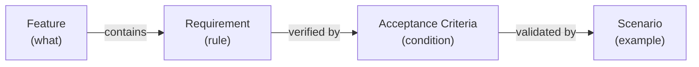

# Feature: Requirement

**Status:** Conceptual

## Summary

A requirement is a discrete, testable rule or condition that a system must satisfy. Requirements live as named subsections within a feature's Behavior section — they are a naming convention, not a separate file artifact. Each requirement is addressable by ID, enabling traceability from acceptance criteria and scenarios back to the specific obligation they verify.

## Problem

SpecScore features describe behavior in prose Behavior sections. When a feature has many behavioral rules, individual obligations are not addressable — acceptance criteria cannot trace back to the specific rule they verify, and tooling cannot enumerate or lint individual requirements. This makes it hard to answer: "Which specific rule does this AC verify?" or "Are all behavioral rules covered by ACs?"

## Design Philosophy

Requirements are the **precision layer** within features. A feature's Behavior section explains *how something works* narratively; requirements mark the specific *rules* within that narrative that the system must satisfy.

Requirements are lightweight by design — a heading convention, not a new file type. This keeps them close to the behavioral context they formalize and avoids duplicating content across artifacts.



## Behavior

### Requirement format

Requirements are subsections within a feature's `## Behavior` section, using the `### REQ:` prefix:

```markdown
## Behavior

### REQ: title-required

A todo item MUST have a non-empty title. Creating a todo without a title MUST be rejected with an error message.

### REQ: slug-format

Feature slugs MUST be lowercase, hyphen-separated, and URL-safe. Underscores, spaces, and special characters are not permitted.
```

The `### REQ:` prefix distinguishes requirements from organizational subsections. Subsection headings without the `REQ:` prefix remain valid for grouping and narrative — not every subsection is a requirement.

### Requirement identification

Requirements are identified by their feature path and slug:

```
{feature-path}#req:{slug}
```

| Feature path | Requirement slug | Full ID |
|---|---|---|
| `todo-item/manage` | `title-required` | `todo-item/manage#req:title-required` |
| `todo-item/completion` | `timestamp-on-complete` | `todo-item/completion#req:timestamp-on-complete` |
| `todo-list` | `default-filter-active` | `todo-list#req:default-filter-active` |

### Requirement slugs

Slugs follow the same rules as feature slugs:
- Lowercase letters, numbers, and hyphens only
- No underscores, spaces, or special characters
- URL-safe and path-safe

### RFC 2119 language

Requirements SHOULD use RFC 2119 keywords (MUST, MUST NOT, SHOULD, SHOULD NOT, MAY) to express obligation levels. This is a convention, not a strict rule — natural language is acceptable when the intent is clear.

| Keyword | Meaning |
|---|---|
| MUST / MUST NOT | Absolute requirement or prohibition |
| SHOULD / SHOULD NOT | Recommended but exceptions exist |
| MAY | Truly optional |

### Requirement granularity

Each requirement expresses a **single testable obligation**. If a requirement contains multiple independent conditions, split it into separate requirements.

**Good** — single obligation:
```markdown
### REQ: title-required
A todo item MUST have a non-empty title.
```

**Bad** — multiple obligations bundled:
```markdown
### REQ: title-rules
A todo item MUST have a non-empty title, MUST NOT exceed 200 characters,
and SHOULD be unique within the list.
```

Split the bad example into `title-required`, `title-max-length`, and `title-unique`.

### Referencing requirements from ACs

Acceptance criteria reference the requirement(s) they verify using the `**Requirement:**` metadata field:

```markdown
# AC: title-required

**Requirement:** todo-item/manage#req:title-required

Creating a todo without a title is rejected. Creating a todo with a title succeeds.
```

An AC may reference multiple requirements when it verifies a condition that spans them:

```markdown
**Requirement:** todo-item/manage#req:title-required, todo-item/manage#req:title-max-length
```

### Parent features and requirements

A parent feature MAY define requirements that apply broadly to its sub-features. Sub-features define their own requirements for behavior specific to them. There is no inheritance — a sub-feature's ACs must explicitly reference the parent requirement ID if they verify a parent-level rule.

## Structural Rules

1. **Requirement headings use the `### REQ: {slug}` format.** The `REQ:` prefix is case-sensitive and followed by a space and the slug.
2. **Requirement slugs are unique within a feature.** Two requirements in the same feature cannot share a slug.
3. **Requirements live in Behavior sections only.** The `### REQ:` convention is not valid outside `## Behavior`.
4. **Each requirement is a single testable obligation.** Multi-condition requirements should be split.

## Interaction with Other Features

| Feature | Interaction |
|---|---|
| [Feature](../feature/README.md) | Requirements live within a feature's Behavior section as named subsections. |
| [Acceptance Criteria](../acceptance-criteria/README.md) | ACs reference requirements via the `**Requirement:**` metadata field. |
| [Scenario](../scenario/README.md) | Scenarios validate ACs, which in turn verify requirements — completing the traceability chain. |

## Acceptance Criteria

Not defined yet.

## Outstanding Questions

- Acceptance criteria not yet defined for this feature.
- Should tooling enforce that every requirement has at least one AC, or is it acceptable to have requirements without ACs (e.g., during early specification)?
- Should requirements support a status independent of their parent feature (e.g., a requirement could be marked `deprecated` while the feature remains `stable`)?
