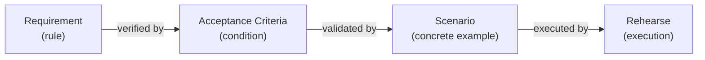

# Feature: Scenario

> [View in Synchestra Hub](https://hub.synchestra.io/project/features?id=specscore@synchestra-io@github.com&path=spec%2Ffeatures%2Fscenario) — graph, discussions, approvals

**Status:** Stable

## Summary

A scenario is a concrete example of system behavior written in Given/When/Then format. Scenarios live in a feature's `_tests/` directory as standalone markdown files, each describing a specific interaction flow with exact inputs and expected outputs. They are the executable proof layer — validating that requirements and acceptance criteria hold under real conditions. Scenarios are linked to the REQs or ACs they validate and are executable by the [Rehearse test runner](https://github.com/synchestra-io/rehearse).

## Problem

SpecScore's requirements define *what rules must hold* — formal obligations like "A todo MUST have a non-empty title." But requirements deliberately omit concrete inputs, flows, and edge-case sequences. This creates a gap:

- **Developers** need concrete examples to understand expected behavior
- **Test runners** need exact inputs and expected outputs to execute
- **Reviewers** need specific flows to verify during acceptance

Without a formal scenario concept, concrete examples end up mixed into requirements (blurring the abstract/concrete distinction) or scattered in ad-hoc test files with no link back to the specification.

## Design Philosophy

Scenarios are the **example layer** — the most concrete artifact in the specification chain:

| Layer | Abstraction | Example |
|---|---|---|
| Feature | Narrative behavior | "The system manages todo items" |
| Requirement | Formal rule | "A todo MUST have a non-empty title" |
| Acceptance Criteria | Abstract condition | "Creating a todo without a title is rejected" |
| **Scenario** | **Concrete flow** | **"GIVEN an empty list, WHEN I add a todo with no title, THEN the CLI prints 'Error: title required' and the list remains empty"** |

Each layer adds precision. Scenarios are the ground truth that proves the chain holds.



## Behavior

### Scenario location

Scenarios live in the `_tests/` directory within a feature:

```
spec/features/{feature-slug}/
  _tests/
    {scenario-slug}.md
    {scenario-slug}.md
    flows/                   <- shared setup/teardown flows (optional)
      {flow-slug}.md
```

The `_tests/` directory follows the reserved `_` prefix convention — it is not a sub-feature and is excluded from the feature index.

#### REQ: tests-dir-only

Scenarios MUST live in `_tests/` directories only. A scenario file is NOT valid elsewhere in the feature tree.

#### REQ: tests-readme

Every `_tests/` directory MUST contain a `README.md` with a scenario index table listing all scenarios in that directory.

### Scenario file format

Every scenario file follows this structure:

```markdown
# Scenario: {Title}

**Validates:** [feature-path#req:slug](../README.md#req-slug)

## Steps

GIVEN {initial condition}
AND {additional context}
WHEN {action}
THEN {expected outcome}
AND {additional outcome}

## Rehearse

\`\`\`rehearse
#!/bin/bash
# executable test script
\`\`\`
```

#### REQ: title-prefix

Every scenario file MUST begin with a heading using the `# Scenario: {Title}` format. The `Scenario:` prefix is required.

#### REQ: steps-required

Every scenario file MUST include a `## Steps` section containing Given/When/Then steps.

### Scenario filename conventions

#### REQ: filename-slug

Scenario filenames MUST be lowercase, hyphen-separated, URL-safe slugs with a `.md` extension. Underscores, spaces, and special characters are NOT permitted.

Examples of valid filenames: `add-todo-without-title.md`, `overdue-filter.md`, `empty-list-display.md`.

### Validates metadata

The `**Validates:**` field links a scenario to one or more requirements or acceptance criteria:

```markdown
**Validates:** [scenario#req:title-prefix](../README.md#req-title-prefix)
```

Or referencing multiple targets:

```markdown
**Validates:** [scenario#req:title-prefix](../README.md#req-title-prefix), [scenario#req:steps-required](../README.md#req-steps-required)
```

The reference format uses the standard requirement identifier `{feature-path}#req:{slug}` or `{feature-path}#ac:{slug}`, wrapped in a markdown link pointing to the anchor in the feature README.

#### REQ: validates-format

When present, the `**Validates:**` field MUST use the format `[{feature-path}#req:{slug}](../README.md#req-{slug})` for requirements or `[{feature-path}#ac:{slug}](../README.md#ac-{slug})` for acceptance criteria. Each reference MUST be a valid markdown link.

#### REQ: validates-optional

The `**Validates:**` field is optional. Scenarios without a validates link are valid — they serve as exploratory behavior examples, integration flows, or cross-feature demonstrations.

#### REQ: validates-many-to-many

The validates relationship is many-to-many: a scenario MAY validate multiple REQs or ACs, and a single REQ or AC MAY be validated by multiple scenarios.

### Given/When/Then format

Scenarios use the Gherkin-inspired Given/When/Then structure:

| Keyword | Purpose | Multiplicity |
|---|---|---|
| GIVEN | Initial state or precondition | One or more (use AND for additional) |
| WHEN | Action or trigger | Exactly one |
| THEN | Expected outcome | One or more (use AND for additional) |
| AND | Continues the preceding keyword | Zero or more |

#### REQ: keywords-uppercase

Step keywords (GIVEN, WHEN, THEN, AND) MUST be uppercase.

#### REQ: single-when

Each scenario MUST contain exactly one WHEN step. Multiple actions MUST be split into separate scenarios.

### Rehearse script block

Scenarios MAY include a fenced `rehearse` code block containing an executable script:

````markdown
## Rehearse

```rehearse
#!/bin/bash
todo add "Buy milk"
output=$(todo list)
assert_contains "$output" "Buy milk"
assert_contains "$output" "[active]"
```
````

#### REQ: rehearse-fence-tag

When a scenario includes an executable script, the fenced code block MUST use the `rehearse` fence tag to distinguish it from regular code examples.

#### REQ: rehearse-shebang

Rehearse script blocks MUST begin with a shebang line (e.g., `#!/bin/bash`, `#!/usr/bin/env python3`) to declare the script language.

#### REQ: rehearse-section

The rehearse script block MUST appear under a `## Rehearse` section heading. It MUST NOT appear inline within the Steps section.

### Shared flows

Common setup and teardown sequences can be extracted into `_tests/flows/`:

```
_tests/
  flows/
    populated-list.md       <- creates a list with standard test data
  add-todo.md               <- references populated-list flow
```

A flow file follows the same Given/When/Then format but is intended for reuse. Scenarios reference flows in their GIVEN section:

```markdown
GIVEN the state from [populated-list](flows/populated-list.md)
WHEN the user runs `todo complete 1`
THEN ...
```

#### REQ: flow-location

Shared flow files MUST live in the `_tests/flows/` subdirectory. They MUST NOT be placed directly in `_tests/`.

#### REQ: flow-format

Flow files MUST follow the same Given/When/Then format as scenario files. They are reusable step sequences, not free-form prose.

### Cross-feature scenarios

Scenarios that exercise multiple features are placed in the `_tests/` directory of the feature that is the primary subject. The `**Validates:**` field can reference REQs or ACs from any feature.

#### REQ: cross-feature-placement

Cross-feature scenarios MUST be placed in the `_tests/` directory of the primary feature under test. They MUST NOT be duplicated across multiple features.

#### REQ: cross-feature-validates

Cross-feature scenarios SHOULD reference REQs or ACs from all exercised features in the `**Validates:**` field, enabling traceability across feature boundaries.

### Adherence footer

#### REQ: adherence-footer

Every scenario document MUST end with an adherence footer per the [Adherence Footer feature](../adherence-footer/README.md). The footer URL MUST be `https://specscore.md/scenario-specification`.

## Interaction with Other Features

| Feature | Interaction |
|---|---|
| [Feature](../feature/README.md) | Scenarios live in a feature's `_tests/` directory, following the reserved `_` prefix convention. |
| [Acceptance Criteria](../acceptance-criteria/README.md) | Scenarios validate ACs via the `**Validates:**` metadata field. An AC is abstract; a scenario is its concrete proof. |
| [Requirement](../requirement/README.md) | Scenarios validate requirements directly via `**Validates:**` or indirectly through bundled ACs. |

## Acceptance Criteria

### AC: valid-scenario-file

**Requirements:** scenario#req:title-prefix, scenario#req:steps-required, scenario#req:filename-slug

A scenario file has a correctly formatted title (`# Scenario: {Title}`), contains a Steps section with Given/When/Then steps, and uses a valid slug filename.

### AC: valid-validates-metadata

**Requirements:** scenario#req:validates-format, scenario#req:validates-optional, scenario#req:validates-many-to-many

When a validates field is present, each reference uses the correct link format and points to a valid REQ or AC. Scenarios without validates fields are accepted. Multiple references in a single field and multiple scenarios referencing the same REQ are both valid.

### AC: correct-step-format

**Requirements:** scenario#req:keywords-uppercase, scenario#req:single-when

Step keywords are uppercase. Each scenario has exactly one WHEN step. Scenarios with lowercase keywords or multiple WHEN steps are rejected by validation.

### AC: valid-rehearse-block

**Requirements:** scenario#req:rehearse-fence-tag, scenario#req:rehearse-shebang, scenario#req:rehearse-section

When a rehearse block is present, it uses the `rehearse` fence tag, starts with a shebang line, and appears under a `## Rehearse` section heading.

## Outstanding Questions

- Should scenarios support parameterized/templated steps (e.g., run the same scenario with different inputs)? Or should each input combination be a separate scenario file?
- Should the `flows/` convention support nesting (flows referencing other flows), or is one level sufficient?
- How should scenario failures be reported — per-step or pass/fail for the whole scenario?

---
*This document follows the https://specscore.md/feature-specification*
