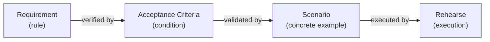

# Feature: Scenario

**Status:** Conceptual

## Summary

A scenario is a concrete example of system behavior written in Given/When/Then format. Scenarios live in a feature's `_tests/` directory as standalone markdown files, each describing a specific interaction flow with exact inputs and expected outputs. They are the executable proof layer — validating that acceptance criteria hold under real conditions. Scenarios are optionally linked to the ACs they validate and are executable by the [Rehearse test runner](https://github.com/synchestra-io/rehearse).

## Problem

SpecScore's acceptance criteria define *what must be true* — abstract conditions like "creating a todo without a title is rejected." But ACs deliberately omit concrete inputs, flows, and edge-case sequences. This creates a gap:

- **Developers** need concrete examples to understand expected behavior
- **Test runners** need exact inputs and expected outputs to execute
- **Reviewers** need specific flows to verify during acceptance

Without a formal scenario concept, concrete examples end up mixed into ACs (blurring the abstract/concrete distinction) or scattered in ad-hoc test files with no link back to the specification.

## Design Philosophy

Scenarios are the **example layer** — the most concrete artifact in the specification chain:

| Layer | Abstraction | Example |
|---|---|---|
| Feature | Narrative behavior | "The system manages todo items" |
| Requirement | Formal rule | "A todo MUST have a non-empty title" |
| Acceptance Criteria | Abstract condition | "Creating a todo without a title is rejected" |
| **Scenario** | **Concrete flow** | **"GIVEN an empty list, WHEN I add a todo with no title, THEN the CLI prints 'Error: title required' and the list remains empty"** |

Each layer adds precision. Scenarios are the ground truth that proves the chain holds.



## Behavior

### Scenario location

Scenarios live in the `_tests/` directory within a feature:

```
spec/features/{feature-slug}/
  _tests/
    {scenario-slug}.md
    {scenario-slug}.md
    flows/                   <- shared setup/teardown flows (optional)
      {flow-slug}.md
```

The `_tests/` directory follows the reserved `_` prefix convention — it is not a sub-feature and is excluded from the feature index.

### Scenario file format

```markdown
# Scenario: {Title}

**Validates:** {feature-slug}/{ac-slug}, {feature-slug}/{ac-slug-2}

## Steps

GIVEN {initial condition}
AND {additional context}
WHEN {action}
THEN {expected outcome}
AND {additional outcome}

## Rehearse

\`\`\`rehearse
#!/bin/bash
# executable test script
\`\`\`
```

### Required sections

| Section | Required | Notes |
|---|---|---|
| Title (`# Scenario: X`) | Yes | Always prefixed with `Scenario:` |
| Validates | No | Links to ACs. Omit for exploratory or cross-feature scenarios. |
| Steps | Yes | Given/When/Then format |
| Rehearse | No | Executable script block for test automation |

### Validates metadata

The `**Validates:**` field links a scenario to one or more acceptance criteria:

```markdown
**Validates:** todo-item/manage/added-to-list, todo-item/manage/title-required
```

The reference format is `{feature-path}/{ac-slug}`, where `{ac-slug}` matches the filename (without `.md`) in the feature's `_acs/` directory.

**Rules:**
- The link is **many-to-many**: a scenario can validate multiple ACs, and an AC can be validated by multiple scenarios
- The field is **optional**: scenarios without AC links are valid — they serve as exploratory behavior examples, integration flows, or cross-feature demonstrations
- When present, tooling can verify that referenced ACs exist

### Given/When/Then format

Scenarios use the Gherkin-inspired Given/When/Then structure:

| Keyword | Purpose | Multiplicity |
|---|---|---|
| GIVEN | Initial state or precondition | One or more (use AND for additional) |
| WHEN | Action or trigger | Exactly one |
| THEN | Expected outcome | One or more (use AND for additional) |
| AND | Continues the preceding keyword | Zero or more |

Keywords are uppercase by convention for visual clarity.

**Example:**

```markdown
## Steps

GIVEN a todo list with two active items
AND one item has due date 2026-01-01
AND today is 2026-04-01
WHEN the user runs `todo list --overdue`
THEN the output contains exactly one item
AND the item is the one with due date 2026-01-01
AND the output does not contain the item without a due date
```

### Rehearse script block

Scenarios may include a fenced `rehearse` code block containing an executable script:

````markdown
## Rehearse

```rehearse
#!/bin/bash
todo add "Buy milk"
output=$(todo list)
assert_contains "$output" "Buy milk"
assert_contains "$output" "[active]"
```
````

**Rules:**
- The script language is determined by the shebang line (`#!/bin/bash`, `#!/usr/bin/env python3`, etc.)
- Scripts use assertion helpers provided by the Rehearse framework (`assert_contains`, `assert_not_contains`, `assert_eq`, `assert_exit_code`)
- Scripts are executed by the [Rehearse test runner](https://github.com/synchestra-io/rehearse) — SpecScore defines the format, Rehearse executes it
- The `rehearse` fence tag distinguishes executable blocks from regular code examples

### Shared flows

Common setup and teardown sequences can be extracted into `_tests/flows/`:

```
_tests/
  flows/
    populated-list.md       <- creates a list with standard test data
  add-todo.md               <- references populated-list flow
```

A flow file follows the same Given/When/Then format but is intended for reuse. Scenarios reference flows in their GIVEN section:

```markdown
GIVEN the state from [populated-list](flows/populated-list.md)
WHEN the user runs `todo complete 1`
THEN ...
```

### Cross-feature scenarios

Scenarios that exercise multiple features are placed in the `_tests/` directory of the feature that is the primary subject. The `**Validates:**` field can reference ACs from any feature:

```markdown
**Validates:** due-dates/overdue-detection, todo-list/filter-by-status

## Steps

GIVEN a todo with due date in the past
AND the todo is active
WHEN the user runs `todo list --overdue`
THEN the overdue todo appears in the output
```

## Structural Rules

1. **Scenarios live in `_tests/` directories only.** They are not valid elsewhere in the feature tree.
2. **Scenario filenames are slugs.** Lowercase, hyphen-separated, URL-safe, with `.md` extension.
3. **Scenario titles use the `# Scenario: X` format.** The `Scenario:` prefix is required.
4. **Steps section uses Given/When/Then keywords.** Keywords are uppercase.
5. **Each scenario has exactly one WHEN.** Multiple actions require multiple scenarios.

## Interaction with Other Features

| Feature | Interaction |
|---|---|
| [Feature](../feature/README.md) | Scenarios live in a feature's `_tests/` directory, following the reserved `_` prefix convention. |
| [Acceptance Criteria](../acceptance-criteria/README.md) | Scenarios validate ACs via the `**Validates:**` metadata field. An AC is abstract; a scenario is its concrete proof. |
| [Requirement](../requirement/README.md) | Scenarios indirectly verify requirements through the AC layer: Scenario -> AC -> Requirement. |

## Acceptance Criteria

Not defined yet.

## Outstanding Questions

- Acceptance criteria not yet defined for this feature.
- Should scenarios support parameterized/templated steps (e.g., run the same scenario with different inputs)? Or should each input combination be a separate scenario file?
- Should the `flows/` convention support nesting (flows referencing other flows), or is one level sufficient?
- How should scenario failures be reported — per-step or pass/fail for the whole scenario?
