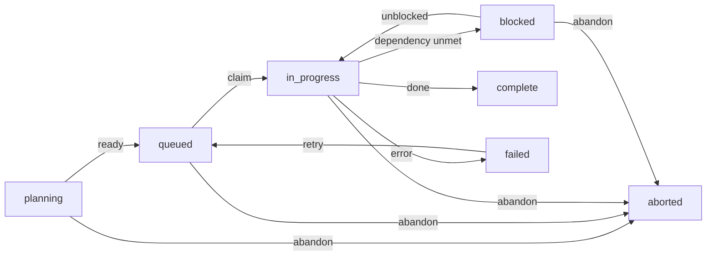

# Feature: Task

> [View in Synchestra Hub](https://hub.synchestra.io/project/features?id=specscore@synchestra-io@github.com&path=spec%2Ffeatures%2Ftask) — graph, discussions, approvals

**Status:** Stable

## Summary

A task is the atomic unit of work in SpecScore. It is a leaf node -- actionable work that an agent or human picks up and completes. Tasks live as directories with a `README.md` and carry properties that describe their dependencies, acceptance criteria, status, and artifacts.

A task with subtasks is called a **plan** -- this is determined by structure, not declaration. The task concept is the foundation of the unified plan/task model: one recursive concept that spans specification and execution.

## Contents

| Directory | Description |
|---|---|
| [_tests](_tests/README.md) | Test scenarios validating task feature requirements |

## Problem

There is no standard definition of an executable work item in the SpecScore methodology. Plans define the "how" at the planning level, but the atomic unit of execution -- the thing an agent or human actually picks up and completes -- has no formal specification.

Without a formal task definition:

- Execution tools invent their own task models, creating terminology drift between SpecScore and orchestration tools.
- There is no shared vocabulary for status, dependencies, or completion criteria at the work-item level.
- Agents and humans cannot reason about task lifecycle without consulting tool-specific documentation.

## Behavior

### Task structure

A task is a directory containing a `README.md` file. The directory name is the task's slug. Tasks live within a plan directory or under `spec/plans/`.

```text
some-plan/
  README.md              <- plan document
  set-up-infrastructure/
    README.md            <- task document
  implement-auth/
    README.md            <- task document (or plan, if it has subtasks)
```

#### REQ: task-directory

Every task MUST reside in a dedicated directory with a `README.md` file as the task document.

#### REQ: task-slug-format

Task slugs MUST be lowercase, hyphen-separated, and URL-safe. Underscores, spaces, and special characters MUST NOT be used.

#### REQ: task-is-leaf

A task is a leaf node -- it has no child task directories. A directory that contains child task directories is a plan, not a task. This distinction is structural, not declared.

### Task statuses and lifecycle

Tasks follow a defined status lifecycle from creation through completion or termination.

| Status | Description |
|---|---|
| `planning` | Task is being defined, not ready for execution |
| `queued` | Task is ready for execution, waiting to be picked up |
| `in_progress` | Task has been claimed and work is underway |
| `blocked` | Task cannot proceed due to unmet dependencies or external factors |
| `complete` | Task is finished and meets its acceptance criteria |
| `failed` | Task was attempted but could not be completed successfully |
| `aborted` | Task was intentionally abandoned before completion |

#### REQ: valid-task-statuses

A task's status MUST be one of: `planning`, `queued`, `in_progress`, `blocked`, `complete`, `failed`, or `aborted`. No other values are permitted.

### Status transitions



#### REQ: status-transitions

Task status transitions MUST follow these rules:

- `planning` MAY transition to `queued` or `aborted`.
- `queued` MAY transition to `in_progress` or `aborted`.
- `in_progress` MAY transition to `blocked`, `complete`, `failed`, or `aborted`.
- `blocked` MAY transition to `in_progress` or `aborted`.
- `failed` MAY transition to `queued` (retry).
- `complete`, `failed` (except retry), and `aborted` are terminal states -- no further transitions are permitted from `complete` or `aborted`.

#### REQ: terminal-states

The statuses `complete` and `aborted` are terminal. Once a task reaches either status, no further transitions are permitted. The status `failed` is terminal unless the task is retried (transition to `queued`).

### Dependency references

Tasks declare dependencies on other tasks using the `depends_on` property. Dependencies determine execution order -- a task with unmet dependencies MUST NOT transition to `in_progress`.

There are three forms of dependency reference:

**Sibling reference (bare slug):** References a task in the same parent plan.

```markdown
**Depends on:** set-up-infrastructure
```

**Cousin reference (relative path):** References a task in a different plan using a relative path.

```markdown
**Depends on:** ../auth-plan/implement-jwt
```

**Cross-project reference (URL):** References a task in a different project.

```markdown
**Depends on:** https://github.com/org/other-project/spec/plans/setup/configure-db
```

#### REQ: dependency-sibling

A bare slug in `depends_on` MUST resolve to a sibling task within the same parent plan directory.

#### REQ: dependency-cousin

A relative path in `depends_on` MUST resolve to a task in a different plan within the same project, using standard relative path resolution from the current task's directory.

#### REQ: dependency-cross-project

A URL in `depends_on` MUST resolve to a task in a different project. The URL MUST point to the task directory in the remote repository.

#### REQ: dependency-blocks-execution

A task with unmet dependencies (any dependency whose status is not `complete`) MUST NOT transition from `queued` to `in_progress`. The task MUST remain in `queued` or transition to `blocked` if it was already `in_progress` when a dependency became unmet.

### Task status board format

A task status board provides a visual summary of all tasks within a plan. It is rendered as a markdown table grouped by status columns.

```markdown
## Task Status Board

| Queued | In Progress | Blocked | Done |
|---|---|---|---|
| task-c | task-a | task-d | ~~task-e~~ |
| task-f | task-b | | |

### Recently Finished

| Task | Status | Completed |
|---|---|---|
| task-e | complete | 2026-03-28 |
| task-g | aborted | 2026-03-27 |
```

#### REQ: board-columns

The task status board MUST include these columns: Queued, In Progress, Blocked, and Done. The `planning` status maps to the Queued column. The `complete`, `failed`, and `aborted` statuses map to the Done column.

#### REQ: board-done-strikethrough

Tasks in the Done column MUST use strikethrough formatting (`~~task-slug~~`) to visually distinguish completed work.

#### REQ: board-recently-finished

The task status board MUST include a Recently Finished section below the main board table. This section shows tasks that have reached a terminal status (`complete`, `failed`, `aborted`) with their status and completion date.

#### REQ: board-reflects-current-state

The task status board MUST reflect the current state of all tasks in the plan. Stale boards are a validation error.

### Task properties

A task document carries structured properties in its `README.md`.

```markdown
# Task: Implement JWT authentication

**Status:** queued
**Depends on:** set-up-infrastructure
**Produces:**
  - JWT middleware module
  - Token refresh endpoint

## Acceptance Criteria

- JWT tokens are validated on every protected endpoint
- Expired tokens return 401 with a clear error message
- Refresh endpoint issues new tokens for valid refresh tokens

## Outstanding Questions

None at this time.
```

#### REQ: task-title-format

Every task document MUST use the `# Task: {Title}` format for its title. The `Task:` prefix is required.

#### REQ: task-required-fields

Every task document MUST include the `Status` field. The `Depends on` and `Produces` fields are OPTIONAL and appear only when applicable.

#### REQ: task-acceptance-criteria

Every task SHOULD include an Acceptance Criteria section defining what "done" looks like. Acceptance criteria inform verification by agents, humans, and test tooling.

#### REQ: task-produces-format

When present, the `Produces` field MUST be a bulleted list of named artifacts. Each artifact is a deliverable that downstream tasks may depend on.

## Interaction with Other Features

| Feature | Interaction |
|---|---|
| [Plan](../plan/README.md) | A task is a leaf within a plan. A plan is a composite task -- a task with subtasks. Tasks and plans share the same status model and property format. |
| [Feature](../feature/README.md) | Features define "what" to build. Tasks are the executable work items that implement features. Plans bridge features to tasks. |
| [Requirement](../requirement/README.md) | Requirements are testable rules within feature specs. Task acceptance criteria may reference or derive from feature requirements. |
| [Acceptance Criteria](../acceptance-criteria/README.md) | Task-level acceptance criteria follow the same conventions as feature-level acceptance criteria but are scoped to the individual work item. |
| [Scenario](../scenario/README.md) | Scenarios in `_tests/` validate task feature requirements with concrete Given/When/Then flows. |

## Acceptance Criteria

### AC: task-structure

**Requirements:** task#req:task-directory, task#req:task-slug-format, task#req:task-is-leaf, task#req:task-title-format, task#req:task-required-fields

A task resides in a dedicated directory with a slug-formatted name and a `README.md` file. The document uses the `# Task: {Title}` format. The task is a leaf node with no child task directories. The `Status` field is always present.

### AC: status-lifecycle

**Requirements:** task#req:valid-task-statuses, task#req:status-transitions, task#req:terminal-states

A task's status is always one of the seven defined values. Status transitions follow the defined state machine. Terminal states (`complete`, `aborted`) permit no further transitions. `failed` permits only a retry transition to `queued`.

### AC: dependency-references

**Requirements:** task#req:dependency-sibling, task#req:dependency-cousin, task#req:dependency-cross-project, task#req:dependency-blocks-execution

Dependency references resolve correctly using bare slugs (sibling), relative paths (cousin), or URLs (cross-project). Tasks with unmet dependencies cannot transition to `in_progress`.

### AC: board-format

**Requirements:** task#req:board-columns, task#req:board-done-strikethrough, task#req:board-recently-finished, task#req:board-reflects-current-state

The task status board has the required columns (Queued, In Progress, Blocked, Done), uses strikethrough for done tasks, includes a Recently Finished section, and reflects current task state.

## Outstanding Questions

- Should task documents support optional metadata fields beyond Status, Depends on, and Produces (e.g., Assignee, Effort, Priority)?
- How should cross-project dependency resolution work when the remote project is not accessible (offline, private)?
- Should the task status board be auto-generated by tooling or manually maintained, and what is the validation tolerance for staleness?

---
*This document follows the https://specscore.md/feature-specification*
